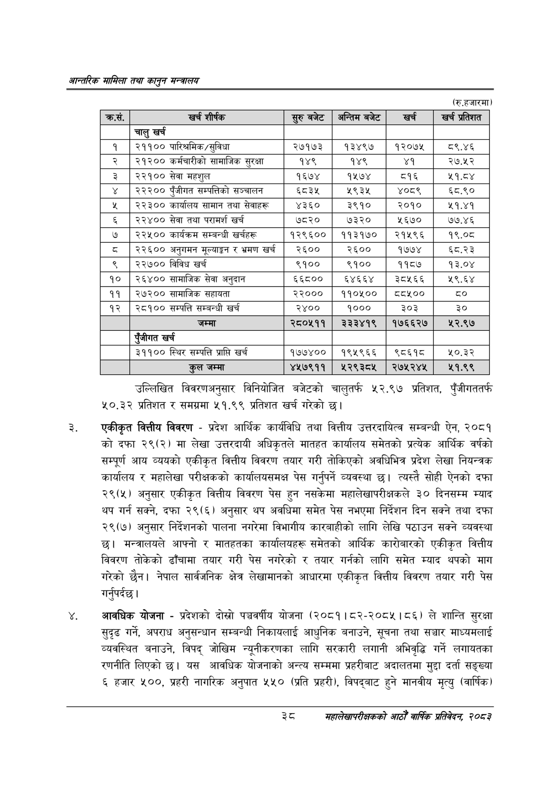

# Page 60 QA

## Rendered page


## Extracted text

```text
आन्तरिक सामिला तथा कालृुन मन्बालय
(रु.हजारमा)
उल्लिखित विवरणअनुसार विनियोजित बजेटको चालुतर्फ ५२.९७ प्रतिशत, पुँजीगततर्फ ५०.३२ प्रतिशत र समग्रमा ५१.९९ प्रतिशत खर्च गरेको छ।
एकीकृत वित्तीय विवरण -प्रदेश आर्थिक कार्यविधि तथा वित्तीय उत्तरदायित्व सम्बन्धी ऐन, २०८१ को दफा २९(२) मा लेखा उत्तरदायी अधिकृतले मातहत कार्यालय समेतको प्रत्येक आर्थिक वर्षको सम्पूर्ण आय व्ययको एकीकृत वित्तीय विवरण तयार गरी तोकिएको अवधिभित्र प्रदेश लेखा नियन्त्रक कार्यालय र महालेखा परीक्षकको कार्यालयसमक्ष पेस गर्नुपर्ने व्यवस्था छ। त्यस्तै सोही ऐनको दफा २९(५) अनुसार एकीकृत वित्तीय विवरण पेस हुन नसकेमा महालेखापरीक्षकले ३० दिनसम्म म्याद थप गर्न सक्ने, दफा २९(६) अनुसार थप अवधिमा समेत पेस नभएमा निर्देशन दिन सक्ने तथा दफा २९(७) अनुसार निर्देशनको पालना नगरेमा विभागीय कारबाहीको लागि लेखि पठाउन सक्ने व्यवस्था छ। मन्त्रालयले आफ्नो र मातहतका कार्यालयहरू समेतको आर्थिक कारोबारको एकीकृत वित्तीय विवरण तोकेको ढाँचामा तयार गरी पेस नगरेको र तयार गर्नको लागि समेत म्याद थपको माग गरेको छैन। नेपाल सार्वजनिक क्षेत्र लेखामानको आधारमा एकीकृत वित्तीय विवरण तयार गरी पेस गर्नुपर्दछ |
आवधिक योजना -प्रदेशको दोस्रो पञ्चवर्षीय योजना (२०८१।८२-२०८५।८६) ले शान्ति सुरक्षा सुदृढ गर्ने, अपराध अनुसन्धान सम्बन्धी निकायलाई आधुनिक बनाउने, सूचना तथा सञ्चार माध्यमलाई व्यवस्थित बनाउने, विपद्‌ जोखिम न्यूनीकरणका लागि सरकारी लगानी अभिवृद्धि गर्ने लगायतका रणनीति लिएको छ। यस आवधिक योजनाको अन्त्य सम्ममा प्रहरीबाट अदालतमा मुद्दा दर्ता सङ्ख्या ६ हजार ५००, प्रहरी नागरिक अनुपात ५५० प्रति प्रहरी), विपद्बाट हुने मानवीय मृत्यु (वार्षिक)
३
सहालेखापरीक्षकको आठौँ वाषिकि प्रतिवेदन २०८२

| क्रस. | खर शीर्षक | र्ुरुबजेट | अन्तिम बबेट | खरी | खर प्रतिशत |
| --- | --- | --- | --- | --- | --- |
|  | चालु खर्च |  |  |  |  |
| १ | २११०० पारित्रमिक/सुविधा | २७१७३ | १३४९७ | १२०७५ | ब८९.४६ |
| २ | २१२०० कर्मचारीको सामाजिक सुरक्षा | १४९ | १४९ | ४१ | २७.५२ |
| ३ | २२१०० सेवा महशुल | १६७४ | १५७४ | ८१६ | ५१.८४ |
| ४ | २२२०० पुँजीगत ख्षम्पतिको सञ्चालन | ६८३५ | ५९३४ | ४०८९ | ६८.९० |
|  | २२३०० कार्यालध सामान तथा सेवाहरू | ४३६० | ३९१० | २०१० | २५१.४१ |
| ६ | २२४०० सेवा तथा परामर्श खर्च | ७८२० | ७३२० | ५६७० | ७७.४६ |
| ७ | २२५०० कार्यक्रम सम्बन्धी खर्चहरू | १२९६०० | ११३१७० | २१५९६ | १९.०८ |
| व्‌ | २२६०० अनुगमन भूल्याङ्गग र भ्रमण खर्च | २६०० | २६०० | १७७४ | ६८.२३ |
| ९ | २२७०० विविध खर्च | ९१०० | ९१०० | ११८७ | १३.०४ |
| १० | २६४०० सामाजिक सेवा अनुदान | ६६८०० | ६४६६४ | ३८१५६६ | ५९.६४ |
| ११ | २७२०० सामाजिक सहायता | २२००० | ११०५०० | बव८८४१०० |  |
| १२ | २८१०० सम्पत्ति सम्बन्धी खर्च | २४०० | १००० | ३०३ | ३० |
|  | जम्मा | २८०५११ | २३२४१९ | १७६६२७ | %३]० |
|  | पूँजीगत खर्च |  |  |  |  |
|  | ३११०० स्थिर सम्पत्ति प्राप्ति खर्च | १७४४०० | १९५९६६ | ९८६१८ | ५०.३२ |
|  | जम्मा | ४५७९११ | २५२९३८५ | २७५२४५ | २५१.९९ |
```

## Flags
- table_page
- medium_quality_table
