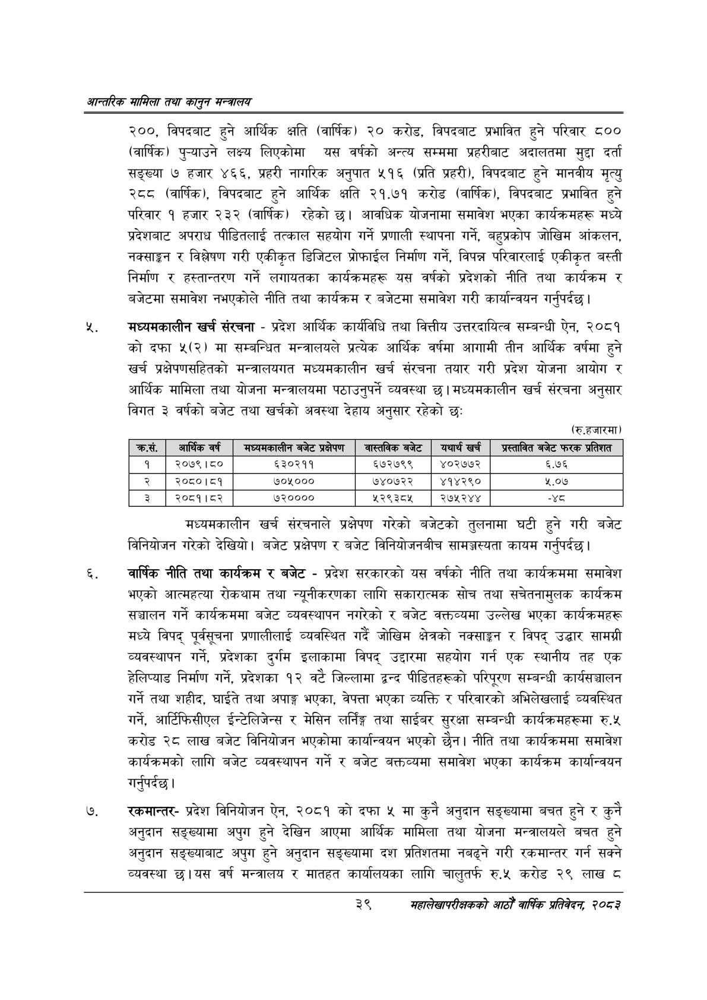

# Page 61 QA

## Rendered page


## Extracted text

```text
आन्तरिक सामिला तथा कालृुन मन्बालय
२००, विपदबाट हुने आर्थिक क्षति (वार्षिक) २० करोड, विपदबाट प्रभावित हुने परिवार ८०० (वार्षिक) पुन्याउने लक्ष्य लिएकोमा यस वर्षको अन्त्य सम्ममा प्रहरीबाट अदालतमा मुद्दा दर्ता सङ्ख्या ७ हजार ४६६, प्रहरी नागरिक अनुपात ५१६ (प्रति प्रहरी), विपदबाट हुने मानवीय मृत्यु रट (वार्षिक), विपदबाट हुने आर्थिक क्षति २१.७१ करोड (वार्षिक), विपदबाट प्रभावित हुने परिवार १ हजार २३२ (वार्षिक) रहेको छ। आवधिक योजनामा समावेश भएका कार्यक्रमहरू मध्ये प्रदेशबाट अपराध पीडितलाई तत्काल सहयोग गर्ने प्रणाली स्थापना गर्ने, बहुप्रकोप जोखिम आंकलन, नक्साङ्कन र विश्लेषण गरी एकीकृत डिजिटल प्रोफाईल निर्माण गर्ने, विपन्न परिवारलाई एकीकृत बस्ती निर्माण र हस्तान्तरण गर्ने लगायतका कार्यक्रमहरू यस वर्षको प्रदेशको नीति तथा कार्यक्रम र बजेटमा समावेश नभएकोले नीति तथा कार्यक्रम र बजेटमा समावेश गरी कार्यान्वयन गर्नुपर्दछ |
मध्यमकालीन खर्च संरचना -प्रदेश आर्थिक कार्यविधि तथा वित्तीय उत्तरदायित्व सम्बन्धी ऐन, २०८१ को दफा ५२(२) मा सम्बन्धित मन्त्रालयले प्रत्येक आर्थिक वर्षमा आगामी तीन आर्थिक वर्षमा हुने खर्च प्रक्षेपणसहितको मन्त्रालयगत मध्यमकालीन खर्च संरचना तयार गरी प्रदेश योजना आयोग र आर्थिक मामिला तथा योजना मन्त्रालयमा पठाउनुपर्ने व्यवस्था | मध्यमकालीन खर्च संरचना अनुसार विगत ३ वर्षको बजेट तथा खर्चको अवस्था देहाय अनुसार रहेको छ:
(रु.हजारमा)
मध्यमकालीन खर्च संरचनाले प्रक्षेपण गरेको बजेटको तुलनामा घटी हुने गरी बजेट विनियोजन गरेको देखियो। बजेट प्रक्षेपण र बजेट विनियोजनबीच सामज्जस्यता कायम गर्नुपर्दछ |
वार्षिक नीति तथा कार्यक्रम र बजेट -प्रदेश सरकारको यस वर्षको नीति तथा कार्यक्रममा समावेश भएको आत्महत्या रोकथाम तथा न्यूनीकरणका लागि सकारात्मक सोच तथा सचेतनामुलक कार्यक्रम सञ्चालन गर्ने कार्यक्रममा बजेट व्यवस्थापन नगरेको र बजेट वक्तव्यमा उल्लेख भएका कार्यक्रमहरू मध्ये विपद्‌ पूर्वसूचना प्रणालीलाई व्यवस्थित गर्दै जोखिम क्षेत्रको नक्साङ्कन र विपद्‌ उद्धार सामग्री व्यवस्थापन गर्ने, प्रदेशका दुर्गम इलाकामा विपद्‌ उद्दारमा सहयोग गर्न एक स्थानीय तह एक हेलिप्याड निर्माण गर्ने, प्रदेशका १२ वटे जिल्लामा द्वन्द पीडितहरूको परिपूरण सम्बन्धी कार्यसञ्चालन गर्ने तथा शहीद, घाईते तथा अपाङ्ग भएका, वेपत्ता भएका व्यक्ति र परिवारको अभिलेखलाई व्यवस्थित गर्ने, आर्टिफिसीएल ईन्टेलिजेन्स र मेसिन लिङग तथा साईबर सुरक्षा सम्बन्धी कार्यक्रमहरूमा रु.५ करोड २८ लाख बजेट विनियोजन भएकोमा कार्यान्वयन भएको छैन। नीति तथा कार्यक्रममा समावेश कार्यक्रमको लागि बजेट व्यवस्थापन गर्ने र बजेट बक्तव्यमा समावेश भएका कार्यक्रम कार्यान्वयन गर्नुपर्दछ।
रकमान्तरप्रदेश विनियोजन ऐन, २०८१ को दफा ५ मा कुनै अनुदान सङ्ख्यामा वचत हुने र कुनै अनुदान सङ्ख्यामा अपुग हुने देखिन आएमा आर्थिक मामिला तथा योजना मन्त्रालयले बचत हुने अनुदान सङ्ख्याबाट अपुग हुने अनुदान सङ्ख्यामा दश प्रतिशतमा नबढ्ने गरी रकमान्तर गर्न सक्ने व्यवस्था छ। यस वर्ष मन्त्रालय र मातहत कार्यालयका लागि चालुतर्फ रु.५ करोड २९ लाख ८
३९
सहालेखापरीक्षकको आठौँ वाषिकि प्रतिवेदन २०८२

|  | आर्थिक वर्ष | नान्पनकासीण बजेट प्रक्षेपण | ना्तनिक बजेट | यथार्थ खर्च | अस्तानित बजेट फरक प्रतिशत |
| --- | --- | --- | --- | --- | --- |
| १ | २०७९।८० | ६३०२११ | ६७२७९९ | ४०२७७२ | ६.७६ |
| २ | २०८०।८१ | ७०५००० | ७४०७२२ | ४१४२९० | ५.०७ |
| रै | २०८१।८२ | ७२०००० | ४५२९३८४५ | २७५२४४ | न्श् |
```

## Flags
- table_page
- medium_quality_table
