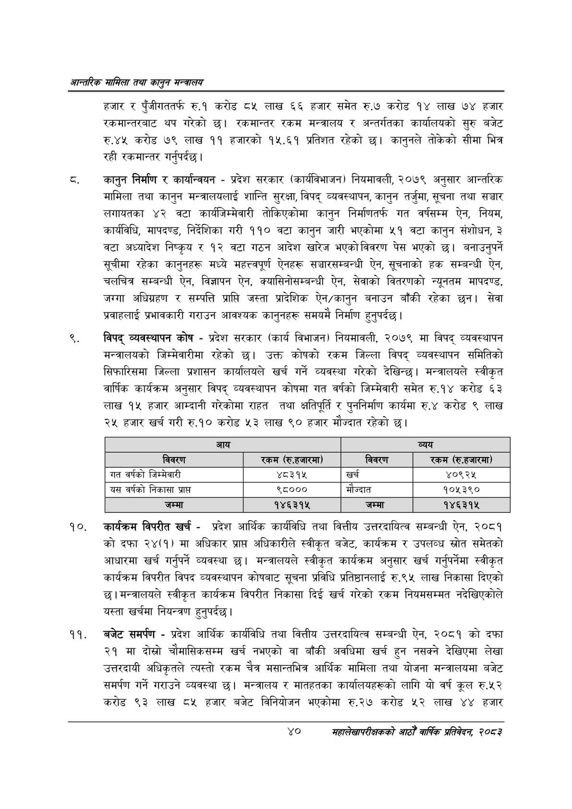

# Page 62 QA

## Rendered page


## Extracted text

```text
आन्तरिक सामिला तथा कालृुन मन्बालय
हजार र पुँजीगततर्फ रु.१ करोड ८५ लाख ६६ हजार समेत रु.७ करोड १४ लाख ७४ हजार रकमान्तरबाट थप गरेको | रकमान्तर रकम मन्त्रालय र अन्तर्गतका कार्यालयको सुरु बजेट रु.४५ करोड ७९ लाख ११ हजारको १५.६१ प्रतिशत रहेको छ। कानुनले तोकेको सीमा भित्र रही रकमान्तर गर्नुपर्दछ |
कानुन निर्माण र कार्यान्वयन -प्रदेश सरकार (कार्यविभाजन) नियमावली, २०७९ अनुसार आन्तरिक मामिला तथा कानुन मन्त्रालयलाई शान्ति सुरक्षा, विपद्‌ व्यवस्थापन, कानुन तर्जुमा, सूचना तथा सञ्चार लगायतका ४२ वटा कार्यजिम्मेवारी तोकिएकोमा कानुन निर्माणतर्फ गत वर्षसम्म ऐन, नियम, कार्यविधि, मापदण्ड, निर्देशिका गरी ११० वटा कानुन जारी भएकोमा ५१ वटा कानुन संशोधन, ३ वटा अध्यादेश निष्कृय र १२ वटा गठन आदेश खारेज भएको विवरण पेस भएको छ। बनाउनुपर्ने सूचीमा रहेका कानुनहरू मध्ये महत्त्वपूर्ण ऐनहरू सञ्चारसम्बन्धी ऐन, सूचनाको हक सम्बन्धी ऐन, चलचित्र सम्बन्धी ऐन, विज्ञापन ऐन, क्यासिनोसम्बन्धी ऐन, सेवाको वितरणको न्यूनतम मापदण्ड, जग्गा अधिग्रहण र सम्पत्ति प्राप्ति जस्ता प्रादेशिक ऐन/कानुन बनाउन बाँकी रहेका छन। सेवा प्रवाहलाई प्रभावकारी गराउन आवश्यक कानुनहरू समयमै निर्माण हुनुपर्दछ |
विपद्‌ व्यवस्थापन कोष -प्रदेश सरकार (कार्य विभाजन) नियमावली, २०७९ मा विपद्‌ व्यवस्थापन मन्त्रालयको जिम्मेवारीमा रहेको छ। उक्त कोषको रकम जिल्ला विपद्‌ व्यवस्थापन समितिको सिफारिसमा जिल्ला प्रशासन कार्यालयले खर्च गर्ने व्यवस्था गरेको देखिन्छ। मन्त्रालयले स्वीकृत वार्षिक कार्यक्रम अनुसार विपद्‌ व्यवस्थापन कोषमा गत वर्षको जिम्मेवारी समेत रु.१४ करोड ६३ लाख १५ हजार आम्दानी गरेकोमा राहत तथा क्षतिपूर्ति र पुननिर्माण कार्यमा रु.४ करोड ९ लाख २५ हजार खर्च गरी रु.१० करोड ५३ लाख ९० हजार मौज्दात रहेको छ।
कार्यक्रम विपरीत खर्च -प्रदेश आर्थिक कार्यविधि तथा वित्तीय उत्तरदायित्व सम्बन्धी ऐन, २०८१ को दफा २४(१) मा अधिकार प्राप्त अधिकारीले स्वीकृत बजेट, कार्यक्रम र उपलव्ध स्रोत समेतको आधारमा खर्च गर्नुपर्ने व्यवस्था | मन्त्रालयले स्वीकृत कार्यक्रम अनुसार खर्च गर्नुपर्नेमा स्वीकृत कार्यक्रम विपरीत विपद व्यवस्थापन कोषबाट सूचना प्रविधि प्रतिष्ठानलाई रु.९५ लाख निकासा दिएको छ। मन्त्रालयले स्वीकृत कार्यक्रम विपरीत निकासा दिई खर्च गरेको रकम नियमसम्मत नदेखिएकोले यस्ता खर्चमा नियन्त्रण हुनुपर्दछ |
बजेट समर्पण -प्रदेश आर्थिक कार्यविधि तथा वित्तीय उत्तरदायित्व सम्बन्धी ऐन, २०८१ को दफा २१ मा दोस्रो चौमासिकसम्म खर्च नभएको वा बाँकी अवधिमा खर्च हुन नसक्ने देखिएमा लेखा उत्तरदायी अधिकृतले त्यस्तो रकम चैत्र मसान्तभित्र आर्थिक मामिला तथा योजना मन्त्रालयमा बजेट समर्पण गर्ने गराउने व्यवस्था छ। मन्त्रालय र मातहतका कार्यालयहरूको लागि यो वर्ष कूल रु.५२ करोड ९३ लाख ८५ हजार बजेट विनियोजन भएकोमा रु.२७ करोड ५२ लाख ४४ हजार
४०
सहालेखापरीक्षकको आठौँ वाषिकि प्रतिवेदन २०८२

| आय |  |  | व्यय |
| --- | --- | --- | --- |
| विवरण | रकम (रु.हजारमा) | विवरण | 'रकम (रु.हजारमा) |
| गत वर्षको जिन्मेवारी | ४८३१५ | खर्च | ४०९२४५ |
| यस वर्षको निकासा प्राप्त | ९८००० | मौज्दात | १०५३९० |
| जम्मा | १४६३१५ | जम्मा | १४६३१५ |
```

## Flags
- table_page
- medium_quality_table
