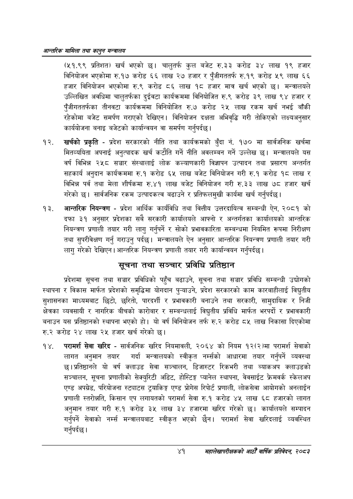

# Page 63 QA

## Rendered page


## Extracted text

```text
आन्तरिक सामिला तथा कालृुन मन्बालय
(५१.९९ प्रतिशत) खर्च भएको छ। चालुतर्फ कुल बजेट €.३३ करोड ३४ लाख १९ हजार विनियोजन भएकोमा रु.१७ करोड ६६ लाख २७ हजार र पुँजीगततर्फ रु.१९ करोड ५९ लाख ६६ हजार विनियोजन भएकोमा रु.९ करोड ८६ लाख १८ हजार मात्र खर्च भएको छ। मन्त्रालयले उल्लिखित अवधिमा चालुतर्फका दुईवटा कार्यक्रममा विनियोजित रु.९ करोड ३९ लाख ९४ हजार र पुँजीगततर्फका तीनवटा कार्यक्रममा विनियोजित रु.७ करोड २५ लाख रकम खर्च नभई बाँकी रहेकोमा बजेट समर्पण गराएको देखिएन। विनियोजन दक्षता अभिवृद्धि गरी तोकिएको लक्ष्यअनुसार कार्ययोजना बनाइ बजेटको कार्यान्वयन वा समर्पण गर्नुपर्दछ |
खर्चको प्रकृति -प्रदेश सरकारको नीति तथा कार्यक्रमको बुँदा नं. १७० मा सार्वजनिक खर्चमा मितव्ययिता अपनाई अनुत्पादक खर्च कटौति गर्ने नीति अवलम्बन गर्ने उल्लेख छ। मन्त्रालयले यस वर्ष विभिन्न २५८ सञ्चार संस्थालाई लोक कल्याणकारी विज्ञापन उत्पादन तथा प्रसारण अन्तर्गत सहकार्य अनुदान कार्यक्रममा रु.१ करोड ६५ लाख बजेट विनियोजन गरी रु.१ करोड १८ लाख र विभिन्न पर्व तथा मेला शीर्षकमा रु.४१ लाख बजेट विनियोजन गरी रु.३३ लाख ७८ हजार खर्च गरेको | सार्वजनिक रकम उत्पादकत्व बढाउने र प्रतिफलमुखी कार्यमा खर्च गर्नुपर्दछ |
आन्तरिक नियन्त्रण -प्रदेश आर्थिक कार्यविधि तथा वित्तीय उत्तरदायित्व सम्बन्धी ऐन, २०८१ को दफा ३१ अनुसार प्रदेशका सबै सरकारी कार्यालयले आफ्नो र अन्तर्गतका कार्यालयको आन्तरिक नियन्त्रण प्रणाली तयार गरी लागु गर्नुपर्ने र सोको प्रभावकारिता सम्बन्धमा नियमित रूपमा निरीक्षण तथा सुपरीवेक्षण गर्नु गराउनु पर्दछ। मन्त्रालयले ऐन अनुसार आन्तरिक नियन्त्रण प्रणाली तयार गरी लागु गरेको देखिएन। आन्तरिक नियन्त्रण प्रणाली तयार गरी कार्यान्वयन गर्नुपर्दछ |
सूचना तथा सञ्चार प्रविधि प्रतिष्ठान
प्रदेशमा सूचना तथा सञ्चार प्रविधिको पहुँच बढाउने, सूचना तथा सञ्चार प्रविधि सम्बन्धी उद्योगको स्थापना र विकास मार्फत प्रदेशको समृद्धिमा योगदान पुन्याउने, प्रदेश सरकारको काम कारबाहीलाई विद्युतीय सुशासनका माध्यमबाट छिटो, छरितो, पारदर्शी र प्रभावकारी बनाउने तथा सरकारी, सामुदायिक र निजी क्षेत्रका व्यवसायी र नागरिक बीचको कारोबार र सम्बन्धलाई विद्युतीय प्रविधि मार्फत भरपर्दो र प्रभावकारी बनाउन यस प्रतिष्ठानको स्थापना भएको हो। यो वर्ष विनियोजन तर्फ रु.२ करोड ८५ लाख निकासा दिएकोमा रु.२ करोड २४ लाख २५ हजार खर्च गरेको छ।
परामर्श सेवा खरिद -सार्वजनिक खरिद नियमावली, २०६४ को नियम १२(२)मा परामर्श सेवाको लागत अनुमान तयार गर्दा मन्त्रालयको स्वीकृत नम्सको आधारमा तयार गर्नुपर्ने व्यवस्था छ। प्रतिष्ठानले यो वर्ष क्लाउड सेवा सञ्चालन, डिजास्टर रिकभरी तथा ब्याकअप क्लाउडको सञ्चालन, सूचना प्रणालीको सेक्युरिटी अडिट, होस्टिङ्ग प्यानेल स्थापना, वेवसाईट फ्रेमवर्क स्केलअप एण्ड अपग्रेड, परियोजना स्ट्याटस ट्रयाकिङ्ग एण्ड प्रोगेस रिपोर्ट प्रणाली, लोकसेवा आयोगको अनलाईन प्रणाली स्तरोन्नति, किसान एप लगायतको परामर्श सेवा रु.१ करोड ४५ लाख ६८ हजारको लागत अनुमान तयार गरी रु.१ करोड ३५ लाख ३४ हजारमा खरिद गरेको छ। कार्यालयले सम्पादन गर्नुपर्ने सेवाको मन्त्रालयबाट स्वीकृत भएको छैन। परामर्श सेवा खरिदलाई व्यवस्थित गर्नुपर्दछ |
४१ सहालेखापरीक्षकको आठौँ वाषिकि प्रतिवेदन २०८२
```

## Flags
- None
