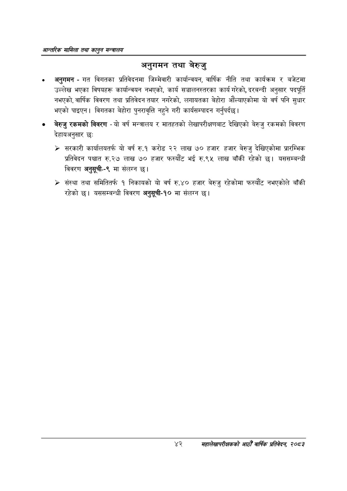

# Page 64 QA

## Rendered page


## Extracted text

```text
आन्तरिक सामिला तथा कालृुन मन्बालय
अनुगमन तथा बेरुजु
० अनुगमन -गत विगतका प्रतिवेदनमा जिम्मेवारी कार्यान्वयन, वार्षिक नीति तथा कार्यक्रम र बजेटमा उल्लेख भएका विषयहरू कार्यान्वयन नभएको, कार्य सञ्चालनस्तरका कार्य गरेको, दरबन्दी अनुसार पदपूर्ति नभएको, वार्षिक विवरण तथा प्रतिवेदन तयार नगरेको, लगायतका बेहोरा औंल्याएकोमा यो वर्ष पनि सुधार भएको पाइएन। विगतका बेहोरा पुनरावृत्ति नहुने गरी कार्यसम्पादन गर्नुपर्दछ |
० बेरुजु रकमको विवरण -यो वर्ष मन्त्रालय र मातहतको लेखापरीक्षणबाट देखिएको बेरुजु रकमको विवरण देहायअनुसार छ:
> सरकारी कार्यालयतर्फ यो वर्ष रु.१ करोड २२ लाख ७० हजार हजार बेरुजु देखिएकोमा प्रारम्भिक प्रतिवेदन पश्चात रु.२७ लाख ७० हजार फस्यौट भई रु.९५ लाख बाँकी रहेको छ। यससम्बन्धी विवरण अनुसूची--९ मा संलग्न
» संस्था तथा समितितर्फ १ निकायको यो वर्ष रु.४० हजार बेरुजु रहेकोमा फस्यौट नभएकोले बाँकी रहेको छ। यससम्बन्धी विवरण अनुसूची-१० मा संलग्न
४२
सहालेखापरीक्षकको आठौँ वाषिकि प्रतिवेदन २०८२
```

## Flags
- None
