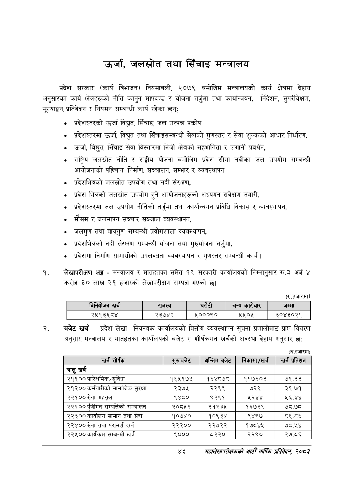

# Page 65 QA

## Rendered page


## Extracted text

```text
उर्जा, जलस्रोत तथा सिँचाइ मन्त्रालय
प्रदेश सरकार (कार्य विभाजन) नियमावली, २०७९ बमोजिम मन्त्रालयको कार्य क्षेत्रमा देहाय अनुसारका कार्य क्षेत्रहरूको नीति कानुन मापदण्ड र योजना तर्जुमा तथा कार्यान्वयन, निर्देशन, सुपरीवेक्षण, मूल्याङ्कन, प्रतिवेदन र नियमन सम्बन्धी कार्य रहेका छन्‌:
० प्रदेशस्तरको उर्जा, विद्युत, सिँचाइ, जल उत्पन्न प्रकोप,
० प्रदेशस्तरमा उर्जा, विद्युत तथा सिँचाइसम्बन्धी सेवाको गुणस्तर र सेवा शुल्कको आधार निर्धारण,
उर्जा, विद्युत सिँचाइ सेवा विस्तारमा निजी क्षेत्रको सहभागिता र लगानी प्रवर्धन,
राष्ट्रिय जलस्रोत नीति र सङ्घीय योजना बमोजिम प्रदेश सीमा नदीका जल उपयोग सम्बन्धी आयोजनाको पहिचान, निर्माण, सञ्चालन, सम्भार र व्यवस्थापन
० प्रदेशभित्रको जलस्रोत उपयोग तथा नदी संरक्षण,
० प्रदेश भित्रको जलस्रोत उपयोग हुने आयोजनाहरूको अध्ययन सर्वेक्षण तयारी,
प्रदेशस्तरमा जल उपयोग नीतिको तर्जुमा तथा कार्यान्वयन प्रविधि विकास र व्यवस्थापन,
० मौसम र जलमापन सञ्चार सञ्जाल व्यवस्थापन,
« जलगुण तथा वायुगुण सम्बन्धी प्रयोगशाला व्यवस्थापन,
० प्रदेशभित्रको नदी संरक्षण सम्बन्धी योजना तथा गुरुयोजना तर्जुमा,
० प्रदेशमा निर्माण सामाग्रीको उपलब्धता व्यवस्थापन र गुणस्तर सम्बन्धी कार्य |
लेखापरीक्षण अङ्ग -मन्त्रालय र मातहतका समेत १९ सरकारी कार्यालयको निम्नानुसार रु.३ अर्ब ४ करोड ३० लाख २१ हजारको लेखापरीक्षण सम्पन्न भएको छ।
(रु.हजारमा)
बजेट खर्च -प्रदेश लेखा नियन्त्रक कार्यालयको वित्तीय व्यवस्थापन सूचना प्रणालीवाट प्राप्त विवरण अनुसार मन्त्रालय र मातहतका कार्यालयको बजेट र शीर्षकगत खर्चको अवस्था देहाय अनुसार छ:
(रु.हजारमा)
४३
सहालेखापरीक्षकको आठौँ वाषिकि प्रतिवेदन २०८२

|  | ननिबोजन खच |  | राजस्व |  |  | अन्य कारेबार | जम्मा |
| --- | --- | --- | --- | --- | --- | --- | --- |
|  | २५१३६८४ |  | २३७४२ | ₹०००९० |  | ४४:१४ | ३०४३०२१ |

| खर्च शीर्षक | छुट्बजट | अन्तिमबजेट | निकासा/खर्च | खर प्रतिशत |
| --- | --- | --- | --- | --- |
| चालु खर्च |  |  |  |  |
| २११०० पारिश्रमिक/सुविधा | १६५१७४५ | १६४८७८ | ११७६०३ | ७१.३३ |
| २१२०० कर्मचारीको सामाजिक सुरक्षा | २३७५ | २२९९ | ७२९ | ३१.७१ |
| २२१०० सेवा महसुल | ९४८० | ९२९१ | ५२४४ | ५६.४४ |
| २२२०० पुँजीगत सम्पत्तिको सञ्चालन | २०८५२ | २१२३४५ | १६७२९ | ७८.७८ |
| २२३०० कार्यालय सामान तथा सेवा | १०७४० | १०९३४ | ९४९७ | ८६.८६ |
| २२४०० सेवा तथा परामर्श खर्च | २२२०० | २२७२२ | १७८४५ | ७८.५४ |
| २२५०० कार्यक्रम सम्बन्धी खर्च | ९००० | ८२२० | २२९० | २७.८६ |
```

## Flags
- table_page
- medium_quality_table
