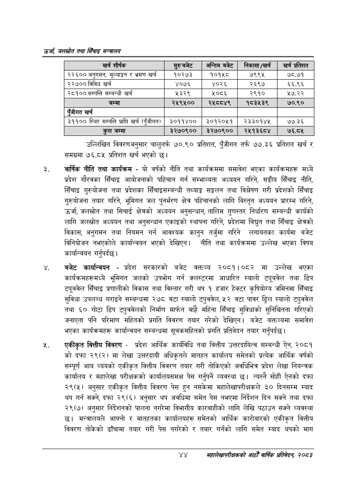

# Page 66 QA

## Rendered page


## Extracted text

```text
उर्जा जलखोत तथा सिँचाइ मन्त्रालय
उल्लिखित विवरणअनुसार चालुतर्फ ७०.९० प्रतिशत, पुँजीगत तर्फ ७७.३६ प्रतिशत खर्च र समग्रमा ७६.८५ प्रतिशत खर्च भएको छ।
वार्षिक नीति तथा कार्यक्रम -यो बर्षको नीति तथा कार्यक्रममा समावेश भएका कार्यक्रमहरू मध्ये प्रदेश गौरवका सिँचाइ आयोजनाको पहिचान गर्न सम्भाव्यता अध्ययन गरिने, सङ्घीय सिँचाइ नीति, सिँचाइ गुरुयोजना तथा प्रदेशका सिँचाइसम्बन्धी तथ्याङ्क सङ्कलन तथा विश्लेषण गरी प्रदेशको सिँचाइ गुरुयोजना तयार गरिने, भूमिगत जल पुनर्भरण क्षेत्र पहिचानको लागि बिस्तृत अध्ययन प्रारम्भ गरिने, उर्जा, जलस्रोत तथा सिचाई क्षेत्रको अध्ययन अनुसन्धान, तालिम गुणस्तर निर्धारण सम्बन्धी कार्यको लागि जलस्रोत अध्ययन तथा अनुसन्धान एकाइको स्थापना गरिने, प्रदेशमा बिद्युत तथा सिँचाइ क्षेत्रको विकास, अनुगमन तथा नियमन गर्न आवश्यक कानुन तर्जुमा गरिने लगायतका कार्यमा बजेट विनियोजन नभएकोले कार्यान्वयन भएको देखिएन। नीति तथा कार्यक्रममा उल्लेख भएका विषय कार्यान्वयन गर्नुपर्दछ |
बजेट कार्यान्वयन -प्रदेश सरकारको बजेट वक्तव्य २०८१।०८२ मा उल्लेख भएका कार्यक्रमहरूमध्ये भुमिगत जलको उपभोग गर्न क्लस्टरमा आधारित स्यालो ट्यूबवेल तथा डिप ट्यूबवेल सिँचाइ प्रणालीको विकास तथा विस्तार गरी थप १ हजार हेक्टर कृषियोग्य जमिनमा सिँचाइ सुविधा उपलब्ध गराइने सम्बन्धमा २७८ वटा स्यालो ट्युववेल, ५२ वटा पावर ड्रिल स्यालो ट्युववेल तथा ६० गोटा डिप ट्युववेलको निर्माण मार्फत बाह्रै महिना सिँचाइ सुविधाको सुनिश्चितता गरिएको जनाएता पनि परिमाण सहितको प्रगति विवरण तयार गरेको देखिएन। बजेट बक्तव्यमा समावेश भएका कार्यक्रमहरू कार्यान्वयन सम्बन्धमा सूचकसहितको प्रगति प्रतिबेदन तयार गर्नुपर्दछ।
एकीकृत वित्तीय विवरण -प्रदेश आर्थिक कार्यविधि तथा वित्तीय उत्तरदायित्व सम्बन्धी ऐन, २०८१ को दफा २९(२) मा लेखा उत्तरदायी अधिकृतले मातहत कार्यालय समेतको प्रत्येक आर्थिक वर्षको सम्पूर्ण आय व्ययको एकीकृत वित्तीय विवरण तयार गरी तोकिएको अवधिभित्र प्रदेश लेखा नियन्त्रक कार्यालय र महालेखा परीक्षकको कार्यालयसमक्ष पेस गर्नुपर्ने व्यवस्था छ। त्यस्तै सोही ऐनको दफा २९(५) अनुसार एकीकृत वित्तीय विवरण पेस हुन नसकेमा महालेखापरीक्षकले ३० दिनसम्म म्याद थप गर्न सक्ने, दफा २९(६) अनुसार थप अवधिमा समेत पेस नभएमा निर्देशन दिन सक्ने तथा दफा २९(७) अनुसार निर्देशनको पालना नगरेमा विभागीय कारबाहीको लागि लेखि पठाउन सक्ने व्यवस्था छ। मन्त्रालयले आफ्नो र मातहतका कार्यालयहरू समेतको आर्थिक कारोबारको एकीकृत वित्तीय विवरण तोकेको ढाँचामा तयार गरी पेस नगरेको र तयार गर्नको लागि समेत म्याद थपको माग
४४
सहालेखापरीक्षकको आठौँ वाषिकि प्रतिवेदन २०८२

| खच शीर्षक | छुए बजेट | अन्तिमबजेट | निकासा/ख्छः | खर्च प्रतिशत |
| --- | --- | --- | --- | --- |
| २२६०० अनुगमन, मूल्याङ्कन र भ्रमण खर्च | १०२७३ | १०१५८ | ७९९५ | ७८.७१ |
| २२७०० विविध खर्च | ४०७६ | ४०२६ | २६९७ | ६६.९६ |
| २८१०० सम्पत्ति सम्बन्धी खर्च | २३२९ | ५०८६ | २९१० | ५७.२२ |
| जम्मा | २४५९५०० | २४५८०४९ | १८३५३९ | ७०.९० |
| एंजीगत खरी |  |  |  |  |
| ३११०० स्थिर सम्पत्ति प्राप्ति खर्च (पुँजीगत) | ३०११४०० | ३०१२०५१ | २३३०१४४५ | ७७.३६ |
| कुल जम्मा | ३२७०९०० | ३२७०९०० | र२५१३६८४ | ७६.८५ |
```

## Flags
- table_page
- medium_quality_table
