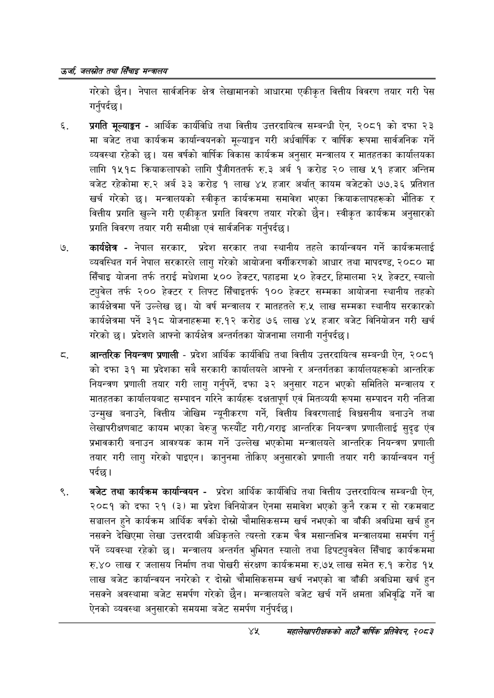

# Page 67 QA

## Rendered page


## Extracted text

```text
उर्जा जलखोत तथा सिँचाइ मन्त्रालय
गरेको छैन। नेपाल सार्वजनिक क्षेत्र लेखामानको आधारमा एकीकृत वित्तीय विवरण तयार गरी पेस गर्नुपर्दछ |
प्रगति मूल्याङ्न -आर्थिक कार्यविधि तथा वित्तीय उत्तरदायित्व सम्बन्धी ऐन, २०८१ को दफा २३ मा बजेट तथा कार्यक्रम कार्यान्वयनको मूल्याङ्कन गरी अर्धवार्षिक र वार्षिक रूपमा सार्वजनिक गर्ने व्यवस्था रहेको | यस वर्षको वार्षिक विकास कार्यक्रम अनुसार मन्त्रालय र मातहतका कार्यालयका लागि १५१८ क्रियाकलापको लागि पुँजीगततर्फ रु.३ अर्ब १ करोड २० लाख ५१ हजार अन्तिम बजेट रहेकोमा रु.२ अर्ब ३३ करोड १ लाख ४५ हजार अर्थात्‌ कायम बजेटको ७७.३६ प्रतिशत खर्च गरेको छ। मन्त्रालयको स्वीकृत कार्यक्रममा समावेश भएका क्रियाकलापहरूको भौतिक र वित्तीय प्रगति खुल्ने गरी एकीकृत प्रगति विवरण तयार गरेको छैन। स्वीकृत कार्यक्रम अनुसारको प्रगति विवरण तयार गरी समीक्षा एवं सार्वजनिक गर्नुपर्दछ |
कार्यक्षेत्र -नेपाल सरकार, प्रदेश सरकार तथा स्थानीय तहले कार्यान्वयन गर्ने कार्यक्रमलाई व्यवस्थित गर्न नेपाल सरकारले लागु गरेको आयोजना वर्गीकरणको आधार तथा मापदण्ड, २०८० मा सिँचाइ योजना तर्फ तराई मधेशमा ५०० हेक्टर, पहाडमा ५० हेक्टर, हिमालमा २५ हेक्टर, स्यालो ट्युवेल तर्फ २०० हेक्टर र लिफ्ट सिँचाइतर्फ १०० हेक्टर सम्मका आयोजना स्थानीय तहको कार्यक्षेत्रमा पर्ने उल्लेख छ। यो वर्ष मन्त्रालय र मातहतले रु.५ लाख सम्मका स्थानीय सरकारको कार्यक्षेत्रमा पर्ने ३१८ योजनाहरूमा रु.१२ करोड ७६ लाख ४५ हजार बजेट विनियोजन गरी खर्च गरेको छ। प्रदेशले आफ्नो कार्यक्षेत्र अन्तर्गतका योजनामा लगानी गर्नुपर्दछ |
ट. आन्तरिक नियन्त्रण प्रणाली -प्रदेश आर्थिक कार्यविधि तथा वित्तीय उत्तरदायित्व सम्बन्धी ऐन, २०८१ को दफा ३१ मा प्रदेशका सबै सरकारी कार्यालयले आफ्नो र अन्तर्गतका कार्यालयहरूको आन्तरिक नियन्त्रण प्रणाली तयार गरी लागु गर्नुपर्ने, दफा ३२ अनुसार गठन भएको समितिले मन्त्रालय र मातहतका कार्यालयबाट सम्पादन गरिने कार्यहरू दक्षतापूर्ण एवं मितव्ययी रूपमा सम्पादन गरी नतिजा उन्मुख बनाउने, वित्तीय जोखिम न्यूनीकरण गर्ने, वित्तीय विवरणलाई विश्वसनीय बनाउने तथा लेखापरीक्षणबाट कायम भएका बेरुजु फस्यौट गरी/गराइ आन्तरिक नियन्त्रण प्रणालीलाई सुदृढ एंव प्रभावकारी बनाउन आवश्यक काम गर्ने उल्लेख भएकोमा मन्त्रालयले आन्तरिक नियन्त्रण प्रणाली तयार गरी लागु गरेको पाइएन। कानुनमा तोकिए अनुसारको प्रणाली तयार गरी कार्यान्वयन गर्नु पर्दछ।
बजेट तथा कार्यक्रम कार्यान्वयन -प्रदेश आर्थिक कार्यविधि तथा वित्तीय उत्तरदायित्व सम्बन्धी ऐन, २०८१ को दफा २१ (३) मा प्रदेश विनियोजन ऐनमा समावेश भएको कुनै रकम र सो रकमबाट सञ्चालन हुने कार्यक्रम आर्थिक वर्षको दोस्रो चौमासिकसम्म खर्च नभएको वा बाँकी अवधिमा खर्च हुन नसक्ने देखिएमा लेखा उत्तरदायी अधिकृतले त्यस्तो रकम चैत्र मसान्तभित्र मन्त्रालयमा समर्पण गर्नु पर्ने व्यवस्था रहेको छ। मन्त्रालय अन्तर्गत भुभिगत स्यालो तथा डिपट्युववेल सिँचाइ कार्यक्रममा रु.४० लाख र जलासय निर्माण तथा पोखरी संरक्षण कार्यक्रममा रु.७५ लाख समेत रु.१ करोड १५ लाख बजेट कार्यान्वयन नगरेको र दोस्रो चौमासिकसम्म खर्च नभएको वा बाँकी अवधिमा खर्च हुन नसक्ने अवस्थामा बजेट समर्पण गरेको छैन। मन्त्रालयले बजेट खर्च गर्ने क्षमता अभिवृद्धि गर्ने वा ऐनको व्यवस्था अनुसारको समयमा बजेट समर्पण गर्नुपर्दछ।
यश
सहालेखापरीक्षकको आठौँ वाषिकि प्रतिवेदन २०८२
```

## Flags
- None
