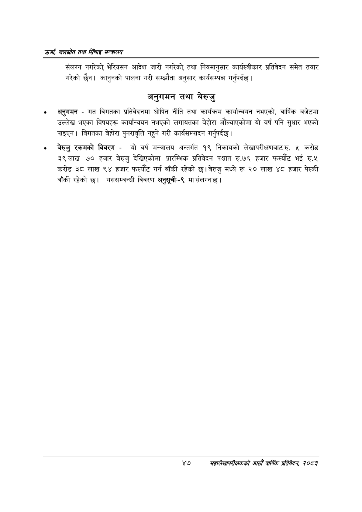

# Page 69 QA

## Rendered page


## Extracted text

```text
उर्जा जलखोत तथा सिँचाइ मन्त्रालय
संलग्न नगरेको, भेरियसन आदेश जारी नगरेको, तथा नियमानुसार कार्यस्वीकार प्रतिवेदन समेत तयार गरेको छैन। कानुनको पालना गरी सम्झौता अनुसार कार्यसम्पन्न गर्नुपर्दछ |
अनुगमन तथा बेरुजु
अनुगमन -गत विगतका प्रतिवेदनमा घोषित नीति तथा कार्यक्रम कार्यान्वयन नभएको, वार्षिक बजेटमा उल्लेख भएका विषयहरू कार्यान्वयन नभएको लगायतका बेहोरा औंल्याएकोमा यो वर्ष पनि सुधार भएको पाइएन। विगतका बेहोरा पुनरावृत्ति नहुने गरी कार्यसम्पादन गर्नुपर्दछ |
बेरुजु रकमको विवरण -यो वर्ष मन्त्रालय अन्तर्गत १९ निकायको लेखापरीक्षणबाटरु, ५ करोड ३९ लाख ७० हजार बेरुजु देखिएकोमा प्रारम्भिक प्रतिवेदन पश्चात रु.७६ हजार फस्यौट भई रु.५ करोड ३८ लाख ९४ हजार फस्यौट गर्न बाँकी रहेको छ। बेरुजु मध्ये रू २० लाख ४८ हजार पेस्की बाँकी रहेको छ। यससम्बन्धी विवरण अनुसूची--९ मा संलग्न छ।
४७
सहालेखापरीक्षकको आठौँ वाषिकि प्रतिवेदन २०८२
```

## Flags
- None
