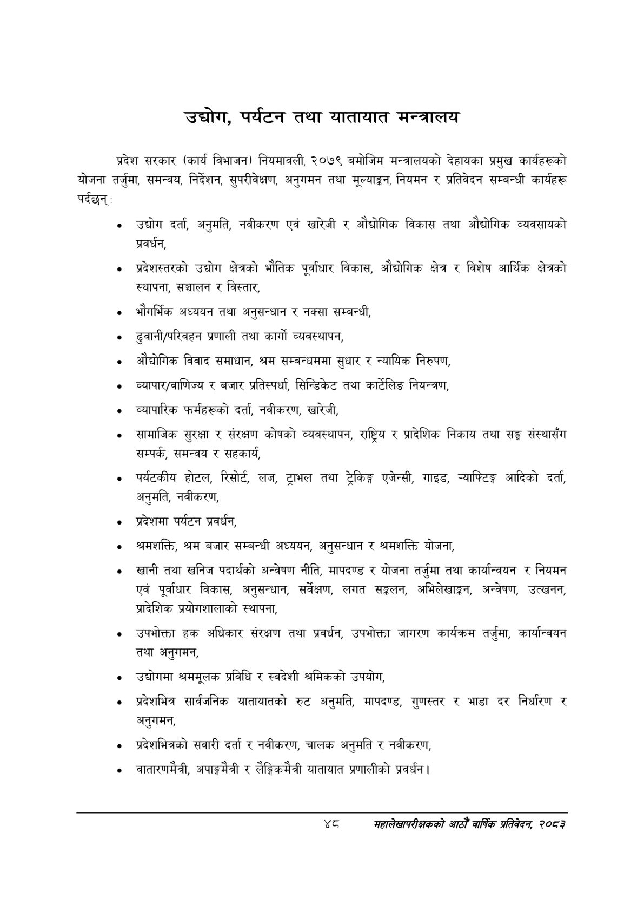

# Page 70 QA

## Rendered page


## Extracted text

```text
उद्योग, पर्यटन तथा यातायात मन्त्रालय
प्रदेश सरकार (कार्य विभाजन) नियमावली, २०७९ बमोजिम मन्त्रालयको देहायका प्रमुख कार्यहरूको योजना तर्जुमा, समन्वय, निर्देशन, सुपरीवेक्षण, अनुगमन तथा मूल्याङ्गन, नियमन र प्रतिवेदन सम्बन्धी कार्यहरू
उद्योग दर्ता, अनुमति, नवीकरण एवं खारेजी र औद्योगिक विकास तथा औद्योगिक व्यवसायको प्रवर्धन,
प्रदेशस्तरको उद्योग क्षेत्रको भौतिक पूर्वाधार विकास, औद्योगिक क्षेत्र र विशेष आर्थिक क्षेत्रको स्थापना, सञ्चालन र विस्तार,
भौगर्भिक अध्ययन तथा अनुसन्धान र नक्सा सम्बन्धी,
ढुवानी/परिवहन प्रणाली तथा कार्गो व्यवस्थापन,
औद्योगिक विवाद समाधान, श्रम सम्बन्धममा सुधार र न्यायिक निरुपण,
व्यापार/वाणिज्य र बजार प्रतिस्पर्धा, सिन्डिकेट तथा कार्टेलिङ नियन्त्रण,
व्यापारिक फर्महरूको दर्ता, नवीकरण, खारेजी,
सामाजिक सुरक्षा र संरक्षण कोषको व्यवस्थापन, राष्ट्रिय र प्रादेशिक निकाय तथा सङ्ग संस्थासँग सम्पर्क, समन्वय र सहकार्य,
पर्यटकीय होटल, रिसोर्ट. लज, ट्राभल तथा ट्रेकिङ्ग एजेन्सी, गाइड, न्याफ्टिङ्ग आदिको दर्ता, अनुमति, नवीकरण,
प्रदेशमा पर्यटन प्रवर्धन,
श्रमशक्ति, श्रम बजार सम्बन्धी अध्ययन, अनुसन्धान र श्रमशक्ति योजना,
खानी तथा खनिज पदार्थको अन्वेषण नीति, मापदण्ड र योजना तर्जुमा तथा कार्यान्वयन र नियमन एवं पूर्वाधार विकास, अनुसन्धान, सर्वेक्षण, लगत सङ्कलन, अभिलेखाङ्कन, अन्वेषण, उत्खनन, प्रादेशिक प्रयोगशालाको स्थापना,
उपभोक्ता हक अधिकार संरक्षण तथा प्रवर्धन, उपभोक्ता जागरण कार्यक्रम तर्जुमा, कार्यान्वयन तथा अनुगमन,
उद्योगमा श्रममूलक प्रविधि र स्वदेशी श्रमिकको उपयोग,
प्रदेशभित्र सार्वजनिक यातायातको रुट अनुमति, मापदण्ड, गुणस्तर र भाडा दर निर्धारण र अनुगमन,
प्रदेशभित्रको सवारी दर्ता र नवीकरण, चालक अनुमति र नवीकरण,
वातारणमैत्री, अपाङ्गमैत्री र लैङ्गिकमैत्री यातायात प्रणालीको प्रवर्धन |
शव
सहालेखापरीक्षकको आठौँ वाषिकि प्रतिवेदन २०८२
```

## Flags
- None
