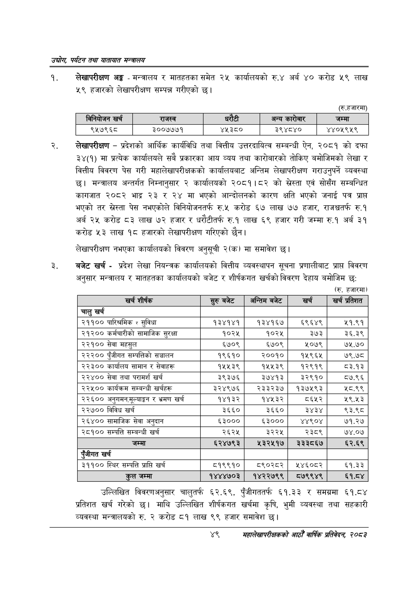

# Page 71 QA

## Rendered page


## Extracted text

```text
उद्योग पर्यटन तथा यातायात सन्चबालय
लेखापरीक्षण अङ्ग -मन्त्रालय र मातहतका समेत २४५ कार्यालयको € अर्ब ४० करोड ५९ लाख ४९ हजारको लेखापरीक्षण सम्पन्न गरीएको छ।
(रु.हजारमा)
लेखापरीक्षण -प्रदेशको आर्थिक कार्यविधि तथा वित्तीय उत्तरदायित्व सम्बन्धी ऐन, २०८१ को दफा ३४(१) मा प्रत्येक कार्यालयले सबै प्रकारका आय व्यय तथा कारोबारको तोकिए बमोजिमको लेखा र वित्तीय विवरण पेस गरी महालेखापरीक्षकको कार्यालयबाट अन्तिम लेखापरीक्षण गराउनुपर्ने व्यवस्था छ। मन्त्रालय अन्तर्गत निम्नानुसार २ कार्यालयको २०८१।८२ को स्रेस्ता एवं सोसँग सम्बन्धित कागजात २०८२ भाद्र २३ र २४ मा भएको आन्दोलनको कारण क्षति भएको जनाई पत्र प्राप्त भएको तर स्रेस्ता पेस नभएकोले विनियोजनतर्फ रु.५ करोड ६७ लाख ७७ हजार, राजश्वतर्फ रु.१ अर्ब २५ करोड ८३ लाख ७२ हजार र धरौटीतर्फ रु.१ लाख ६९ हजार गरी जम्मा रु.१ अर्ब ३९ करोड ५३ लाख १८ हजारको लेखापरीक्षण गरिएको छैन।
लेखापरीक्षण नभएका कार्यालयको विवरण अनुसूची २(क) मा समावेश छ।
बजेट खर्च -प्रदेश लेखा नियन्त्रक कार्यालयको वित्तीय व्यवस्थापन सूचना प्रणालीबाट प्राप्त विवरण अनुसार मन्त्रालय र मातहतका कार्यालयको बजेट र शीर्षकगत खर्चको विवरण देहाय बमोजिम छः:
(रु. हजारमा)
उल्लिखित विवरणअनुसार चालुतर्फ ६२.६९, पुँजीगततर्फ ६१.३३ र समग्रमा ६१.८४ प्रतिशत खर्च गरेको छ। माथि उल्लिखित शीर्षकगत खर्चमा कृषि, भुमी व्यवस्था तथा सहकारी व्यवस्था मन्त्रालयको रु. २ करोड ८१ लाख ९९ हजार समावेश छ।
४९
सहालेखापरीक्षकको आठौँ वाषिकि प्रतिवेदन २०८२

|  |  | बिनियोजन खरी |  | राजस्व |  |  | अन्य कारोबार | जम्मा |
| --- | --- | --- | --- | --- | --- | --- | --- | --- |
|  |  | ९५७९६८ |  | ३००७७७१ | ४५३८० |  | ३९४८४० | ४४०५९५९ |

| खर्च शीर्षक | सुरु बबेट | अन्तिम बजेट | खरी | खर्च प्रतिशत |
| --- | --- | --- | --- | --- |
| चालु खर्च |  |  |  |  |
| २११०० पारिश्रमिक र सुविधा | १३४१४१ | १३४१६७ | ६९६४९ | २५१.९१ |
| २१२०० कर्मचारीको सामाजिक सुरक्षा | १०२५ | १०२५ | ३७३ | ३६.३९ |
| २२१०० सेवा महसुल | ६७०९ | ६७०९ | ४०७९ |  |
| २३३०० एंजीगत कषम्पततिको सञ्चालन | १९६१० | २००१० | १५९६४ | ७९.७८ |
| २२३०० कार्वालय सामान र सेवाहरू | १५५३९ | १५५३९ | १२९१९ | ८३.१३ |
| २२४०० सेवा तथा परामर्श खर्च | ३९३७६ | ३७४१३ | ३२९१० | ८७.९६ |
| २२५०० कार्यक्रम सम्बन्धी खर्चहरू | ३२४९७६ | २३३२३७ | १३७५९३ | २८.९९ |
| २२६०० र भ्रमण खर्च | १४१३२ | १४५३२ | ८६५२ | २९.४३ |
| २२७०० विविध खर्च | ३६६० | ३६६० | ३४३४ | ९३.९८ |
| २६४०० सानाजिक सेवा अनुदान | ६३००० | ६३००० | ४४९०४ | ७१.२७ |
| २८१०० सम्पत्ति सम्बन्धी खर्च | २६२५ | ३२२५ | २३८९ | ७४.०७ |
| जम्मा | ६२४७९३ | ५३२५१७ | ३३३८६७ | ६२.६९ |
| एंजीगत खर्च |  |  |  |  |
| ३११०० स्थिर सम्पत्ति प्राप्ति खर्च | ८१९९१० | व९०२८२ | १४६०८२ | ६१.३३ |
| जम्मा | १४४४७०३ | १४२२७९९ | ८०७९९४९ | ६१.८४ |
```

## Flags
- table_page
- medium_quality_table
