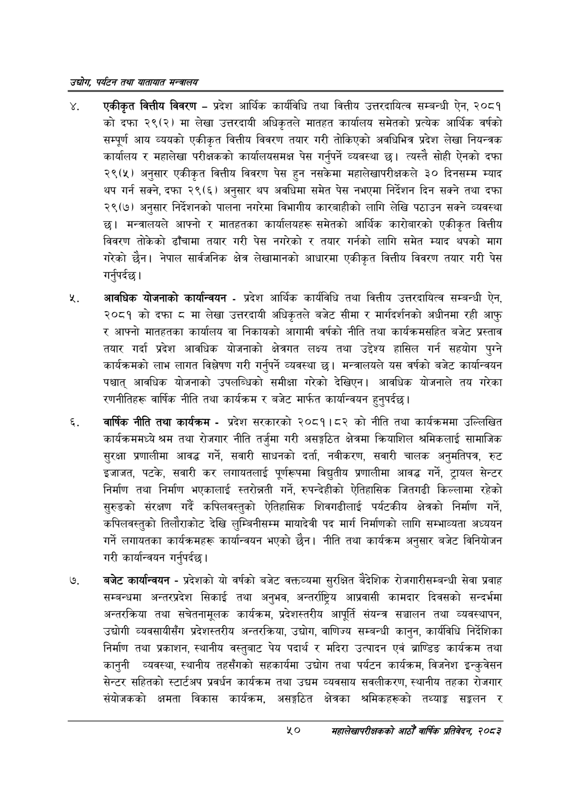

# Page 72 QA

## Rendered page


## Extracted text

```text
उद्योग पर्यटन तथा यातायात सन्चबालय
. एकीकृत वित्तीय विवरण -प्रदेश आर्थिक कार्यविधि तथा वित्तीय उत्तरदायित्व सम्बन्धी ऐन, २०८१ को दफा २९(२) मा लेखा उत्तरदायी अधिकृतले मातहत कार्यालय समेतको प्रत्येक आर्थिक वर्षको सम्पूर्ण आय व्ययको एकीकृत वित्तीय विवरण तयार गरी तोकिएको अवधिभित्र प्रदेश लेखा नियन्त्रक कार्यालय र महालेखा परीक्षकको कार्यालयसमक्ष पेस गर्नुपर्ने व्यवस्था | त्यस्तै सोही ऐनको दफा २९(५) अनुसार एकीकृत वित्तीय विवरण पेस हुन नसकेमा महालेखापरीक्षकले ३० दिनसम्म म्याद थप गर्न सक्ने, दफा २९(६) अनुसार थप अवधिमा समेत पेस नभएमा निर्देशन दिन सक्ने तथा दफा २९(७) अनुसार निर्देशनको पालना नगरेमा विभागीय कारबाहीको लागि लेखि पठाउन सक्ने व्यवस्था छ। मन्त्रालयले आफ्नो र मातहतका कार्यालयहरू समेतको आर्थिक कारोबारको एकीकृत वित्तीय विवरण तोकेको ढाँचामा तयार गरी पेस नगरेको र तयार गर्नको लागि समेत म्याद थपको माग गरेको छैन। नेपाल सार्वजनिक क्षेत्र लेखामानको आधारमा एकीकृत वित्तीय विवरण तयार गरी पेस गर्नुपर्दछ |
आवधिक योजनाको कार्यान्वयन -प्रदेश आर्थिक कार्यविधि तथा वित्तीय उत्तरदायित्व सम्बन्धी ऐन, २०८१ को दफा ८ मा लेखा उत्तरदायी अधिकृतले बजेट सीमा र मार्गदर्शनको अधीनमा रही आफु र आफ्नो मातहतका कार्यालय वा निकायको आगामी वर्षको नीति तथा कार्यक्रमसहित बजेट प्रस्ताव तयार गर्दा प्रदेश आवधिक योजनाको क्षेत्रगत लक्ष्य तथा उद्देश्य हासिल गर्न सहयोग पुग्ने कार्यक्रमको लाभ लागत विश्लेषण गरी गर्नुपर्ने व्यवस्था छ। मन्त्रालयले यस वर्षको बजेट कार्यान्वयन पश्चात्‌ आवधिक योजनाको उपलब्धिको समीक्षा गरेको देखिएन। आवधिक योजनाले तय गरेका रणनीतिहरू वार्षिक नीति तथा कार्यक्रम र बजेट मार्फत कार्यान्वयन हुनुपर्दछ |
वार्षिक नीति तथा कार्यक्रम -प्रदेश सरकारको २०८१।८२ को नीति तथा कार्यक्रममा उल्लिखित कार्यक्रममध्ये श्रम तथा रोजगार नीति तर्जुमा गरी असङ्गठित क्षेत्रमा क्रियाशिल श्रमिकलाई सामाजिक सुरक्षा प्रणालीमा आवद्ध गर्ने, सवारी साधनको दर्ता, नवीकरण, सवारी चालक अनुमतिपत्र, रुट इजाजत, पटके, सवारी कर लगायतलाई पूर्णरूपमा विद्युतीय प्रणालीमा आवद्ध गर्ने, ट्रायल सेन्टर निर्माण तथा निर्माण भएकालाई स्तरोन्नती गर्ने, रुपन्देहीको ऐतिहासिक जितगढी किल्लामा रहेको सुरुङको संरक्षण गर्दै कपिलवस्तुको ऐतिहासिक शिवगढीलाई पर्यटकीय क्षेत्रको निर्माण गर्ने, कपिलवस्तुको तिलौराकोट देखि लुम्बिनीसम्म मायादेवी पद मार्ग निर्माणको लागि सम्भाव्यता अध्ययन गर्ने लगायतका कार्यक्रमहरू कार्यान्वयन भएको छैन। नीति तथा कार्यक्रम अनुसार बजेट विनियोजन गरी कार्यान्वयन गर्नुपर्दछ |
बजेट कार्यान्वयन -प्रदेशको यो वर्षको बजेट वक्तव्यमा सुरक्षित बैदेशिक रोजगारीसम्बन्धी सेवा प्रवाह सम्बन्धमा अन्तरप्रदेश सिकाई तथा अनुभव, अन्तर्राष्ट्रिय आप्रवासी कामदार दिवसको सन्दर्भमा अन्तरक्रिया तथा सचेतनामूलक कार्यक्रम, प्रदेशस्तरीय आपूर्ति संयन्त्र सञ्चालन तथा व्यवस्थापन, उद्योगी व्यवसायीसँग प्रदेशस्तरीय अन्तरक्रिया, उद्योग, वाणिज्य सम्बन्धी कानुन, कार्यविधि निर्देशिका निर्माण तथा प्रकाशन, स्थानीय वस्तुबाट पेय पदार्थ र मदिरा उत्पादन एवं ब्राण्डिङ कार्यक्रम तथा कानुनी व्यवस्था, स्थानीय तहसँगको सहकार्यमा उद्योग तथा पर्यटन कार्यक्रम, विजनेश इन्कुवेसन सेन्टर सहितको स्टार्टअप प्रवर्धन कार्यक्रम तथा उद्यम व्यवसाय सवलीकरण, स्थानीय तहका रोजगार संयोजकको क्षमता विकास कार्यक्रम, असङ्गठित क्षेत्रका श्रमिकहरूको तथ्याङ्ग सङ्घलन र
५० सहालेखापरीक्षकको आठौँ वाषिकि प्रतिवेदन २०८२
```

## Flags
- None
