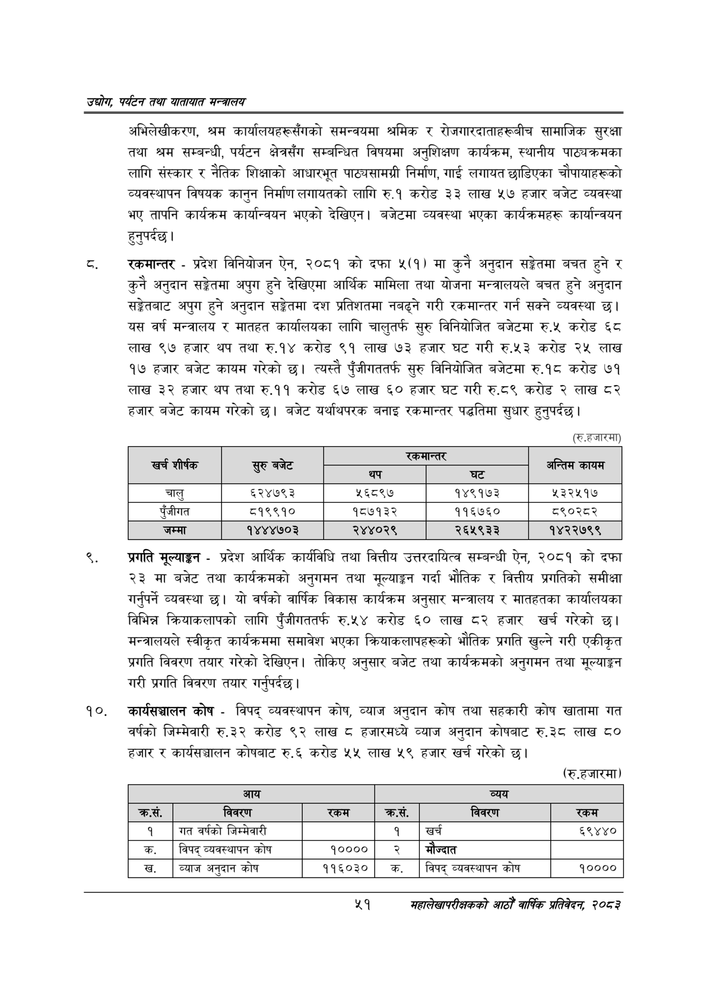

# Page 73 QA

## Rendered page


## Extracted text

```text
उद्योग पर्यटन तथा यातायात सन्चबालय
अभिलेखीकरण, श्रम कार्यालयहरूसँगको समन्वयमा श्रमिक र रोजगारदाताहरूबीच सामाजिक सुरक्षा तथा श्रम सम्बन्धी, पर्यटन क्षेत्रसँग सम्बन्धित विषयमा अनुशिक्षण कार्यक्रम, स्थानीय पाट्यक्रमका लागि संस्कार र नैतिक शिक्षाको आधारभूत पाठ्यसामग्री निर्माण, गाई लगायत छाडिएका चौपायाहरूको व्यवस्थापन विषयक कानुन निर्माण लगायतको लागि रु.१ करोड ३३ लाख ५७ हजार बजेट व्यवस्था भए तापनि कार्यक्रम कार्यान्वयन भएको देखिएन। बजेटमा व्यवस्था भएका कार्यक्रमहरू कार्यान्वयन हुनुपर्दछ।
रकमान्तर -प्रदेश विनियोजन ऐन, २०८१ को दफा ५(१) मा कुनै अनुदान सङ्गेतमा बचत हुने र कुनै अनुदान सङ्गेतमा अपुग हुने देखिएमा आर्थिक मामिला तथा योजना मन्त्रालयले बचत हुने अनुदान सङ्गेतबाट अपुग हुने अनुदान सङ्गेतमा दश प्रतिशतमा नबढ्ने गरी रकमान्तर गर्न सक्ने व्यवस्था | यस वर्ष मन्त्रालय र मातहत कार्यालयका लागि चालुतर्फ सुरु विनियोजित बजेटमा रु.५ करोड ६८ लाख ९७ हजार थप तथा रु.१४ करोड ९१ लाख ७३ हजार घट गरी रु.५३ करोड २५ लाख १७ हजार बजेट कायम गरेको | त्यस्तै पुँजीगततर्फ सुरु विनियोजित बजेटमा रु.१८ करोड ७१ लाख ३२ हजार थप तथा रु.११ करोड ६७ लाख ६० हजार घट गरी रु.८९ करोड २ लाख ८२ हजार बजेट कायम गरेको छ। बजेट यर्थाथपरक बनाइ रकमान्तर पद्धतिमा सुधार हुनुपर्दछ |
(रु.हजारमा)
प्रगति मूल्याङ्कन -प्रदेश आर्थिक कार्यविधि तथा वित्तीय उत्तरदायित्व सम्बन्धी ऐन, २०८१ को दफा २३ मा बजेट तथा कार्यक्रमको अनुगमन तथा मूल्याङ्कन गर्दा भौतिक र वित्तीय प्रगतिको समीक्षा गर्नुपर्ने व्यवस्था छ। यो वर्षको वार्षिक विकास कार्यक्रम अनुसार मन्त्रालय र मातहतका कार्यालयका विभिन्न क्रियाकलापको लागि पुँजीगततर्फ रु.५४ करोड ६० लाख ८२ हजार खर्च गरेको छ। मन्त्रालयले स्वीकृत कार्यक्रममा समावेश भएका क्रियाकलापहरूको भौतिक प्रगति खुल्ने गरी एकीकृत प्रगति विवरण तयार गरेको देखिएन। तोकिए अनुसार बजेट तथा कार्यक्रमको अनुगमन तथा मूल्याङ्कन गरी प्रगति विवरण तयार गर्नुपर्दछ |
कार्यसञ्चालन कोष -विपद्‌ व्यवस्थापन कोष, व्याज अनुदान कोष तथा सहकारी कोष खातामा गत वर्षको जिम्मेवारी रु.३२ करोड ९२ लाख हजारमध्ये व्याज अनुदान कोषबाट रु.३८ लाख ८० हजार र कार्यसञ्चालन कोषबाट रु.६ करोड ५५ लाख ५९ हजार खर्च गरेको छ।
(रु.हजारमा)
२१
सहालेखापरीक्षकको आठौँ वाषिकि प्रतिवेदन २०८२

| खर्च शीर्षक | बजेट |  | द्कनान्तर | अन्तिम |
| --- | --- | --- | --- | --- |
|  | सुरु |  |  | कायम |
| चालु | ६२४७९३ | ५६८९७ | १४९१७३ | २३२५१७ |
| पुँजीगत | ८५१९९१० | १८७१३२ | ११६७६० | ८९०२८२ |
| जम्मा | १४४४७०३ | २४४०२९ | २६५९३३ | १४२२७९९ |

|  | आय |  |  | व्यय |  |
| --- | --- | --- | --- | --- | --- |
| कस. | विवरण | रकम | क्रस. | विवरण | रकम |
| १ | गत वर्षको जिन्मेवारी |  | १ | खर्च | ६९४४० |
| क. | विपद्‌ व्यवस्थापन कोष | १०००० | २ | मंज्दात |  |
|  | व्याज अनुदान कोष | ११६०३० | क. | विपद्‌ व्यवस्थापन कोष | १०००० |
```

## Flags
- table_page
- medium_quality_table
