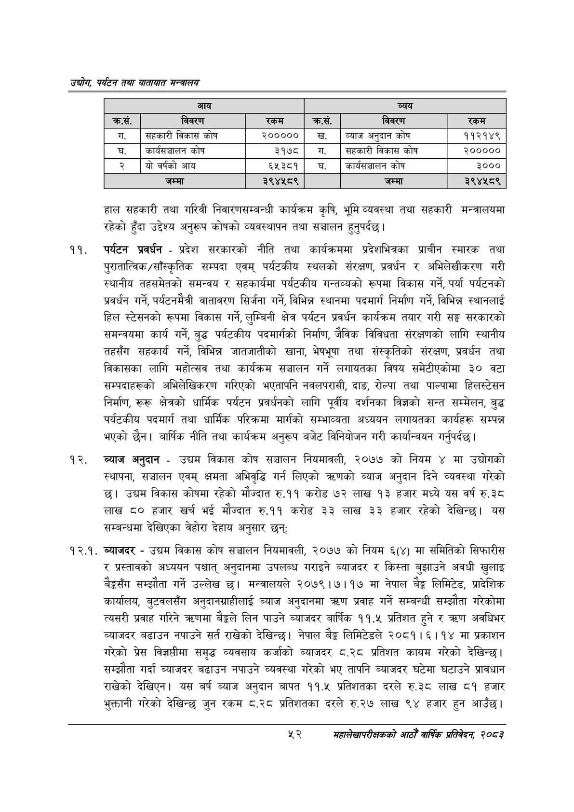

# Page 74 QA

## Rendered page


## Extracted text

```text
उद्योग पर्यटन तथा यातायात सन्चबालय
हाल सहकारी तथा गरिवी निवारणसम्बन्धी कार्यक्रम कृषि, भूमि व्यवस्था तथा सहकारी मन्त्रालयमा रहेको हुँदा उद्देश्य अनुरूप कोषको व्यवस्थापन तथा सञ्चालन हुनुपर्दछ |
पर्यटन प्रवर्धन -प्रदेश सरकारको नीति तथा कार्यक्रममा प्रदेशभित्रका प्राचीन स्मारक तथा पुरातात्विक/साँस्कृतिक सम्पदा एवम्‌ पर्यटकीय स्थलको संरक्षण, प्रवर्धन र अभिलेखीकरण गरी स्थानीय तहसमेतको समन्वय र सहकार्यमा पर्यटकीय गन्तव्यको रूपमा विकास गर्ने, पर्या पर्यटनको प्रवर्धन गर्ने, पर्यटनमैत्री वातावरण सिर्जना गर्ने, विभिन्न स्थानमा पदमार्ग निर्माण गर्ने, विभिन्न स्थानलाई हिल स्टेसनको रूपमा विकास गर्ने, लुम्बिनी क्षेत्र पर्यटन प्रवर्धन कार्यक्रम तयार गरी सङ्घ सरकारको समन्वयमा कार्य गर्ने, बुद्ध पर्यटकीय पदमार्गको निर्माण, जैविक विविधता संरक्षणको लागि स्थानीय तहसँग सहकार्य गर्ने, विभिन्न जातजातीको खाना, भेषभूषा तथा संस्कृतिको संरक्षण, प्रवर्धन तथा विकासका लागि महोत्सव तथा कार्यक्रम सञ्चालन गर्ने लगायतका विषय समेटीएकोमा ३० वटा सम्पदाहरूको अभिलेखिकरण गरिएको भएतापनि नवलपरासी, दाङ, रोल्पा तथा पाल्पामा हिलस्टेसन निर्माण, रूरू क्षेत्रको धार्मिक पर्यटन प्रवर्धनको लागि पूर्वीय दर्शनका विज्ञको सन्त सम्मेलन, बुद्ध पर्यटकीय पदमार्ग तथा धार्मिक परिक्रमा मार्गको सम्भाव्यता अध्ययन लगायतका कार्यहरू सम्पन्न भएको | बार्षिक नीति तथा कार्यक्रम अनुरूप बजेट विनियोजन गरी कार्यान्वयन गर्नुपर्दछ |
ब्याज अनुदान -उद्यम विकास कोष सञ्चालन नियमावली, २०७७ को नियम ४ मा उद्योगको स्थापना, सञ्चालन एवम्‌ क्षमता अभिवृद्धि गर्न लिएको त्रणको ब्याज अनुदान दिने व्यवस्था गरेको छ। उद्यम विकास कोषमा रहेको मौज्दात रु.११ करोड ७२ लाख १३ हजार मध्ये यस वर्ष रु.३८ लाख ८० हजार खर्च भई मौज्दात रु.११ करोड ३३ लाख ३३ हजार रहेको देखिन्छु। यस सम्बन्धमा देखिएका वेहोरा देहाय अनुसार छन्‌;
१२.१. ब्याजदर -उद्यम विकास कोष सञ्चालन नियमावली, २०७७ को नियम ६(४) मा समितिको सिफारीस र प्रस्तावको अध्ययन पश्चात्‌ अनुदानमा उपलब्ध गराइने ब्याजदर र किस्ता बुझाउने अवधी खुलाइ सम्झौता गर्ने उल्लेख छ। मन्त्रालयले २०७९।७।१७ मा नेपाल बेङ्ग लिमिटेड, प्रादेशिक कार्यालय, बुटवलसँग अनुदानग्राहीलाई ब्याज अनुदानमा त्रण प्रवाह गर्ने सम्बन्धी सम्झौता गरेकोमा त्यसरी प्रवाह गरिने त्रहणमा बैङ्कले लिन पाउने व्याजदर बार्षिक ११.५ प्रतिशत हुने र त्रहण अवधिभर ब्याजदर बढाउन नपाउने सर्त राखेको देखिन्छ। नेपाल बेङ्ग लिमिटेडले २०८१। ६११४ मा प्रकाशन गरेको प्रेस विज्ञप्तीमा समृद्ध व्यवसाय कर्जाको व्याजदर ८.२८ प्रतिशत कायम गरेको देखिन्छ। सम्झौता गर्दा ब्याजदर बढाउन नपाउने व्यवस्था गरेको भए तापनि ब्याजदर घटेमा घटाउने प्रावधान राखेको देखिएन। यस बर्ष ब्याज अनुदान बापत ११.५ प्रतिशतका दरले रु.३८ लाख ८१ हजार भुक्तानी गरेको देखिन्छ जुन रकम ८.२८ प्रतिशतका दरले रु.२७ लाख ९४ हजार हुन आउँछ।
सहालेखापरीक्षकको आठौँ वाषिकि प्रतिवेदन २०८२

|  | आय |  |  | व्यय |  |
| --- | --- | --- | --- | --- | --- |
| क्रस. | विवरण | रकम | क्रस. | विवरण | रकम |
| ग. | सहकारी विकास कोष | २००००० |  | व्याज अनुदान कोष | ११२१४९ |
| घ. | कार्यसञ्चालन कोष | ३१७८ | ग. | सहकारी विकास कोष | २००००० |
| २ | योवर्षको आय | ६५३८१ | घ. | कार्यसञ्चालन कोष | ३००० |
|  | जम्मा | २९४५८९ |  | जम्मा | २९४४५८९ |
```

## Flags
- table_page
- medium_quality_table
