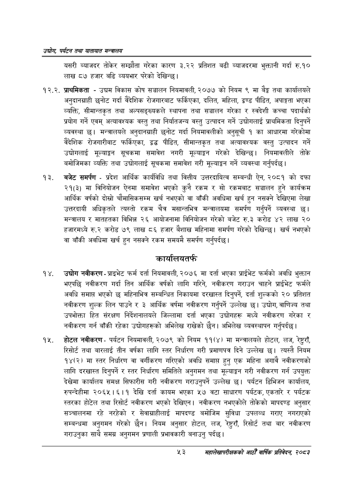

# Page 75 QA

## Rendered page


## Extracted text

```text
उद्योग पर्यटन तथा यातायात सन्चबालय
यसरी ब्याजदर तोकेर सम्झौता गरेका कारण ३.२२ प्रतिशत बढी व्याजदरमा भुक्तानी गर्दा रु.१० लाख ८७ हजार बढि व्ययभार परेको देखिन्छ।
१२.२. प्राथमिकता -उद्यम विकास कोष सञ्चालन नियमावली, २०७७ को नियम ९ मा बैङ्क तथा कार्यालयले अनुदानग्राही छनोट गर्दा वैदेशिक रोजगारबाट फर्किएका, दलित, महिला, द्वण्ड पीडित, अपाङ्गता भएका व्यक्ति, सीमान्तकृत तथा अल्पसङ्ख्यकले स्थापना तथा सञ्चालन गरेका र स्वदेशी कच्चा पदार्थको प्रयोग गर्ने एवम्‌ अत्यावश्यक वस्तु तथा निर्यातजन्य वस्तु उत्पादन गर्ने उद्योगलाई प्राथमिकता दिनुपर्ने व्यवस्था | मन्त्रालयले अनुदानग्राही छनोट गर्दा नियमावलीको अनुसूची १ का आधारमा गरेकोमा वैदेशिक रोजगारीबाट फर्किएका, द्वद्ध पीडित, सीमान्तकृत तथा अत्यावश्यक वस्तु उत्पादन गर्ने उद्योगलाई मूल्याङ्गग सूचकमा समावेश नगरी मूल्याङ्कन गरेको देखिन्छ। नियमावलीले तोके बमोजिमका व्यक्ति तथा उद्योगलाई सूचकमा समावेश गरी मूल्याङ्कन गर्ने व्यवस्था गर्नुपर्दछ |
बजेट समर्पण -प्रदेश आर्थिक कार्यविधि तथा वित्तीय उत्तरदायित्व सम्बन्धी ऐन, २०८१ को दफा २१(३) मा विनियोजन ऐनमा समावेश भएको कुनै रकम र सो रकमबाट सञ्चालन हुने कार्यक्रम आर्थिक वर्षको दोस्रो चौमासिकसम्म खर्च नभएको वा बाँकी अवधिमा खर्च हुन नसक्ने देखिएमा लेखा उत्तरदायी अधिकृतले त्यस्तो रकम चैत्र मसान्तभित्र मन्त्रालयमा समर्पण गर्नुपर्ने व्यवस्था छ। मन्त्रालय र मातहतका विभिन्न २६ आयोजनामा विनियोजन गरेको बजेट रु.३ करोड ४२ लाख २० हजारमध्ये रु.२ करोड ७९ लाख ८६ हजार वैशाख महिनामा समर्पण गरेको देखिन्छ। खर्च नभएको वा बाँकी अवधिमा खर्च हुन नसक्ने रकम समयमै समर्पण गर्नुपर्दछ |
कार्यालयतर्फ
उद्योग नवीकरण -प्राइभेट फर्म दर्ता नियमावली, २०७६ मा दर्ता भएका प्राईभेट फर्मको अवधि भुक्तान भएपछि नवीकरण गर्दा तिन आर्थिक वर्षको लागि गरिने, नवीकरण गराउन चाहने प्राईभेट फर्मले अवधि समाप्त भएको छ महिनाभित्र सम्बन्धित निकायमा दरखास्त दिनुपर्ने, दर्ता शुल्कको २० प्रतिशत नवीकरण शुल्क लिन पाउने र ३ आर्थिक वर्षमा नवीकरण गर्नुपर्ने उल्लेख छ। उद्योग, वाणिज्य तथा उपभोक्ता हित संरक्षण निर्देशनालयले जिल्लामा दर्ता भएका उद्योगहरू मध्ये नवीकरण गरेका र नवीकरण गर्न बाँकी रहेका उद्योगहरूको अभिलेख राखेको | अभिलेख व्यवस्थापन गर्नुपर्दछ |
होटल नवीकरण -पर्यटन नियमावली, २०७९ को नियम ११(४) मा मन्त्रालयले होटल, लज, रेष्टररौँ, रिसोर्ट तथा बारलाई तीन वर्षका लागि स्तर निर्धारण गरी प्रमाणपत्र दिने उल्लेख छ। त्यस्तै नियम १४(२) मा स्तर निर्धारण वा वर्गीकरण गरिएको अवधि समाप्त हुनु एक महिना अगावै नवीकरणको लागि दरखास्त दिनुपर्ने र स्तर निर्धारण समितिले अनुगमन तथा मूल्याङ्कन गरी नवीकरण गर्न उपयुक्त देखेमा कार्यालय समक्ष सिफारीस गरी नवीकरण गराउनुपर्ने उल्लेख छ। पर्यटन डिभिजन कार्यालय, रुपन्देहीमा २०६५।६।१ देखि दर्ता कायम भएका ५७ वटा साधारण पर्यटक, एकतारे र पर्यटक स्तरका होटेल तथा रिसोर्ट नवीकरण भएको देखिएन। नवीकरण नभएकोले तोकेको मापदण्ड अनुसार सञ्चालनमा रहे नरहेको र सेवाग्राहीलाई मापदण्ड बमोजिम सुविधा उपलब्ध गराए नगराएको सम्बन्धमा अनुगमन गरेको छैन। नियम अनुसार होटल, लज, रेष्टरराँ, रिसोर्ट तथा बार नवीकरण गराउनुका साथै समग्र अनुगमन प्रणाली प्रभावकारी बनाउनु पर्दछ।
%३
सहालेखापरीक्षकको आठौँ वाषिकि प्रतिवेदन २०८२
```

## Flags
- None
