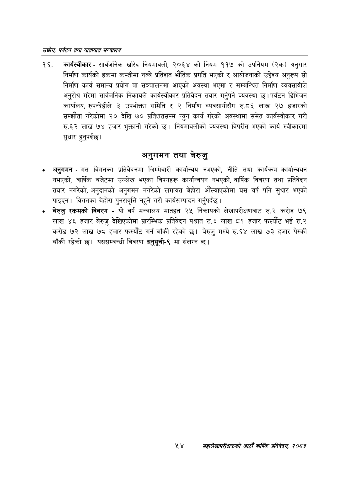

# Page 76 QA

## Rendered page


## Extracted text

```text
उद्योग पर्यटन तथा यातायात सन्चबालय
कार्यस्वीकार -सार्वजनिक खरिद नियमावली, २०६४ को नियम ११७ को उपनियम (२क) अनुसार निर्माण कार्यको हकमा कम्तीमा नब्बे प्रतिशत भौतिक प्रगति भएको र आयोजनाको उद्देश्य अनुरूप सो निर्माण कार्य समान्य प्रयोग वा सञ्चालनमा आएको अवस्था भएमा र सम्बन्धित निर्माण व्यवसायीले अनुरोध गरेमा सार्वजनिक निकायले कार्यस्वीकार प्रतिवेदन तयार गर्नुपर्ने व्यवस्था | पर्यटन डिभिजन कार्यालय, रुपन्देहीले ३ उपभोक्ता समिति र २ निर्माण व्यवसायीसँग रु.८६ लाख २७ हजारको सम्झौता गरेकोमा २० देखि ७० प्रतिशतसम्म न्युन कार्य गरेको अवस्थामा समेत कार्यस्वीकार गरी रु.६२ लाख ७४ हजार भुक्तानी गरेको छ। नियमावलीको व्यवस्था विपरीत भएको कार्य स्वीकारमा सुधार हुनुपर्दछ |
अनुगमन तथा बेरुजु
अनुगमन -गत विगतका प्रतिवेदनमा जिम्मेवारी कार्यान्वय नभएको, नीति तथा कार्यक्रम कार्यान्वयन नभएको, वार्षिक बजेटमा उल्लेख भएका विषयहरू कार्यान्वयन नभएको, वार्षिक विवरण तथा प्रतिवेदन तयार नगरेको, अनुदानको अनुगमन नगरेको लगायत बेहोरा औंल्याएकोमा यस वर्ष पनि सुधार भएको पाइएन। विगतका बेहोरा पुनरावृत्ति नहुने गरी कार्यसम्पादन गर्नुपर्दछ |
० बेरुजु रकमको विवरण -यो वर्ष मन्त्रालय मातहत २५ निकायको लेखापरीक्षणबाट रु.२ करोड ७९ लाख ४६ हजार बेरुजु देखिएकोमा प्रारम्भिक प्रतिवेदन पश्चात रु.६ लाख ८१ हजार फस्यौंट भई रु.२ करोड ७२ लाख ७८ हजार फस्यौट गर्न बाँकी रहेको छ। बेरुजु मध्ये रु.६४ लाख ७३ हजार पेस्की बाँकी रहेको छ। यससम्बन्धी विवरण अनुसूची-९ मा संलग्न छ।
४५४ सहालेखापरीक्षकको आठौँ वाषिकि प्रतिवेदन २०८२
```

## Flags
- None
