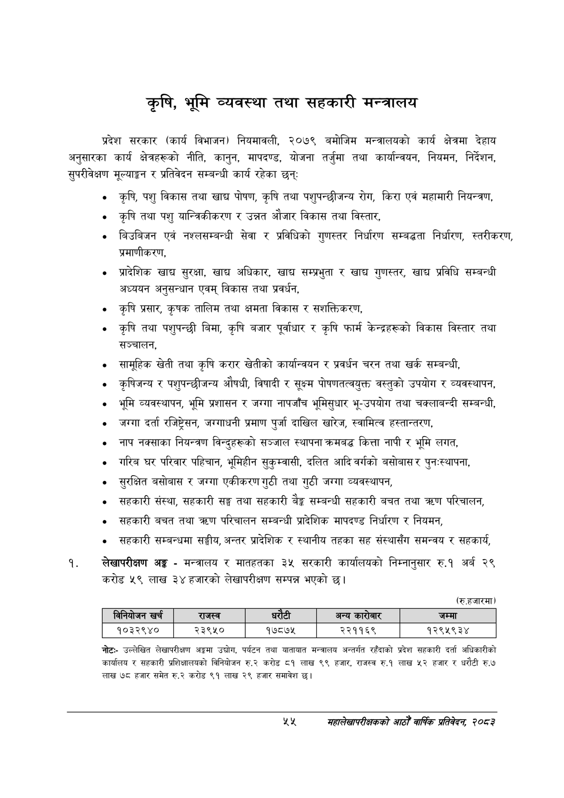

# Page 77 QA

## Rendered page


## Extracted text

```text
कृषि, भूमि व्यवस्था तथा सहकारी मन्त्रालय
प्रदेश सरकार (कार्य विभाजन) नियमावली, २०७९ बमोजिम मन्त्रालयको कार्य क्षेत्रमा देहाय अनुसारका कार्य क्षेत्रहरूको नीति, कानुन, मापदण्ड, योजना तर्जुमा तथा कार्यान्वयन, नियमन, निर्देशन, सुपरीवेक्षण मूल्याङ्कन र प्रतिवेदन सम्बन्धी कार्य रहेका छन्‌
कृषि, पशु विकास तथा खाद्य पोषण, कृषि तथा पशुपन्छीजन्य रोग, किरा एवं महामारी नियन्त्रण,
० कृषि तथा पशु यान्त्रिकीकरण र उन्नत औजार विकास तथा विस्तार,
बिउबिजन एवं नश्लसम्बन्धी सेवा र प्रविधिको गुणस्तर निर्धारण सम्बद्धता निर्धारण, स्तरीकरण, प्रमाणीकरण,
प्रादेशिक खाद्य सुरक्षा, खाद्य अधिकार, खाद्य सम्प्रभुता र खाद्य गुणस्तर, खाद्य प्रविधि सम्बन्धी अध्ययन अनुसन्धान एवम्‌ विकास तथा प्रवर्धन,
कृषि प्रसार, कृषक तालिम तथा क्षमता विकास र सशक्तिकरण,
कृषि तथा पशुपन्छी बिमा, कृषि बजार पूर्वाधार र कृषि फार्म केन्द्रहरूको विकास विस्तार तथा सञ्चालन,
सामूहिक खेती तथा कृषि करार खेतीको कार्यान्वयन र प्रवर्धन चरन तथा खर्क सम्बन्धी,
० कृषिजन्य र पशुपन्छीजन्य औषधी, विषादी र सूक्ष्म पोषणतत्वयुक्त वस्तुको उपयोग र व्यवस्थापन,
भूमि व्यवस्थापन, भूमि प्रशासन र जग्गा नापजाँच भूमिसुधार भू-उपयोग तथा चक्लाबन्दी सम्बन्धी,
जग्गा दर्ता रजिष्ट्रेसन, जग्गाधनी प्रमाण पुर्जा दाखिल खारेज, स्वामित्व हस्तान्तरण,
नाप नक्साका नियन्त्रण विन्दुहरूको सञ्जाल स्थापना क्रमबद्ध कित्ता नापी र भूमि लगत,
गरिब घर परिवार पहिचान, भूमिहीन सुकुम्वासी, दलित आदि वर्गको बसोबास र पुनःस्थापना,
० सुरक्षित बसोबास र जग्गा एकीकरण गुठी तथा गुठी जग्गा व्यवस्थापन,
० सहकारी संस्था, सहकारी सङ्घ तथा सहकारी ३ सम्बन्धी सहकारी बचत तथा त्रण परिचालन,
० सहकारी बचत तथा क्रण परिचालन सम्बन्धी प्रादेशिक मापदण्ड निर्धारण र नियमन,
«० सहकारी सम्बन्धमा सङ्घीय, अन्तर प्रादेशिक र स्थानीय तहका सह संस्थासँग समन्वय र सहकार्य,
लेखापरीक्षण अङ्ग -मन्त्रालय र मातहतका ३५ सरकारी कार्यालयको निम्नानुसार रु.१ अर्ब २९ करोड ५९ लाख ३४ हजारको लेखापरीक्षण सम्पन्न भएको छ।
(रुहजारमा)
उल्लेखित लेखापरीक्षण अङ्गमा उद्योग, पर्यटन तथा यातायात मन्त्रालय अन्तर्गत रहँदाको प्रदेश सहकारी दर्ता अधिकारीको कार्यालय र सहकारी प्रशिक्षालयको विनियोजन रु.२ करोड ८१ लाख ९९ हजार, राजस्व रु.१ लाख ५२ हजार र धरौटी रु.७ लाख ७८ हजार समेत रु.२ करोड ९१ लाख २९ हजार समावेश |
[४
सहालेखापरीक्षकको आठौँ वाषिकि प्रतिवेदन २०८२

| बिनियोजन खर्च | राजस्व |  |  | अन्य कारोबार | जम्मा |
| --- | --- | --- | --- | --- | --- |
| १०३२९४० | २३९५० | १७८७५ |  | २२११६९ | १२९५९३४ |
```

## Flags
- table_page
- medium_quality_table
