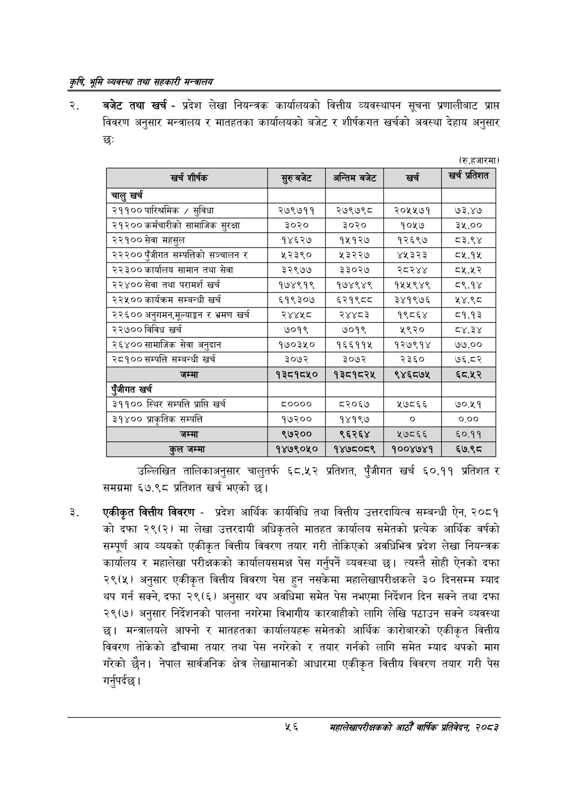

# Page 78 QA

## Rendered page


## Extracted text

```text
कृषि भूमि व्यवस्था तथा सहकारी
बजेट तथा खर्च -प्रदेश लेखा नियन्त्रक कार्यालयको वित्तीय व्यवस्थापन सूचना प्रणालीबाट प्राप्त विवरण अनुसार मन्त्रालय र मातहतका कार्यालयको बजेट र शीर्षकगत खर्चको अवस्था देहाय अनुसार छः
(रु.हजारमा)
उल्लिखित तालिकाअनुसार चालुतर्फ ६८.५२ प्रतिशत, पुँजीगत खर्च ६०.११ प्रतिशत र समग्रमा ६७.९८ प्रतिशत खर्च भएको छ।
एकीकृत वित्तीय विवरण -प्रदेश आर्थिक कार्यविधि तथा वित्तीय उत्तरदायित्व सम्बन्धी ऐन, २०८१ को दफा २९(२) मा लेखा उत्तरदायी अधिकृतले मातहत कार्यालय समेतको प्रत्येक आर्थिक वर्षको सम्पूर्ण आय व्ययको एकीकृत वित्तीय विवरण तयार गरी तोकिएको अवधिभित्र प्रदेश लेखा नियन्त्रक कार्यालय र महालेखा परीक्षकको कार्यालयसमक्ष पेस गर्नुपर्ने व्यवस्था छ। त्यस्तै सोही ऐनको दफा २९(५) अनुसार एकीकृत वित्तीय विवरण पेस हुन नसकेमा महालेखापरीक्षकले ३० दिनसम्म म्याद थप गर्न सक्ने, दफा २९(६) अनुसार थप अवधिमा समेत पेस नभएमा निर्देशन दिन सक्ने तथा दफा २९(७) अनुसार निर्देशनको पालना नगरेमा विभागीय कारबाहीको लागि लेखि पठाउन सक्ने व्यवस्था छ। मन्त्रालयले आफ्नो र मातहतका कार्यालयहरू समेतको आर्थिक कारोबारको एकीकृत वित्तीय विवरण तोकेको ढाँचामा तयार तथा पेस नगरेको र तयार गर्नको लागि समेत म्याद थपको माग गरेको छैन। नेपाल सार्वजनिक क्षेत्र लेखामानको आधारमा एकीकृत वित्तीय विवरण तयार गरी पेस गर्नुपर्दछ |
५६
सहालेखापरीक्षकको आठौँ वाषिकि प्रतिवेदन २०८२

| खस्न शीर्षक |  | अन्तिमबबेट | खर्क | खे प्रतिशत |
| --- | --- | --- | --- | --- |
| चालु खर्च |  |  |  |  |
| २११०० पारिश्रमिक / सुविधा | २७९७११ | २७९७९८ | २०५५७१ | ७३.४७ |
| २१२०० कर्मचारीको लामाजिक सुरक्षा | ३०२० | ३०२० | १०५७ | ३५.०० |
| २२१०० सेवा महसुल | १४६२७ | १५१२७ | १२६९७ | ८३.९४ |
| २२२०० एंजीगत क्षम्पततिको सञ्चालन | ४३३%० | ५३२२७ | ४५३२३ | ८५.१४५ |
| २२३०० कार्यालय सामान तथा सेवा | ३२९७७ | ३३०२७ | २८२४४ |  |
| २२४०० सेवा तथा परामर्श खर्च | १७४९१९ | १७४९४९ | १५५९४९ | ८९.१४ |
| २२५०० कार्यक्रम सम्बन्धी खर्च | ६१९३०७ | ६२१९८८ | ३४१९७६ | ५४.९८ |
| २२६०० अनुगमन,१०४ङ" र भ्रमण खर्च | २४४५८ | २४४८३ | १९८६४ | ८१.१३ |
| २२७०० विविध खर्च | ७०१९ | ७०१९ | ५९२० | ८४.३४ |
| २६४०० लामाजिक सेवा अनुदान | १७०३५० | १६६११५ | १२७९१४ | ७७.०० |
| २८१०० सम्पत्ति सम्बन्धी खर्च | ३०७२ | ३०७२ | २३६० | ७६.८२ |
| जम्मा | १३८१८५० | १३८१८२५ | ९४६८७५ | ६८०.५२ |
| एंजीगत खर्च |  |  |  |  |
| ३११०० स्थिर सम्पत्ति प्राप्ति खर्च | ८०००० | ८२०६७ | ५७८६६ | ७०.५१ |
| ३१४०० जाकृतिक सम्पत्ति | १७२०० | १४१९७ | ० | ०.०० |
| जम्मा | ९७२०० | ९६२६४ | २७८६६ | ६०.११ |
| कुल जम्मा | १४७९०५० | १४७८०८९ | १००४७४१ | ६७.९८ |
```

## Flags
- table_page
- medium_quality_table
