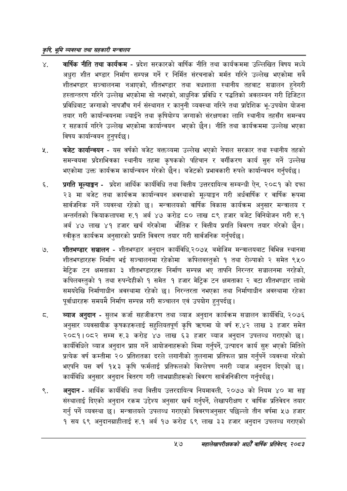

# Page 79 QA

## Rendered page


## Extracted text

```text
कृषि भूमि व्यवस्था तथा सहकारी
. वार्षिक नीति तथा कार्यक्रम -प्रदेश सरकारको वार्षिक नीति तथा कार्यक्रममा उल्लिखित विषय मध्ये अधुरा शीत भण्डार निर्माण सम्पन्न गर्ने र निर्मित संरचनाको मर्मत गरिने उल्लेख भएकोमा सबै शीतभण्डार सञ्चालनमा नआएको, शीतभण्डार तथा वधशाला स्थानीय तहबाट सञ्चालन हुनेगरी हस्तान्तरण गरिने उल्लेख भएकोमा सो नभएको, आधुनिक प्रविधि र पद्धतिको अवलम्बन गरी डिजिटल प्रविधिबाट जग्गाको नापजाँच गर्न संस्थागत र कानुनी व्यवस्था गरिने तथा प्रादेशिक भू-उपयोग योजना तयार गरी कार्यान्वयनमा ल्याईने तथा कृषियोग्य जग्गाको संरक्षणका लागि स्थानीय तहसँग समन्वय र सहकार्य गरिने उल्लेख भएकोमा कार्यान्वयन भएको छैन। नीति तथा कार्यक्रममा उल्लेख भएका विषय कार्यान्वयन हुनुपर्दछ |
बजेट कार्यान्वयन -यस वर्षको बजेट बक्तव्यमा उल्लेख भएको नेपाल सरकार तथा स्थानीय तहको समन्वयमा प्रदेशभित्रका स्थानीय तहमा कृषकको पहिचान र वर्गीकरण कार्य सुरु गर्ने उल्लेख भएकोमा उक्त कार्यक्रम कार्यान्वयन गरेको छैन। बजेटको प्रभावकारी रुपले कार्यान्वयन गर्नुपर्दछ |
प्रगति मूल्याङ्गन -प्रदेश आर्थिक कार्यविधि तथा वित्तीय उत्तरदायित्व सम्बन्धी ऐन, २०८१ को दफा २३ मा बजेट तथा कार्यक्रम कार्यान्वयन अवस्थाको मूल्याङ्कन गरी अर्धवार्षिक र वार्षिक रूपमा सार्वजनिक गर्ने व्यवस्था रहेको छ। मन्त्रालयको वार्षिक विकास कार्यक्रम अनुसार मन्त्रालय र अन्तर्गतको क्रियाकलापमा रु.१ अर्ब ४७ करोड ८० लाख ८९ हजार बजेट विनियोजन गरी रु.१ अर्ब ४७ लाख ४१ हजार खर्च गरेकोमा भौतिक र वित्तीय प्रगति विवरण तयार गरेको छैन। स्वीकृत कार्यक्रम अनुसारको प्रगति विवरण तयार गरी सार्वजनिक गर्नुपर्दछ |
शीतभण्डार सञ्चालन -शीतभण्डार अनुदान कार्यविधि,२०७५ बमोजिम मन्त्रालयबाट विभिन्न स्थानमा शीतभण्डारहरू निर्माण भई सञ्चालनमा रहेकोमा कपिलबस्तुको १ तथा रोल्पाको २ समेत ९५० मेट्रिक टन क्षमताका ३ शीतभण्डारहरू निर्माण सम्पन्न भए तापनि निरन्तर सञ्चालनमा नरहेको, कपिलवस्तुको १ तथा रुपन्देहीको १ समेत १ हजार मेट्रिक टन क्षमताका २ वटा शीतभण्डार लामो समयदेखि निर्माणाधीन अवस्थामा रहेको छ। निरन्तरता नभएका तथा निर्माणाधीन अवस्थामा रहेका पूर्वाधारहरू समयमै निर्माण सम्पन्न गरी सञ्चालन एवं उपयोग हुनुपर्दछ |
ब्याज अनुदान -सुलभ कर्जा सहजीकरण तथा व्याज अनुदान कार्यक्रम सञ्चालन कार्यविधि, २०७६ अनुसार व्यवसायीक कृषकहरूलाई सहुलियतपूर्ण कृषि त्रहणमा यो वर्ष रु.४२ लाख ३ हजार समेत २०८१।०८२ सम्म रु.३ करोड ४७ लाख ६३ हजार ब्याज अनुदान उपलब्ध गराएको छ। कार्यविधिले ब्याज अनुदान प्राप्त गर्ने आयोजनाहरूको बिमा गर्नुपर्ने, उत्पादन कार्य सुरु भएको मितिले प्रत्येक वर्ष कम्तीमा २० प्रतिशतका दरले लगानीको तुलनामा प्रतिफल प्राप्त गर्नुपर्ने व्यवस्था गरेको भएपनि यस वर्ष १५३ कृषि फर्मलाई प्रतिफलको विश्लेषण नगरी व्याज अनुदान दिएको छ। कार्यबिधि अनुसार अनुदान वितरण गरी लाभग्राहीहरूको विवरण सार्वजनिकीरण गर्नुपर्दछ |
अनुदान -आर्थिक कार्यविधि तथा वित्तीय उत्तरदायित्व नियमावली, २०७७ को नियम ४० मा सङ्घ संस्थालाई दिएको अनुदान रकम उद्देश्य अनुसार खर्च गर्नुपर्ने, लेखापरीक्षण र वार्षिक प्रतिवेदन तयार गर्नु पर्ने व्यवस्था छ। मन्त्रालयले उपलब्ध गराएको विवरणअनुसार पछिल्लो तीन वर्षमा ५७ हजार १ सय ६९ अनुदानग्राहीलाई रु.१ अर्ब १७ करोड ६९ लाख ३३ हजार अनुदान उपलब्ध गराएको
४७
सहालेखापरीक्षकको आठौँ वाषिकि प्रतिवेदन २०८२
```

## Flags
- None
