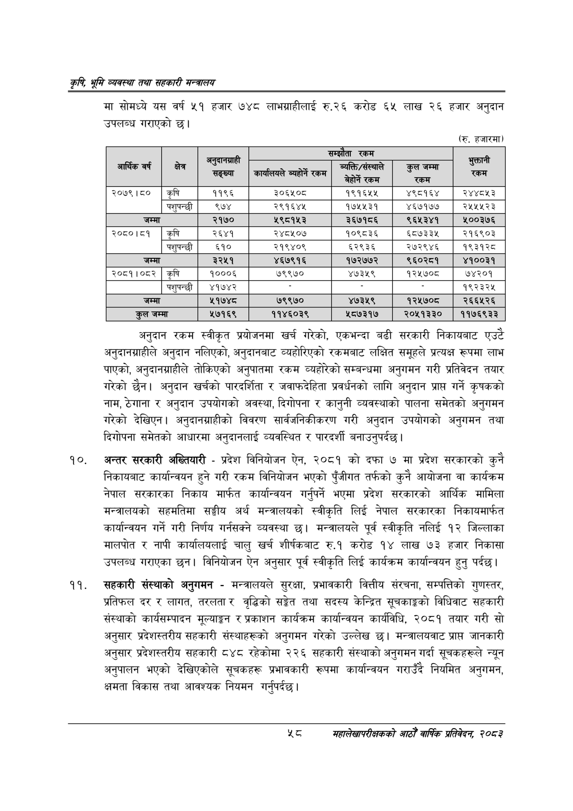

# Page 80 QA

## Rendered page


## Extracted text

```text
कृषि भूमि व्यवस्था तथा सहकारी
मा सोमध्ये यस वर्ष ५१ हजार ७४८ लाभग्राहीलाई रु.२६ करोड ६५ लाख २६ हजार अनुदान उपलब्ध गराएको छ।
(रु. हजारमा)
अनुदान रकम स्वीकृत प्रयोजनमा खर्च गरेको, एकभन्दा बढी सरकारी निकायबाट एउटै अनुदानग्राहीले अनुदान नलिएको, अनुदानबाट व्यहोरिएको रकमबाट लक्षित समूहले प्रत्यक्ष रूपमा लाभ पाएको, अनुदानग्राहीले तोकिएको अनुपातमा रकम व्यहोरेको सम्बन्धमा अनुगमन गरी प्रतिवेदन तयार गरेको छैन। अनुदान खर्चको पारदर्शिता र जवाफदेहिता प्रवर्धनको लागि अनुदान प्राप्त गर्ने कृषकको नाम, ठेगाना र अनुदान उपयोगको अवस्था, दिगोपना र कानुनी व्यवस्थाको पालना समेतको अनुगमन गरेको देखिएन। अनुदानग्राहीको विवरण सार्वजनिकीकरण गरी अनुदान उपयोगको अनुगमन तथा दिगोपना समेतको आधारमा अनुदानलाई व्यवस्थित र पारदर्शी बनाउनुपर्दछ |
अन्तर सरकारी अख्तियारी -प्रदेश विनियोजन ऐन, २०८१ को दफा ७ मा प्रदेश सरकारको कुनै निकायबाट कार्यान्वयन हुने गरी रकम विनियोजन भएको पुँजीगत तर्फको कुनै आयोजना वा कार्यक्रम नेपाल सरकारका निकाय मार्फत कार्यान्वयन गर्नुपर्ने भएमा प्रदेश सरकारको आर्थिक मामिला मन्त्रालयको सहमतिमा सङ्घीय अर्थ मन्त्रालयको स्वीकृति लिई नेपाल सरकारका निकायमार्फत कार्यान्वयन गर्ने गरी निर्णय गर्नसक्ने व्यवस्था छ। मन्त्रालयले पूर्व स्वीकृति नलिई १२ जिल्लाका मालपोत र नापी कार्यालयलाई चालु खर्च शीर्षकबाट रु.१ करोड १४ लाख ७३ हजार निकासा उपलब्ध गराएका छन। विनियोजन ऐन अनुसार पूर्व स्वीकृति लिई कार्यक्रम कार्यान्वयन हुन्‌ पर्दछ।
सहकारी संस्थाको अनुगमन -मन्त्रालयले सुरक्षा, प्रभावकारी वित्तीय संरचना, सम्पत्तिको गुणस्तर, प्रतिफल दर र लागत, तरलता र वृद्धिको सङ्गेत तथा सदस्य केन्द्रित सूचकाङ्गको विधिवाट सहकारी संस्थाको कार्यसम्पादन मूल्याङ्कन र प्रकाशन कार्यक्रम कार्यान्वयन कार्यविधि, २०८१ तयार गरी सो अनुसार प्रदेशस्तरीय सहकारी संस्थाहरूको अनुगमन गरेको उल्लेख छ। मन्त्रालयवाट प्राप्त जानकारी अनुसार प्रदेशस्तरीय सहकारी ८४८ रहेकोमा २२६ सहकारी संस्थाको अनुगमन गर्दा सूचकहरूले न्यून अनुपालन भएको देखिएकोले सूचकहरू प्रभावकारी रूपमा कार्यान्वयन गराउँदै नियमित अनुगमन, क्षमता विकास तथा आवश्यक नियमन गर्नुपर्दछ।
सहालेखापरीक्षकको आठौँ वाषिकि प्रतिवेदन २०८२

|  |  |  |  | (६१ |  |  |
| --- | --- | --- | --- | --- | --- | --- |
| आर्थिक वर्ष | क्षेत्र | अनुवानआहो सङ्ख्या | कार्यालयले व्यहोर्ने रकम | ब्यक्ति/संस्थयाले जि | कुल जम्मा री | भुक्तानी 'रकम |
| २०७९।८० | कृषि | ११९६ | ३०६४५०८ | १९१६४५५ | ४९८१६४ | २४४८५३ |
|  | पशुषन्छी | ९७४ | २९१६४४५ | १७५४५३१ | ४६७१७७ | २५५५२३ |
| जम्मा |  | २१७० | २९८१४५३ | ३६७१८६ | ९६५३४१ | ₹००३७६ |
| २०८०।८१ | कृषि | २६४१ | २४८४५०७ | १०९८३६ | ६८७३३४५ | २१६९०३ |
|  | पशुपन्छी | ६१० | २१९४०९ | ६२९३६ | २७२९४६ | १९३१२८ |
| जम्मा |  | ३२५१ | ४६७९१६ | १७२७७२ | ९६०२८१ | ४१००३१ |
| २०८१।०८२ | कृषि | १०००६ | ७९९७० | ४७३५९ | १२५७०८ | ७४२०१ |
|  | पशुपन्छी | ४१७४२ |  |  |  | १९२३२४५ |
| जम्मा |  | ५१७४८ | ७९९७० | ४७३५९ | १२५७०८ | २६६५२६ |
| कुल जम्मा |  | ५७१६९ | ११४६०३९ | ५८७३१७ | २०५१३३० | ११७६९३३ |
```

## Flags
- table_page
- medium_quality_table
