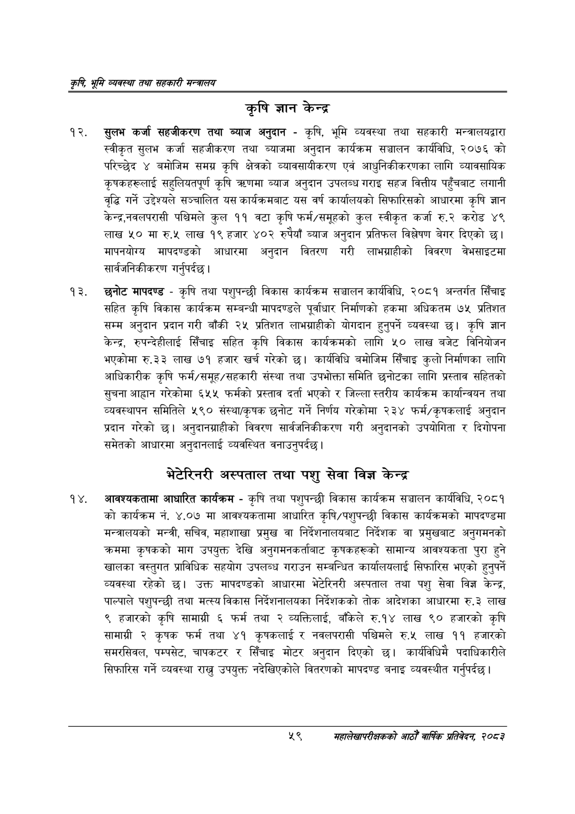

# Page 81 QA

## Rendered page


## Extracted text

```text
कृषि भूमि व्यवस्था तथा सहकारी
कृषि ज्ञान केन्द्र
सुलभ कर्जा सहजीकरण तथा ब्याज अनुदान -कृषि, भूमि व्यवस्था तथा सहकारी मन्त्रालयद्वारा स्वीकृत सुलभ कर्जा सहजीकरण तथा ब्याजमा अनुदान कार्यक्रम सञ्चालन कार्यविधि, २०७६ को परिच्छेद ४ बमोजिम समग्र कृषि क्षेत्रको व्यावसायीकरण एवं आधुनिकीकरणका लागि व्यावसायिक कृषकहरूलाई सहुलियतपूर्ण कृषि त्रणमा ब्याज अनुदान उपलब्ध गराइ सहज वित्तीय पहुँचबाट लगानी वृद्धि गर्ने उद्देश्यले सञ्चालित यस कार्यक्रमबाट यस वर्ष कार्यालयको सिफारिसको आधारमा कृषि ज्ञान करेन्द्रनवलपरासी पश्चिमले कूल ११ वटा कृषि फर्म/समूहको कुल स्वीकृत कर्जा रु.२ करोड ४९ लाख ५० मा रु.५ लाख १९ हजार ४०२ रुपैयाँ ब्याज अनुदान प्रतिफल विश्लेषण बेगर दिएको छ। मापनयोर्य मापदण्डको आधारमा अनुदान वितरण गरी लाभग्राहीको विवरण वेभसाइटमा सार्वजनिकीकरण गर्नुपर्दछ |
छनोट मापदण्ड -कृषि तथा पशुपन्छी विकास कार्यक्रम सञ्चालन कार्यविधि, २०८१ अन्तर्गत सिँचाइ सहित कृषि विकास कार्यक्रम सम्बन्धी मापदण्डले पूर्वाधार निर्माणको हकमा अधिकतम ७५ प्रतिशत सम्म अनुदान प्रदान गरी बाँकी २५ प्रतिशत लाभग्राहीको योगदान हुनुपर्ने व्यवस्था छ। कृषि ज्ञान केन्द्र, रुपन्देहीलाई सिँचाइ सहित कृषि विकास कार्यक्रमको लागि ५० लाख बजेट विनियोजन भएकोमा रु.३३ लाख ७१ हजार खर्च गरेको छ। कार्यविधि बमोजिम सिँचाइ कुलो निर्माणका लागि आधिकारीक कृषि फर्म/समूह/सहकारी संस्था तथा उपभोक्ता समिति छनोटका लागि प्रस्ताव सहितको सुचना आह्वान गरेकोमा ६५५ फर्मको प्रस्ताव दर्ता भएको र जिल्ला स्तरीय कार्यक्रम कार्यान्वयन तथा व्यवस्थापन समितिले ५९० संस्था/कृषक छनोट गर्ने निर्णय गरेकोमा २३४ फर्म/कृषकलाई अनुदान प्रदान गरेको छ। अनुदानग्राहीको विवरण सार्वजनिकीकरण गरी अनुदानको उपयोगिता र दिगोपना समेतको आधारमा अनुदानलाई व्यवस्थित वनाउनुपर्दछ।
भेटेरिनरी अस्पताल तथा पशु सेवा विज्ञ केन्द्र
आवश्यकतामा आधारित कार्यक्रम -कृषि तथा पशुपन्छी विकास कार्यक्रम सञ्चालन कार्यविधि, २०८१ को कार्यक्रम नं. ४.०७ मा आवश्यकतामा आधारित कृषि/पशुपन्छी विकास कार्यक्रमको मापदण्डमा मन्त्रालयको मन्त्री, सचिव, महाशाखा प्रमुख वा निर्देशनालयबाट निर्देशक वा प्रमुखबाट अनुगमनको क्रममा कृषकको माग उपयुक्त देखि अनुगमनकर्ताबाट कृषकहरूको सामान्य आवश्यकता पुरा हुने खालका वस्तुगत प्राविधिक सहयोग उपलब्ध गराउन सम्बन्धित कार्यालयलाई सिफारिस भएको हुनुपर्ने व्यवस्था रहेको | उक्त मापदण्डको आधारमा भेटेरिनरी अस्पताल तथा पशु सेवा विज्ञ केन्द्र, पाल्पाले पशुपन्छी तथा मत्स्य विकास निर्देशनालयका निर्देशकको तोक आदेशका आधारमा रु.३ लाख ९ हजारको कृषि सामाग्री ६ फर्म तथा २ व्यक्तिलाई, बाँकेले रु.१४ लाख ९० हजारको कृषि सामाग्री २ कृषक फर्म तथा ४१ कृषकलाई र नवलपरासी पश्चिमले रु.५ लाख ११ हजारको समरसिवल, पम्पसेट, चापकटर र सिँचाइ मोटर अनुदान दिएको छ। कार्यविधिमै पदाधिकारीले सिफारिस गर्ने व्यवस्था राख्नु उपयुक्त नदेखिएकोले वितरणको मापदण्ड बनाइ व्यवस्थीत गर्नुपर्दछ |
५९
सहालेखापरीक्षकको आठौँ वाषिकि प्रतिवेदन २०८२
```

## Flags
- None
