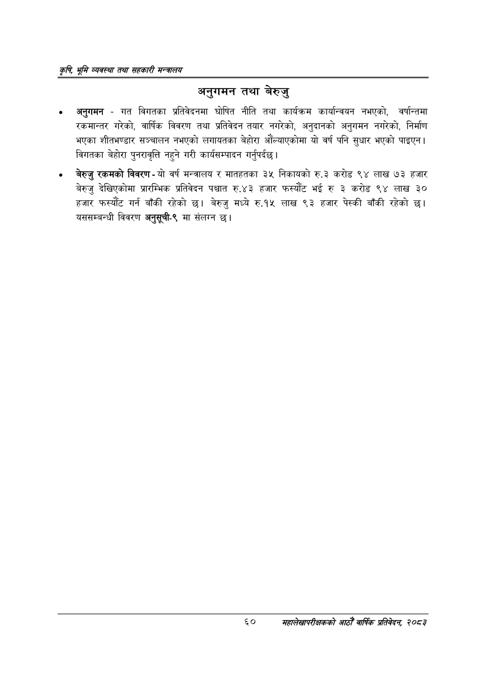

# Page 82 QA

## Rendered page


## Extracted text

```text
कृषि भूमि व्यवस्था तथा सहकारी सन्बालय
अनुगमन तथा बेरुजु
अनुगमन -गत विगतका प्रतिवेदनमा घोषित नीति तथा कार्यक्रम कार्यान्वयन नभएको, वर्षान्तमा रकमान्तर गरेको, वार्षिक विवरण तथा प्रतिवेदन तयार नगरेको, अनुदानको अनुगमन नगरेको, निर्माण भएका शीतभण्डार सञ्चालन नभएको लगायतका बेहोरा औंल्याएकोमा यो वर्ष पनि सुधार भएको पाइएन | विगतका बेहोरा पुनरावृत्ति नहुने गरी कार्यसम्पादन गर्नुपर्दछ |
० बेरुजु रकमको विवरण -यो वर्ष मन्त्रालय र मातहतका ३५ निकायको रु.३ करोड ९४ लाख ७३ हजार बेरुजु देखिएकोमा प्रारम्भिक प्रतिवेदन पश्चात रु.४३ हजार फस्यौट भई रु ३ करोड ९४ लाख ३० हजार फस्यौट गर्न बाँकी रहेको छ। बेरुजु मध्ये रु.१५ लाख ९३ हजार पेस्की बाँकी रहेको छ। यससम्बन्धी विवरण अनुसूची-९ मा संलग्न छ।
६०
सहालेखापरीक्षकको आठौँ वाषिकि प्रतिवेदन २०८२
```

## Flags
- None
