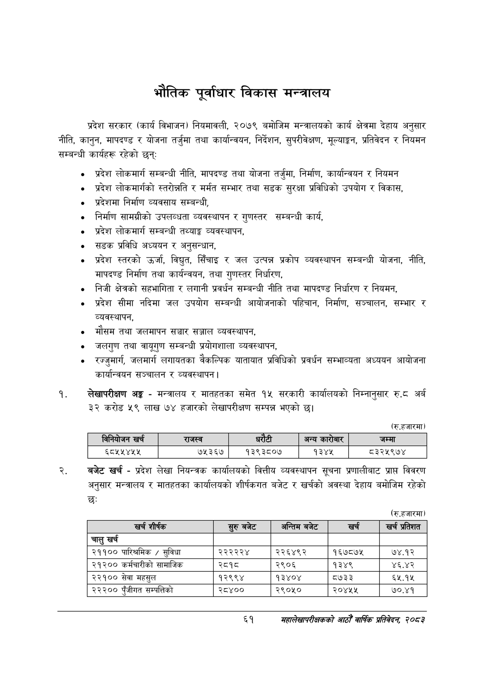

# Page 83 QA

## Rendered page


## Extracted text

```text
भौतिक पूर्वाधार विकास मन्त्रालय
प्रदेश सरकार (कार्य विभाजन) नियमावली, २०७९ बमोजिम मन्त्रालयको कार्य क्षेत्रमा देहाय अनुसार नीति, कानुन, मापदण्ड र योजना तर्जुमा तथा कार्यान्वयन, निर्देशन, सुपरीवेक्षण, मूल्याङ्कन, प्रतिवेदन र नियमन सम्बन्धी कार्यहरू रहेको छन्‌
प्रदेश लोकमार्ग सम्बन्धी नीति, मापदण्ड तथा योजना तर्जुमा, निर्माण, कार्यान्वयन र नियमन
प्रदेश लोकमार्गको स्तरोन्नति र मर्मत सम्भार तथा सडक सुरक्षा प्रविधिको उपयोग र विकास,
प्रदेशमा निर्माण व्यवसाय सम्बन्धी,
निर्माण सामग्रीको उपलब्धता व्यवस्थापन र गुणस्तर सम्बन्धी कार्य,
प्रदेश लोकमार्ग सम्बन्धी तथ्याङ्क व्यवस्थापन,
सडक प्रविधि अध्ययन र अनुसन्धान,
प्रदेश स्तरको उर्जा, विद्युत सिँचाइ र जल उत्पन्न प्रकोप व्यवस्थापन सम्बन्धी योजना, नीति, मापदण्ड निर्माण तथा कार्यन्वयन, तथा गुणस्तर निर्धारण,
निजी क्षेत्रको सहभागिता र लगानी प्रवर्धन सम्बन्धी नीति तथा मापदण्ड निर्धारण र नियमन,
प्रदेश सीमा नदिमा जल उपयोग सम्बन्धी आयोजनाको पहिचान, निर्माण, सञ्चालन, सम्भार र व्यवस्थापन,
मौसम तथा जलमापन सञ्चार सञ्जाल व्यवस्थापन,
जलगुण तथा सम्बन्धी प्रयोगशाला व्यवस्थापन,
रज्जुमार्ग, जलमार्ग लगायतका वैकल्पिक यातायात प्रविधिको प्रवर्धन सम्भाव्यता अध्ययन आयोजना कार्यान्वयन सञ्चालन र व्यवस्थापन |
लेखापरीक्षण अङ्ग -मन्त्रालय र मातहतका समेत १५ सरकारी कार्यालयको निम्नानुसार रु.ट अर्ब ३२ करोड ५९ लाख ७४ हजारको लेखापरीक्षण सम्पन्न भएको छ।
(रु.हजारमा)
बजेट खर्च -प्रदेश लेखा नियन्त्रक कार्यालयको वित्तीय व्यवस्थापन सूचना प्रणालीबाट प्राप्त विवरण अनुसार मन्त्रालय र मातहतका कार्यालयको शीर्षकगत बजेट र खर्चको अवस्था देहाय बमोजिम रहेको छः
(रु.हजारमा)
६१
सहालेखापरीक्षकको आठौँ वाषिकि प्रतिवेदन २०८२

|  |  | ।नानेकोजन |  | राजस्व | धरेटी |  | अन्य कारोबार | जम्मा |
| --- | --- | --- | --- | --- | --- | --- | --- | --- |
|  |  | ६८५५४५५ |  | ७५३६७ | १३९३८०७ |  | १३४५ | ८३२५९७४ |

| खर्च शीर्षक | सुरु बजेट | अन्तिम बजेट | खर्च | खर्च प्रतिशत |
| --- | --- | --- | --- | --- |
| चालु खर्च |  |  |  |  |
| २११०० पारिश्रमिक / सुविधा | २२२२२४ | २२६४९२ | १६७८७४५ | ७४.१२ |
| २१२०० कर्मचारीको सामाजिक | २८१८ | २९०६ | १३४९ | ४६.४२ |
| २२१०० सेवा महसुल | १२९९४ | १३४०४ | ८७३३ | ६५.१५ |
| २२२०० पुँजीगत सम्पत्तिको | २८४०० | २९०५० | २०४५४५ | ७०.४१ |
```

## Flags
- table_page
- medium_quality_table
