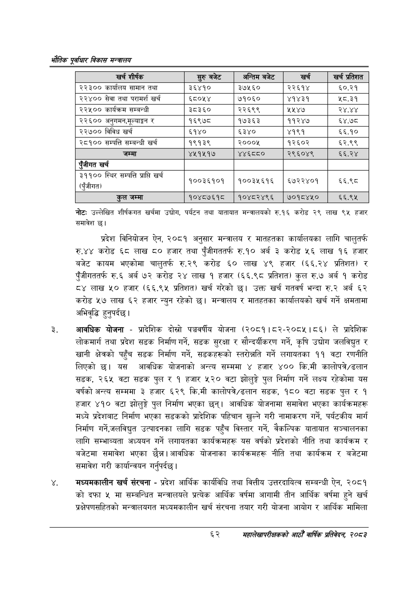

# Page 84 QA

## Rendered page


## Extracted text

```text
एवधार विकास मन्त्रालय
नोटः उल्लेखित शीर्षकगत खर्चमा उद्योग, पर्यटन तथा यातायात मन्त्रालयको रु.१६ करोड २९ लाख ९४ हजार समावेश छ।
प्रदेश विनियोजन ऐन, २०८१ अनुसार मन्त्रालय र मातहतका कार्यालयका लागि चालुतर्फ रु.४४ करोड ६८ लाख ८० हजार तथा पुँजीगततर्फ रु.१० अर्ब ३ करोड ५६ लाख १६ हजार बजेट कायम भएकोमा चालुतर्फ रु.२९ करोड ६० लाख ४९ हजार (६६.२४ प्रतिशत) र पुँजीगततर्फ रु.६ अर्ब ७२ करोड २४ लाख १ हजार (६६.९८ प्रतिशत) कुल रु.७ अर्ब १ करोड ८४ लाख ५० हजार (६६.९५ प्रतिशत) खर्च गरेको छ। उक्त खर्च गतवर्ष भन्दा रु.२ अर्ब ६२ करोड ५२७ लाख ६२ हजार न्युन रहेको | मन्त्रालय र मातहतका कार्यालयको खर्च गर्ने क्षमतामा अभिवृद्धि हुनुपर्दछ |
आवधिक योजना -प्रादेशिक दोस्रो पञ्चवर्षीय योजना (२०८१।८२-२०८५।८६) ले प्रादेशिक लोकमार्ग तथा प्रदेश सडक निर्माण गर्ने, सडक सुरक्षा र सौन्दर्यीकरण गर्ने, कृषि उद्योग जलविद्युत र खानी क्षेत्रको पहुँच सडक निर्माण गर्ने, सडकहरूको स्तरोन्नति गर्ने लगायतका ११ वटा रणनीति लिएको छ। यस आवधिक योजनाको अन्त्य सम्ममा ४ हजार्‌ ४०० कि.मी कालोपत्रेशडलान सडक, २६५ वटा सडक पुल र १ हजार ५२० वटा झोलुङ्गे पुल निर्माण गर्ने लक्ष्य रहेकोमा यस वर्षको अन्त्य सम्ममा ३ हजार ६२९ कि.मी कालोपत्रे/डलान सडक, १८० वटा सडक पुल र १ हजार ४१० वटा झोलुङ्गे पुल निर्माण भएका छन्‌। आवधिक योजनामा समावेश भएका कार्यक्रमहरू मध्ये प्रदेशबाट निर्माण भएका सडकको प्रादेशिक पहिचान खुल्ने गरी नामाकरण गर्ने, पर्यटकीय मार्ग निर्माण गर्ने,जलविद्युत उत्पादनका लागि सडक पहुँच विस्तार गर्ने, वैकल्पिक यातायात सञ्चालनका लागि सम्भाव्यता अध्ययन गर्ने लगायतका कार्यक्रमहरू यस वर्षको प्रदेशको नीति तथा कार्यक्रम र बजेटमा समावेश भएका छैन्न। आवधिक योजनाका कार्यक्रमहरू नीति तथा कार्यक्रम र बजेटमा समावेश गरी कार्यान्वयन गर्नुपर्दछ |
मध्यमकालीन खर्च संरचना -प्रदेश आर्थिक कार्यविधि तथा वित्तीय उत्तरदायित्व सम्बन्धी ऐन, २०८१ कोदफा ५ मा सम्बन्धित मन्त्रालयले प्रत्येक आर्थिक वर्षमा आगामी तीन आर्थिक वर्षमा हुने खर्च प्रक्षेपणसहितको मन्त्रालयगत मध्यमकालीन खर्च संरचना तयार गरी योजना आयोग र आर्थिक मामिला
६२
सहालेखापरीक्षकको आठौँ वाषिकि प्रतिवेदन २०८२

| खर्च शीर्षक | सुरु बजेट | अन्तिम बजेट | खर्च | खर्च प्रतिशत |
| --- | --- | --- | --- | --- |
| २२३०० कार्यालष सामान तथा | ३६४१० | ३७५६० | २२६१४ | ६०.२१ |
| २२४०० सेवा तथा परामर्श खर्च | ६८०५४ | ७१०६० | ४१४३१ | ५८.३१ |
| २२५०० कार्यक्रम सम्बन्धी | ३८३६० | २२६९९ | ५५४७ | २४.४४ |
| २२६०० अनुनमन,भूल्याङ्गन र | १६९७८ | १७३६३ | ११२४७ | ६४.७८ |
| २२७०० विविध खर्च | ६१४० | ६३४० | ४१९१ | ६६.१० |
| २८१०० सम्पत्ति सम्बन्धी खर्च | १९१३९ | २०००५ | १२६०२ | ६२.९९ |
| जम्मा | ४५१४५१७ | ४४६८८० | २९६०४९ | ६६.२४ |
| एंजीगत खर्च |  |  |  |  |
| ३११०० स्थिर सम्पत्ति प्राप्ति खर्च पुँजीगत (पुँजीगत) | १००३६१०१ | १००३५६१६ | ६७२२४०१ | ६६.९८ |
| कुल जम्मा | १०४८७६१८ | १०४८२४९६ | ७०१८४५० | ६६.९५ |
```

## Flags
- table_page
- medium_quality_table
