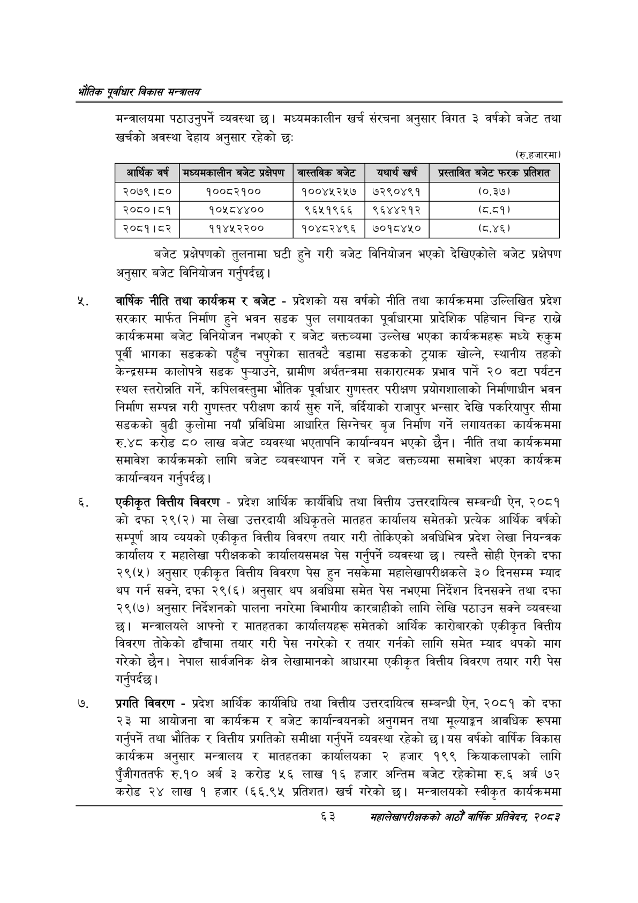

# Page 85 QA

## Rendered page


## Extracted text

```text
एवधार विकास मन्त्रालय
मन्त्रालयमा पठाउनुपर्ने व्यवस्था | मध्यमकालीन खर्च संरचना अनुसार विगत ३ वर्षको बजेट तथा खर्चको अवस्था देहाय अनुसार रहेको छ:
(रु.हजारमा)
बजेट प्रक्षेपणको तुलनामा घटी हुने गरी बजेट विनियोजन भएको देखिएकोले बजेट प्रक्षेपण अनुसार बजेट विनियोजन गर्नुपर्दछ |
वार्षिक नीति तथा कार्यक्रम र बजेट -प्रदेशको यस वर्षको नीति तथा कार्यक्रममा उल्लिखित प्रदेश सरकार मार्फत निर्माण हुने भवन सडक पुल लगायतका पूर्वाधारमा प्रादेशिक पहिचान चिन्ह राख्ने कार्यक्रममा बजेट विनियोजन नभएको र बजेट बक्तव्यमा उल्लेख भएका कार्यक्रमहरू मध्ये रुकुम पूर्वी भागका सडकको पहुँच नपुगेका सातवटै वडामा सडकको ट्र्याक खोल्ने, स्थानीय तहको केन्द्रसम्म कालोपत्रे सडक पु-याउने, ग्रामीण अर्थतन्त्रमा सकारात्मक प्रभाव पार्ने २० वटा पर्यटन स्थल स्तरोन्नति गर्ने, कपिलवस्तुमा भौतिक पूर्वाधार गुणस्तर परीक्षण प्रयोगशालाको निर्माणाधीन भवन निर्माण सम्पन्न गरी गुणस्तर परीक्षण कार्य सुरु गर्ने, बर्दियाको राजापुर भन्सार देखि पकरियापुर सीमा सडकको बुढी कुलोमा नयाँ प्रविधिमा आधारित सिग्नेचर बृज निर्माण गर्ने लगायतका कार्यक्रममा रु.४८ करोड ८० लाख बजेट व्यवस्था भएतापनि कार्यान्वयन भएको छैन। नीति तथा कार्यक्रममा समावेश कार्यक्रमको लागि बजेट व्यवस्थापन गर्ने र बजेट बक्तव्यमा समावेश भएका कार्यक्रम कार्यान्वयन गर्नुपर्दछ |
एकीकृत वित्तीय विवरण -प्रदेश आर्थिक कार्यविधि तथा वित्तीय उत्तरदायित्व सम्बन्धी ऐन, २०८१ को दफा २९(२) मा लेखा उत्तरदायी अधिकृतले मातहत कार्यालय समेतको प्रत्येक आर्थिक वर्षको सम्पूर्ण आय व्ययको एकीकृत वित्तीय विवरण तयार गरी तोकिएको अवधिभित्र प्रदेश लेखा नियन्त्रक कार्यालय र महालेखा परीक्षकको कार्यालयसमक्ष पेस गर्नुपर्ने व्यवस्था छ। त्यस्तै सोही ऐनको दफा २९(५) अनुसार एकीकृत वित्तीय विवरण पेस हुन नसकेमा महालेखापरीक्षकले ३० दिनसम्म म्याद थप गर्न सक्ने, दफा २९(६) अनुसार थप अवधिमा समेत पेस नभएमा निर्देशन दिनसक्ने तथा दफा २९(७) अनुसार निर्देशनको पालना नगरेमा विभागीय कारबाहीको लागि लेखि पठाउन सक्ने व्यवस्था छ। मन्त्रालयले आफ्नो र मातहतका कार्यालयहरू समेतको आर्थिक कारोबारको एकीकृत वित्तीय विवरण तोकेको ढाँचामा तयार गरी पेस नगरेको र तयार गर्नको लागि समेत म्याद थपको माग गरेको छैन। नेपाल सार्वजनिक क्षेत्र लेखामानको आधारमा एकीकृत वित्तीय विवरण तयार गरी पेस गर्नुपर्दछ |
प्रगति विवरण -प्रदेश आर्थिक कार्यविधि तथा वित्तीय उत्तरदायित्व सम्बन्धी ऐन, २०८१ को दफा २३ मा आयोजना वा कार्यक्रम र बजेट कार्यान्वयनको अनुगमन तथा मूल्याङ्गन आवधिक रूपमा गर्नुपर्ने तथा भौतिक र वित्तीय प्रगतिको समीक्षा गर्नुपर्ने व्यवस्था रहेको छ। यस वर्षको वार्षिक विकास कार्यक्रम अनुसार मन्त्रालय र मातहतका कार्यालयका २ हजार १९९ क्रियाकलापको लागि पुँजीगततर्फ रु.१० अर्ब ३ करोड ५६ लाख १६ हजार अन्तिम बजेट रहेकोमा रु.६ अर्ब ७२ करोड २४ लाख १ हजार (६६.९५ प्रतिशत) खर्च गरेको छ। मन्त्रालयको स्वीकृत कार्यक्रममा
६३
सहालेखापरीक्षकको आठौँ वाषिकि प्रतिवेदन २०८२

| आर्थिक वर्ष | भध्यनकालीन बजेट प्रक्षेपण | ना्तनक बजेट | यथार्थ खर्च | श्रल्ताबत बजेट फरक प्रतिशत |
| --- | --- | --- | --- | --- |
| २०७९।८० | १००८२१०० | १००४५२५७ | ७२९०४९१ | (०.३७) |
| २०८०।८१ | १०४५८४४०० | ९६५१९६६ | ९६४४२१२ | (८.८१) |
| २०८१। ८२ | ११४४५२२०० | १०४८२४९६ | ७०१८४५० | (८.४६) |
```

## Flags
- table_page
- medium_quality_table
