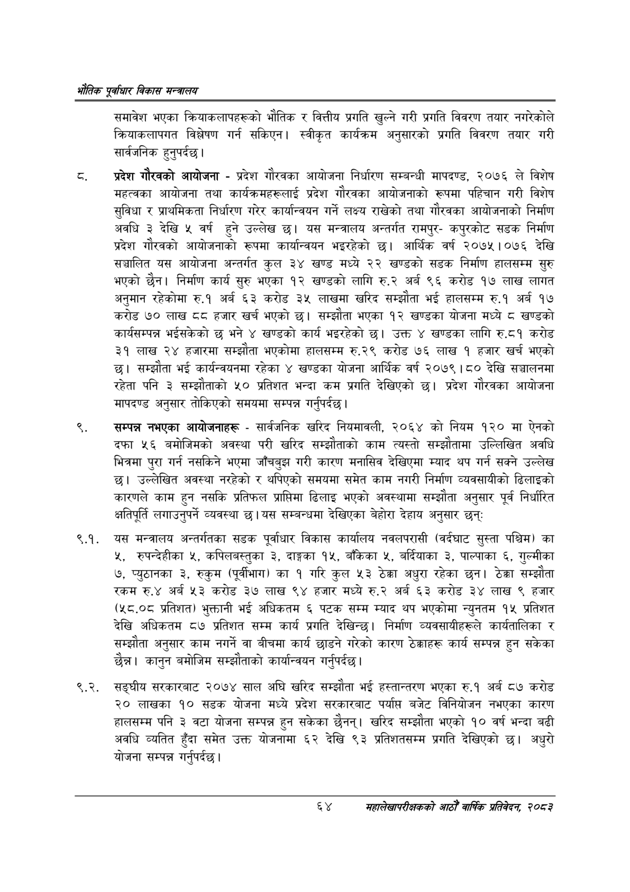

# Page 86 QA

## Rendered page


## Extracted text

```text
एवधार विकास मन्त्रालय
समावेश भएका क्रियाकलापहरूको भौतिक र वित्तीय प्रगति खुल्ने गरी प्रगति विवरण तयार नगरेकोले क्रियाकलापगत विश्लेषण गर्न सकिएन। स्वीकृत कार्यक्रम अनुसारको प्रगति विवरण तयार गरी सार्वजनिक हुनुपर्दछ |
प्रदेश गौरवको आयोजना -प्रदेश गौरवका आयोजना निर्धारण सम्बन्धी मापदण्ड, २०७६ ले विशेष महत्वका आयोजना तथा कार्यक्रमहरूलाई प्रदेश गौरवका आयोजनाको रूपमा पहिचान गरी विशेष सुविधा र प्राथमिकता निर्धारण गरेर कार्यान्वयन गर्ने लक्ष्य राखेको तथा गौरवका आयोजनाको निर्माण अवधि ३ देखि ५ वर्ष हुने उल्लेख छ। यस मन्त्रालय अन्तर्गत रामपुरकपुरकोट सडक निर्माण प्रदेश गौरवको आयोजनाको रूपमा कार्यान्वयन भइरहेको छ। आर्थिक वर्ष २०७५।०७६ देखि सञ्चालित यस आयोजना अन्तर्गत कुल ३४ खण्ड मध्ये २२ खण्डको सडक निर्माण हालसम्म सुरु भएको छैन। निर्माण कार्य सुरु भएका १२ खण्डको लागि रु.२ अर्ब ९६ करोड १७ लाख लागत अनुमान रहेकोमा रु.१ अर्ब ६३ करोड ३५ लाखमा खरिद सम्झौता भई हालसम्म रु.१ अर्ब १७ करोड ७० लाख ठव हजार खर्च भएको छ। सम्झौता भएका १२ खण्डका योजना मध्ये ८ खण्डको कार्यसम्पन्न भईसकेको छ भने खण्डको कार्य भइरहेको छ। उक्त ४ खण्डका लागि रु.८१ करोड ३१ लाख २४ हजारमा सम्झौता भएकोमा हालसम्म रु.२९ करोड ७६ लाख १ हजार खर्च भएको छ। सम्झौता भई कार्यन्वयनमा रहेका ४ खण्डका योजना आर्थिक वर्ष २०७९।८० देखि सञ्चालनमा रहेता पनि ३ सम्झौताको ५० प्रतिशत भन्दा कम प्रगति देखिएको छ। प्रदेश गौरवका आयोजना मापदण्ड अनुसार तोकिएको समयमा सम्पन्न गर्नुपर्दछ |
सम्पन्न नभएका आयोजनाहरू -सार्वजनिक खरिद नियमावली, २०६४ को नियम १२० मा ऐनको दफा ५६ बमोजिमको अवस्था परी खरिद सम्झौताको काम त्यस्तो सम्झौतामा उल्लिखित अवधि भित्रमा पुरा गर्न नसकिने भएमा जाँचबुझ गरी कारण मनासिव देखिएमा म्याद थप गर्न सक्ने उल्लेख छ। उल्लेखित अवस्था नरहेको र थपिएको समयमा समेत काम नगरी निर्माण व्यवसायीको ढिलाइको कारणले काम हुन नसकि प्रतिफल प्राप्तिमा ढिलाइ भएको अवस्थामा सम्झौता अनुसार पूर्व निर्धारित क्षतिपूर्ति लगाउनुपर्ने व्यवस्था | यस सम्बन्धमा देखिएका बेहोरा देहाय अनुसार छन्‌ः
९.१. यस मन्त्रालय अन्तर्गतका सडक पूर्वाधार विकास कार्यालय नवलपरासी (वर्दघाट सुस्ता पश्चिम) का ५, रुपन्देहीका ५, कपिलवस्तुका ३, दाङ्गका १५, बाँकेका ५, बर्दियाका ३, पाल्पाका ६, गुल्मीका ७, प्युठानका ३, रुकुम (पूर्वीभाग) का १ गरि कुल ५३ ठेक्का अधुरा रहेका छन। ठेक्का सम्झौता रकम रु.४ अर्ब ५३ करोड ३७ लाख ९४ हजार मध्ये अर्ब ६३ करोड ३४ लाख ९ हजार (५८.०८ प्रतिशत) भुक्तानी भई अधिकतम ६ पटक सम्म म्याद थप भएकोमा न्युनतम १५ प्रतिशत देखि अधिकतम ८७ प्रतिशत सम्म कार्य प्रगति देखिन्छ। निर्माण व्यवसायीहरूले कार्यतालिका र सम्झौता अनुसार काम नगर्ने वा वीचमा कार्य छाडने गरेको कारण ठेक्काहरू कार्य सम्पन्न हुन सकेका छैन्न। कानुन बमोजिम सम्झौताको कार्यान्वयन गर्नुपर्दछ |
६.२. सङ्घीय सरकारबाट २०७४ साल अघि खरिद सम्झौता भई हस्तान्तरण भएका रु.१ अर्ब ८७ करोड ० लाखका १० सडक योजना मध्ये प्रदेश सरकारबाट पर्यापत बजेट विनियोजन नभएका कारण हालसम्म पनि ३ वटा योजना सम्पन्न हुन सकेका छैनन्‌। खरिद सम्झौता भएको १० वर्ष भन्दा बढी अवधि व्यतित हुँदा समेत उक्त योजनामा ६२ देखि ९३ प्रतिशतसम्म प्रगति देखिएको छ। अधुरो योजना सम्पन्न गर्नुपर्दछ |
६४ सहालेखापरीक्षकको आठौँ वाषिकि प्रतिवेदन २०८२
```

## Flags
- None
