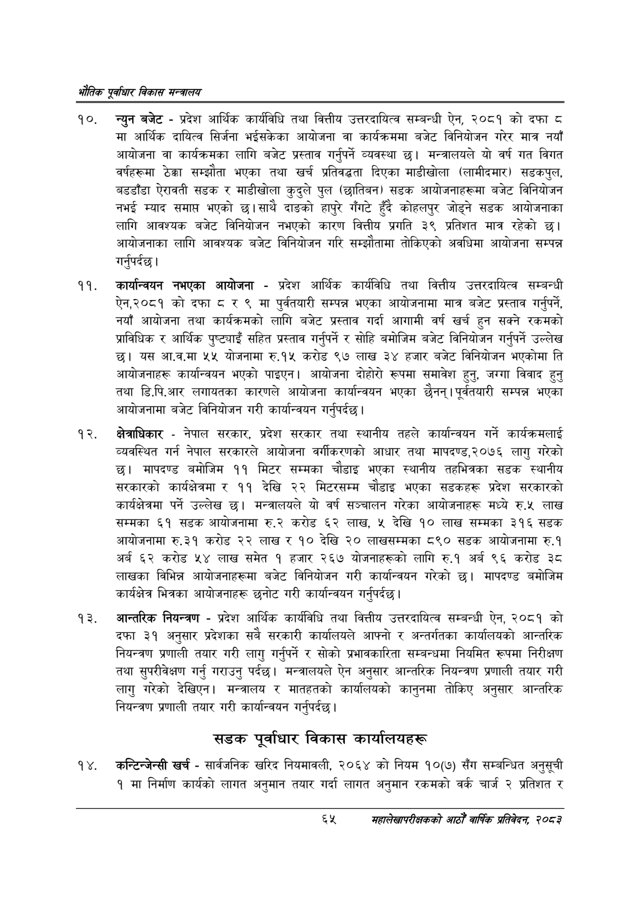

# Page 87 QA

## Rendered page


## Extracted text

```text
एवधार विकास मन्त्रालय
न्युन बजेट -प्रदेश आर्थिक कार्यविधि तथा वित्तीय उत्तरदायित्व सम्बन्धी ऐन, २०८१ को दफा ८ मा आर्थिक दायित्व सिर्जना भईसकेका आयोजना वा कार्यक्रममा बजेट विनियोजन गरेर मात्र नयाँ आयोजना वा कार्यक्रमका लागि बजेट प्रस्ताव गर्नुपर्ने व्यवस्था छ। मन्त्रालयले यो वर्ष गत विगत वर्षहरूमा ठेक्का सम्झौता भएका तथा खर्च प्रतिवद्धता दिएका माडीखोला (लामीदमार) सडकपुल, बडडाँडा ऐरावती सडक र माडीखोला कुदुले पुल (छातिबन) सडक आयोजनाहरूमा बजेट विनियोजन नभई म्याद समाप्त भएको छ। साथै दाङको हापुरे गँगटे हुँदै कोहलपुर जोड्ने सडक आयोजनाका लागि आवश्यक बजेट विनियोजन नभएको कारण वित्तीय प्रगति ३९ प्रतिशत मात्र रहेको छ। आयोजनाका लागि आवश्यक बजेट विनियोजन गरि सम्झौतामा तोकिएको अवधिमा आयोजना सम्पन्न गर्नुपर्दछ |
कार्यान्वयन नभएका आयोजना -प्रदेश आर्थिक कार्यविधि तथा वित्तीय उत्तरदायित्व सम्बन्धी ऐन,२०८१ को दफा ८ र ९ मा पूर्वतयारी सम्पन्न भएका आयोजनामा मात्र बजेट प्रस्ताव गर्नुपर्ने, नयाँ आयोजना तथा कार्यक्रमको लागि बजेट प्रस्ताव गर्दा आगामी वर्ष खर्च हुन सक्ने रकमको प्राविधिक र आर्थिक पुष्ट्याइँ सहित प्रस्ताव गर्नुपर्ने र सोहि बमोजिम बजेट विनियोजन गर्नुपर्ने उल्लेख छु। यस आ.व.मा ५५ योजनामा रु.१५ करोड ९७ लाख ३४ हजार बजेट विनियोजन भएकोमा ति आयोजनाहरू कार्यान्वयन भएको पाइएन। आयोजना दोहोरो रूपमा समावेश हुन्‌, जग्गा विवाद हुनु तथा डि.पि.आर लगायतका कारणले आयोजना कार्यान्वयन भएका छैनन्‌। पूर्वतयारी सम्पन्न भएका आयोजनामा बजेट विनियोजन गरी कार्यान्वयन गर्नुपर्दछ |
क्षेत्राधिकार -नेपाल सरकार, प्रदेश सरकार तथा स्थानीय तहले कार्यान्वयन गर्ने कार्यक्रमलाई व्यवस्थित गर्न नेपाल सरकारले आयोजना वर्गीकरणको आधार तथा मापदण्ड,२०७६ लागु गरेको छ। मापदण्ड बमोजिम ११ मिटर सम्मका चौडाइ भएका स्थानीय तहभित्रका सडक स्थानीय सरकारको कार्यक्षेत्रमा र ११ देखि २२ मिटरसम्म चौडाइ भएका सडकहरू प्रदेश सरकारको कार्यक्षेत्रमा पर्ने उल्लेख | मन्त्रालयले यो वर्ष सञ्चालन गरेका आयोजनाहरू मध्ये रु.५ लाख सम्मका ६१ सडक आयोजनामा रु.२ करोड ६२ लाख, ५ देखि १० लाख सम्मका ३१६ सडक आयोजनामा रु.३१ करोड २२ लाख र १० देखि २० लाखसम्मका ८९० सडक आयोजनामा रु.१ अर्ब ६२ करोड ५४ लाख समेत १ हजार २६७ योजनाहरूको लागि रु.१ अर्ब ९६ करोड ३८ लाखका विभिन्न आयोजनाहरूमा बजेट विनियोजन गरी कार्यान्वयन गरेको छ। मापदण्ड बमोजिम कार्यक्षेत्र भित्रका आयोजनाहरू छनोट गरी कार्यान्वयन गर्नुपर्दछ |
आन्तरिक नियन्त्रण -प्रदेश आर्थिक कार्यविधि तथा वित्तीय उत्तरदायित्व सम्बन्धी ऐन, २०८१ को दफा ३१ अनुसार प्रदेशका सबै सरकारी कार्यालयले आफ्नो र अन्तर्गतका कार्यालयको आन्तरिक नियन्त्रण प्रणाली तयार गरी लागु गर्नुपर्ने र सोको प्रभावकारिता सम्बन्धमा नियमित रूपमा निरीक्षण तथा सुपरीवेक्षण गर्नु गराउनु पर्दछ। मन्त्रालयले ऐन अनुसार आन्तरिक नियन्त्रण प्रणाली तयार गरी लागु गरेको देखिएन। मन्त्रालय र मातहतको कार्यालयको कानुनमा तोकिए अनुसार आन्तरिक नियन्त्रण प्रणाली तयार गरी कार्यान्वयन गर्नुपर्दछ |
सडक पूर्वाधार विकास कार्यालयहरू
'कन्टिन्जेन्सी खर्च -सार्वजनिक खरिद नियमावली, २०६४ को नियम १०(७) सँग सम्बन्धित अनुसूची १ मा निर्माण कार्यको लागत अनुमान तयार गर्दा लागत अनुमान रकमको वर्क चार्ज २ प्रतिशत र
६५
सहालेखापरीक्षकको आठौँ वाषिकि प्रतिवेदन २०८२
```

## Flags
- None
