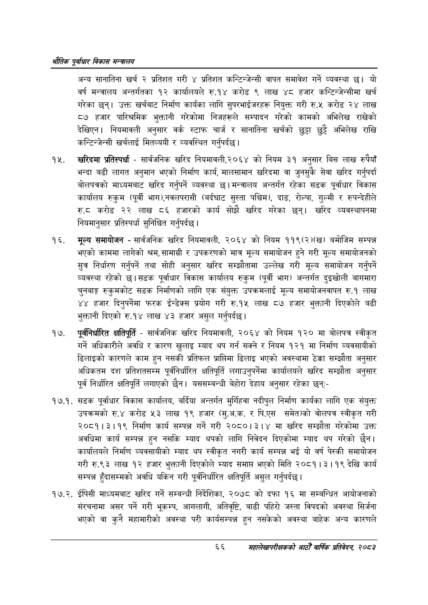

# Page 88 QA

## Rendered page


## Extracted text

```text
एवधार विकास मन्त्रालय
अन्य सानातिना खर्च २ प्रतिशत गरी ४ प्रतिशत कन्टिन्जेन्सी वापत समावेश गर्ने व्यवस्था छ। यो वर्ष मन्त्रालय अन्तर्गतका १२ कार्यालयले रु.१४ करोड ९ लाख ४८ हजार कन्टिन्जेन्सीमा खर्च गरेका छन्‌। उक्त खर्चबाट निर्माण कार्यका लागि सुपरभाईजरहरू नियुक्त गरी रु.५ करोड २४ लाख ८७ हजार पारिश्रमिक भुक्तानी गरेकोमा निजहरूले सम्पादन गरेको कामको अभिलेख राखेको देखिएन। नियमावली अनुसार वर्क स्टाफ चार्ज र सानातिना खर्चको छुट्टा छुट्टै अभिलेख राखि कन्टिन्जेन्सी खर्चलाई मितव्ययी र व्यवस्थित गर्नुपर्दछ |
खरिदमा प्रतिस्पर्धा -सार्वजनिक खरिद नियमावली,२०६४ को नियम ३१ अनुसार बिस लाख रुपैयाँ भन्दा बढी लागत अनुमान भएको निर्माण कार्य, मालसामान खरिदमा वा जुनसुकै सेवा खरिद गर्नुपर्दा बोलपत्रको माध्यमबाट खरिद गर्नुपर्ने व्यवस्था | मन्त्रालय अन्तर्गत रहेका सडक पूर्वाधार विकास कार्यालय रुकुम (पूर्वी भाग),नवलपरासी (बर्दघाट सुस्ता पश्चिम), दाङ, रोल्पा, गुल्मी र रुपन्देहीले रु.ट करोड २२ लाख ८६ हजारको कार्य सोझै खरिद गरेका छन्‌। खरिद व्यवस्थापनमा नियमानुसार प्रतिस्पर्धा सुनिश्चित गर्नुपर्दछ |
मूल्य समायोजन -सार्वजनिक खरिद नियमावली, २०६४ को नियम ११९(२)(ख) बमोजिम सम्पन्न भएको काममा लागेको श्रम, सामाग्री र उपकरणको मात्र मूल्य समायोजन हुने गरी मूल्य समायोजनको सुत्र निर्धारण गर्नुपर्ने तथा सोही अनुसार खरिद सम्झौतामा उल्लेख गरी मूल्य समायोजन गर्नुपर्ने व्यवस्था रहेको छ। सडक पूर्वाधार विकास कार्यालय रुकुम (पूर्वी भाग) अन्तर्गत दुइखोली बागमारा चुनबाङ्ग रुकुमकोट सडक निर्माणको लागि एक संयुक्त उपक्रमलाई मूल्य समायोजनवापत रु.१ लाख ४४ हजार दिनुपर्नेमा फरक ईन्डेक्स प्रयोग गरी रु.१५ लाख ८७ हजार भुक्तानी दिएकोले बढी भुक्तानी दिएको रु.१४ लाख ४३ हजार असुल गर्नुपर्दछ |
पूर्वनिर्धारित क्षतिपूर्ति -सार्वजनिक खरिद नियमावली, २०६४ को नियम १२० मा बोलपत्र स्वीकृत गर्ने अधिकारीले अवधि र कारण खुलाइ म्याद थप गर्न सक्ने र नियम १२१ मा निर्माण व्यवसायीको ढिलाइको कारणले काम हुन नसकी प्रतिफल प्राप्तिमा ढिलाइ भएको अवस्थामा ठेक्का सम्झौता अनुसार अधिकतम दश प्रतिशतसम्म पूर्वनिर्धारित क्षतिपूर्ति लगाउनुपर्नेमा कार्यालयले खरिद सम्झौता अनुसार पूर्व निर्धारित क्षतिपूर्ति लगाएको छैन। यससम्बन्धी बेहोरा देहाय अनुसार रहेका छन्‌:-
१७.१. सडक पूर्वाधार विकास कार्यालय, बर्दिया अन्तर्गत मुर्गिहवा नदीपुल निर्माण कार्यका लागि एक संयुक्त उपक्रमको रु.४ करोड ५३ लाख १९ हजार (मु.अ.क. र पि.एस समेत)को वोलपत्र स्वीकृत गरी २०८१।३।१९ निर्माण कार्य सम्पन्न गर्ने गरी २०८०।३।४ मा खरिद सम्झौता गरेकोमा उक्त अवधिमा कार्य सम्पन्न हुन नसकि म्याद थपको लागि निवेदन दिएकोमा म्याद थप गरेको छैन। कार्यालयले निर्माण व्यवसायीको म्याद थप स्वीकृत नगरी कार्य सम्पन्न भई यो वर्ष पेस्की समायोजन गरी रु.९३ लाख १२ हजार भुक्तानी दिएकोले म्याद समाप्त भएको मिति २०८१। ३। १९ देखि कार्य सम्पन्न हुँदासम्मको अवधि यकिन गरी पूर्वनिर्धारित क्षतिपूर्ति असुल गर्नुपर्दछ |
१७.२. ईपिसी माध्यमबाट खरिद गर्ने सम्बन्धी निर्देशिका, २०७८ को दफा १६ मा सम्बन्धित आयोजनाको संरचनामा असर पर्ने गरी भूकम्प, आगलागी, अतिवृष्टि, बाढी पहिरो जस्ता विपदको अवस्था सिर्जना भएको वा कुनै महामारीको अवस्था परी कार्यसम्पन्न हुन नसकेको अवस्था बाहेक अन्य कारणले
६६ सहालेखापरीक्षकको आठौँ वाषिकि प्रतिवेदन २०८२
```

## Flags
- None
