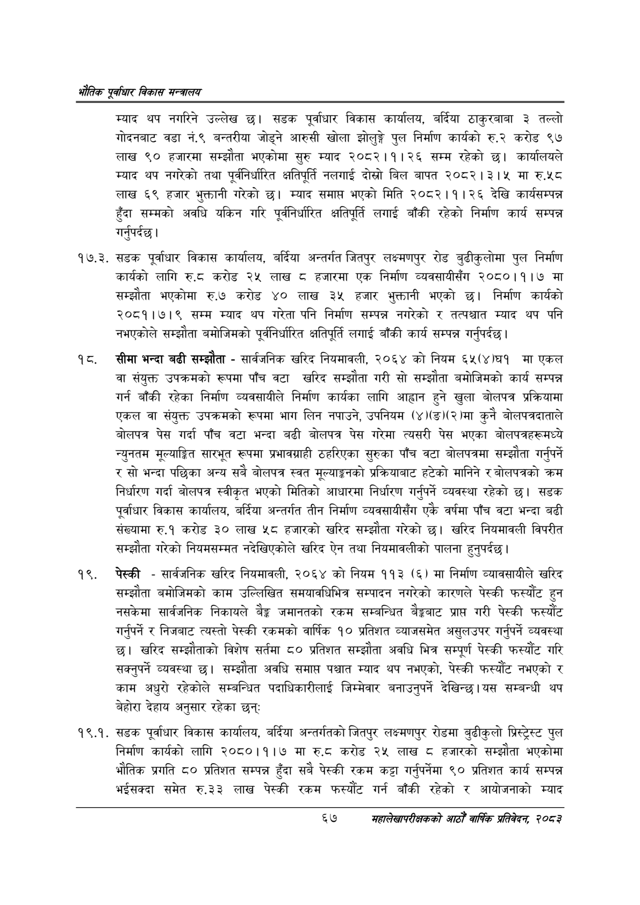

# Page 89 QA

## Rendered page


## Extracted text

```text
एवधार विकास मन्त्रालय
म्याद थप नगरिने उल्लेख | सडक पूर्वाधार विकास कार्यालय, बर्दिया ठाकुरबाबा ३ तल्लो गोदनबाट वडा नं.९ बन्तरीया जोड्ने आरुसी खोला झोलुङ्गे पुल निर्माण कार्यको रु.२ करोड ९७ लाख ९० हजारमा सम्झौता भएकोमा सुरु म्याद २०८२।१।२६ सम्म रहेको छ। कार्यालयले म्याद थप नगरेको तथा पूर्वनिर्धारित क्षतिपूर्ति नलगाई दोस्रो बिल बापत २०८२।३।५ मा रु.५८० लाख ६९ हजार भुक्तानी गरेको छ। म्याद समाप्त भएको मिति २०८२।१। २६ देखि कार्यसम्पन्न हुँदा सम्मको अवधि यकिन गरि पूर्वनिर्धारित क्षतिपूर्ति लगाई बाँकी रहेको निर्माण कार्य सम्पन्न गर्नुपर्दछ |
१७.३. सडक पूर्वाधार विकास कार्यालय, बर्दिया अन्तर्गत जितपुर लक्ष्मणपुर रोड बुढीकुलोमा पुल निर्माण कार्यको लागि ६.६ करोड २४ लाख हजारमा एक निर्माण व्यवसायीसँग २०८०।१।७ मा सम्झौता भएकोमा रु.७ करोड ४० लाख ३५ हजार भुक्तानी भएको छ। निर्माण कार्यको २०८१।७।९ सम्म म्याद थप गरेता पनि निर्माण सम्पन्न नगरेको र तत्पश्चात म्याद थप पनि नभएकोले सम्झौता बमोजिमको पूर्वनिर्धारित क्षतिपूर्ति लगाई बाँकी कार्य सम्पन्न गर्नुपर्दछ |
सीमा भन्दा बढी सम्झौता -सार्वजनिक खरिद नियमावली, २०६४ को नियम ६५(४)घ१ मा एकल वा संयुक्त उपक्रमको रूपमा पाँच वटा खरिद सम्झौता गरी सो सम्झौता बमोजिमको कार्य सम्पन्न गर्न बाँकी रहेका निर्माण व्यवसायीले निर्माण कार्यका लागि आह्वान हुने खुला बोलपत्र प्रक्रियामा एकल वा संयुक्त उपक्रमको रूपमा भाग लिन नपाउने, उपनियम (४)(ङ)(२)मा कुनै बोलपत्रदाताले बोलपत्र पेस गर्दा पाँच वटा भन्दा बढी बोलपत्र पेस गरेमा त्यसरी पेस भएका बोलपत्रहरूमध्ये न्युनतम मूल्याङ्गित सारभूत रूपमा प्रभावग्राही ठहरिएका सुरुका पाँच वटा बोलपत्रमा सम्झौता गर्नुपर्ने र सो भन्दा पछिका अन्य सबै बोलपत्र स्वत मूल्याङ्कनको प्रक्रियाबाट हटेको मानिने र बोलपत्रको क्रम निर्धारण गर्दा बोलपत्र स्वीकृत भएको मितिको आधारमा निर्धारण गर्नुपर्ने व्यवस्था रहेको सडक पूर्वाधार विकास कार्यालय, बर्दिया अन्तर्गत तीन निर्माण व्यवसायीसँग एकै वर्षमा पाँच वटा भन्दा बढी संख्यामा रु.१ करोड ३० लाख ५८ हजारको खरिद सम्झौता गरेको छ। खरिद नियमावली विपरीत सम्झौता गरेको नियमसम्मत नदेखिएकोले खरिद ऐन तथा नियमावलीको पालना हुनुपर्दछ |
पेस्की -सार्वजनिक खरिद नियमावली, २०६४ को नियम ११३ (६) मा निर्माण व्यावसायीले खरिद सम्झौता बमोजिमको काम उल्लिखित समयावधिभित्र सम्पादन नगरेको कारणले पेस्की फस्यौट हुन नसकेमा सार्वजनिक निकायले बैङ्क जमानतको रकम सम्बन्धित बैङ्कबाट प्राप्त गरी पेस्की फस्यौंट गर्नुपर्ने र निजबाट त्यस्तो पेस्की रकमको वार्षिक १० प्रतिशत व्याजसमेत असुलउपर गर्नुपर्ने व्यवस्था छ। खरिद सम्झौताको विशेष सर्तमा ८० प्रतिशत सम्झौता अवधि भित्र सम्पूर्ण पेस्की फस्यौट गरि सक्नुपर्ने व्यवस्था छ। सम्झौता अवधि समाप्त पश्चात म्याद थप नभएको, पेस्की फस्यौट नभएको र काम अधुरो रहेकोले सम्बन्धित पदाधिकारीलाई जिम्मेवार बनाउनुपर्ने देखिन्छ। यस सम्बन्धी थप बेहोरा देहाय अनुसार रहेका छन्‌
१९.१. सडक पूर्वाधार विकास कार्यालय, बर्दिया अन्तर्गतको जितपुर लक्ष्मणपुर रोडमा बुढीकुलो प्रिस्ट्रस्ट पुल निर्माण कार्यको लागि २०८०।१।७ मा करोड २५ लाख हजारको सम्झौता भएकोमा भौतिक प्रगति ८० प्रतिशत सम्पन्न हुँदा सबै पेस्की रकम कट्टा गर्नुपर्नेमा ९० प्रतिशत कार्य सम्पन्न भईसक्दा समेत रु.३३ लाख पेस्की रकम फस्यौट गर्न बाँकी रहेको र आयोजनाको म्याद
६७
सहालेखापरीक्षकको आठौँ वाषिकि प्रतिवेदन २०८२
```

## Flags
- None
