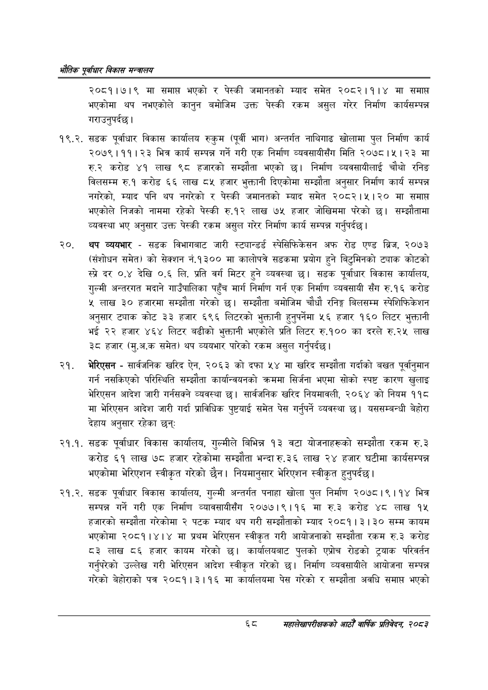

# Page 90 QA

## Rendered page


## Extracted text

```text
एवधार विकास मन्त्रालय
२०८१।७।९ मा समाप्त भएको र पेस्की जमानतको म्याद समेत २०८२।१।४ मा समाप्त भएकोमा थप नभएकोले कानुन बमोजिम उक्त पेस्की रकम असुल गरेर निर्माण कार्यसम्पन्न गराउनुपर्दछ।
१९.२. सडक पूर्वाधार विकास कार्यालय रुकुम (पूर्वी भाग) अन्तर्गत नाथिगाढ खोलामा पुल निर्माण कार्य २०७९।११।२३ भित्र कार्य सम्पन्न गर्ने गरी एक निर्माण व्यवसायीसँग मिति २०७८।५। २३ मा करोड ४१ लाख ९८ हजारको सम्झौता भएको छ। निर्माण व्यवसायीलाई चौथो रनिङ विलसम्म रु.१ करोड ६६ लाख ८५ हजार भुक्तानी दिएकोमा सम्झौता अनुसार निर्माण कार्य सम्पन्न नगरेको, म्याद पनि थप नगरेको र पेस्की जमानतको म्याद समेत २०८२।५।२० मा समाप्त भएकोले निजको नाममा रहेको पेस्की रु.१२ लाख ७५ हजार जोखिममा परेको छ। सम्झौतामा व्यवस्था भए अनुसार उक्त पेस्की रकम असुल गरेर निर्माण कार्य सम्पन्न गर्नुपर्दछ।
थप व्ययभार -सडक विभागबाट जारी स्ट्यान्डर्ड स्पेसिफिकेसन अफ रोड एण्ड ब्रिज, २०७३ (संशोधन समेत) को सेक्शन नं.१३०० मा कालोपत्रे सडकमा प्रयोग हुने बिटुमिनको ट्याक कोटको स्प्रे दर ०.४ देखि ०.६ लि. प्रति वर्ग मिटर हुने व्यवस्था छ। सडक पूर्वाधार विकास कार्यालय, गुल्मी अन्तरगत मदाने गाउँपालिका पहुँच मार्ग निर्माण गर्न एक निर्माण व्यवसायी सँग रु.१६ करोड ५ लाख ३० हजारमा सम्झौता गरेको छ। सम्झौता बमोजिम चौधौ रनिङ्ग बिलसम्म स्पेशिफिकेशन अनुसार ट्याक कोट ३३ हजार ६९६ लिटरको भुक्तानी हुनुपर्नेमा ५६ हजार १६० लिटर भुक्तानी भई २२ हजार ४६४ लिटर बढीको भुक्तानी भएकोले प्रति लिटर रु.१०० का दरले रु.२५ लाख ३ हजार (मु.अ.क समेत) थप व्ययभार पारेको रकम असुल गर्नुपर्दछ |
भेरिएसन -सार्वजनिक खरिद ऐन, २०६३ को दफा ५४ मा खरिद सम्झौता गर्दाको बखत पूर्वानुमान गर्न नसकिएको परिस्थिति सम्झौता कार्यान्वयनको क्रममा सिर्जना भएमा सोको स्पष्ट कारण खुलाइ भेरिएसन आदेश जारी गर्नसक्ने व्यवस्था छ। सार्वजनिक खरिद नियमावली, २०६४ को नियम ११८ मा भेरिएसन आदेश जारी गर्दा प्राविधिक पुष्टयाई समेत पेस गर्नुपर्ने व्यवस्था छ। यससम्बन्धी बेहोरा देहाय अनुसार रहेका छन्‌ः
२१.१. सडक पूर्वाधार विकास कार्यालय, गुल्मीले बिभिन्न १३ वटा योजनाहरूको सम्झौता रकम रु.३ करोड ६१ लाख ७८ हजार रहेकोमा सम्झौता भन्दा रु.३६ लाख २४ हजार घटीमा कार्यसम्पन्न भएकोमा भेरिएशन स्वीकृत गरेको छैन। नियमानुसार भेरिएशन स्वीकृत हुनुपर्दछ |
२१.२. सडक पूर्वाधार विकास कार्यालय, गुल्मी अन्तर्गत पनाहा खोला पुल निर्माण २०७८। ९। १४ भित्र सम्पन्न गर्ने गरी एक निर्माण व्यावसायीसँग २०७७।९।१६ मा रु.३ करोड ४८ लाख १५ हजारको सम्झौता गरेकोमा २ पटक म्याद थप गरी सम्झौताको म्याद २०८१।३। ३० सम्म कायम भएकोमा २०८१।४।४ मा प्रथम भेरिएसन स्वीकृत गरी आयोजनाको सम्झौता रकम रु.३ करोड ८३ लाख ८६ हजार कायम गरेको छ। कार्यालयबाट पुलको एप्रोच रोडको ट्र्याक परिवर्तन गर्नुपरेको उल्लेख गरी भेरिएसन आदेश स्वीकृत गरेको छ। निर्माण व्यवसायीले आयोजना सम्पन्न गरेको बेहोराको पत्र २०८१।३।१६ मा कार्यालयमा पेस गरेको र सम्झौता अवधि समाप्त भएको
६८ सहालेखापरीक्षकको आठौँ वाषिकि प्रतिवेदन २०८२
```

## Flags
- None
