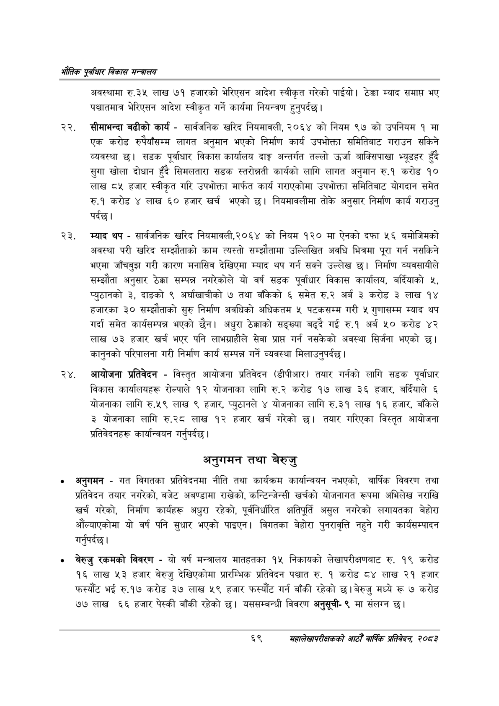

# Page 91 QA

## Rendered page


## Extracted text

```text
एवधार विकास मन्त्रालय
अवस्थामा रु.३५ लाख ७१ हजारको भेरिएसन आदेश स्वीकृत गरेको पाईयो। ठेक्का म्याद समाप्त भए पश्चातमात्र भेरिएसन आदेश स्वीकृत गर्ने कार्यमा नियन्त्रण हुनुपर्दछ |
२२, सीमाभन्दा बढीको कार्य -सार्वजनिक खरिद नियमावली, २०६४ को नियम ९७ को उपनियम १ मा एक करोड रुपैयाँसम्म लागत अनुमान भएको निर्माण कार्य उपभोक्ता समितिबाट गराउन सकिने व्यवस्था छ। सडक पूर्वाधार विकास कार्यालय दाङ्ग अन्तर्गत तल्लो उर्जा बाक्सिपाखा भ्यूडहर हुँदै सुगा खोला दोधान हुँदै सिमलतारा सडक स्तरोन्नती कार्यको लागि लागत अनुमान रु.१ करोड १० लाख ८५ हजार स्वीकृत गरि उपभोक्ता मार्फत कार्य गराएकोमा उपभोक्ता समितिबाट योगदान समेत रु.१ करोड ४ लाख ६० हजार खर्च भएको छ। नियमावलीमा तोके अनुसार निर्माण कार्य गराउनु पर्दछ।
म्याद थप -सार्वजनिक खरिद नियमावली,२०६४ को नियम १२० मा ऐनको दफा ५६ बमोजिमको अवस्था परी खरिद सम्झौताको काम त्यस्तो सम्झौतामा उल्लिखित अवधि भित्रमा पूरा गर्न नसकिने भएमा जाँचबुझ गरी कारण मनासिव देखिएमा म्याद थप गर्न सक्ने उल्लेख छ। निर्माण व्यवसायीले सम्झौता अनुसार ठेक्का सम्पन्न नगरेकोले यो वर्ष सडक पूर्वाधार विकास कार्यालय, बर्दियाको ५, प्युठानको ३, दाङको ९ अर्घाखाचीको ७ तथा वाँकिको ६ समेत रु.२ अर्ब ३ करोड ३ लाख १४ हजारका ३० सम्झौताको सुरु निर्माण अवधिको अधिकतम ५ पटकसम्म गरी ५ गुणासम्म म्याद थप गर्दा समेत कार्यसम्पन्न भएको छैन। अधुरा ठेक्काको सङ्ख्या बढ्दै गई रु.१ अर्ब ५० करोड ४२ लाख ७३ हजार खर्च भएर पनि लाभग्राहीले सेवा प्राप्त गर्न नसकेको अवस्था सिर्जना भएको छ। कानुनको परिपालना गरी निर्माण कार्य सम्पन्न गर्ने व्यवस्था मिलाउनुपर्दछ।
आयोजना प्रतिवेदन -विस्तृत आयोजना प्रतिवेदन (डीपीआर) तयार गर्नको लागि सडक पूर्वाधार विकास कार्यालयहरू रोल्पाले १२ योजनाका लागि रु.२ करोड १७ लाख ३६ हजार, बर्दियाले ६ योजनाका लागि रु.५९ लाख ९ हजार, प्युठानले ४ योजनाका लागि रु.३१ लाख १६ हजार, बाँकेले ३ योजनाका लागि रु.२८ लाख १२ हजार खर्च गरेको तयार गरिएका विस्तृत आयोजना प्रतिवेदनहरू कार्यान्वयन गर्नुपर्दछ |
अनुगमन तथा बेरुजु
अनुगमन -गत विगतका प्रतिवेदनमा नीति तथा कार्यक्रम कार्यान्वयन नभएको, वार्षिक विवरण तथा प्रतिवेदन तयार नगरेको, बजेट अबण्डामा राखेको, कन्टिन्जेन्सी खर्चको योजनागत रूपमा अभिलेख नराखि खर्च गरेको, निर्माण कार्यहरू अधुरा रहेको, पूर्वनिर्धारित क्षतिपूर्ति असुल नगरेको लगायतका बेहोरा औंल्याएकोमा यो वर्ष पनि सुधार भएको पाइएन। विगतका बेहोरा पुनरावृत्ति नहुने गरी कार्यसम्पादन गर्नुपर्दछ।
बेरुजु रकमको विवरण -यो वर्ष मन्त्रालय मातहतका १५ निकायको लेखापरीक्षणबाट रु. १९ करोड १६ लाख ५३ हजार बेरुजु देखिएकोमा प्रारम्भिक प्रतिवेदन पश्चात रु. १ करोड ८४ लाख २१ हजार फस्यौट भई रु.१७ करोड ३७ लाख ५९ हजार फस्यौट गर्न बाँकी रहेको छ। बेरुजु मध्ये रू ७ करोड ७७ लाख ६६ हजार पेस्की बाँकी रहेको छ। यससम्बन्धी विवरण अनुसूची९ मा संलग्न छ।
६९
सहालेखापरीक्षकको आठौँ वाषिकि प्रतिवेदन २०८२
```

## Flags
- None
