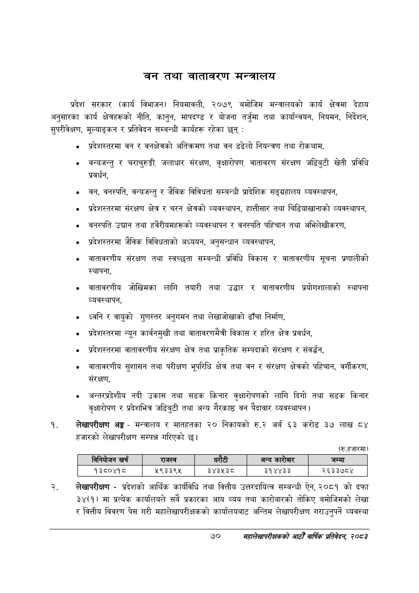

# Page 92 QA

## Rendered page


## Extracted text

```text
बन तथा वातावरण मन्त्रालय
प्रदेश सरकार (कार्य विभाजन) नियमावली, २०७९ बमोजिम मन्त्रालयको कार्य क्षेत्रमा देहाय अनुसारका कार्य क्षेत्रहरूको नीति, कानुन, मापदण्ड र योजना तर्जुमा तथा कार्यान्वयन, नियमन, निर्देशन, सुपरीवेक्षण, मूल्याङ्कन र प्रतिवेदन सम्बन्धी कार्यहरू रहेका छन्‌:
प्रदेशस्तरमा वन र वनक्षेत्रको अतिक्रमण तथा वन डढेलो नियन्त्रण तथा रोकथाम,
वन्यजन्तु र चराचुरुङ्गी, जलाधार संरक्षण, वृक्षारोपण, वातावरण संरक्षण जडिबुटी खेती प्रविधि प्रवर्धन,
वन, वनस्पति, वन्यजन्तु र जेविक विविधता सम्बन्धी प्रादेशिक सङ्ग्रहालय व्यवस्थापन,
प्रदेशस्तरमा संरक्षण क्षेत्र र चरन क्षेत्रको व्यवस्थापन, हात्तीसार तथा चिडियाखानाको व्यवस्थापन,
वनस्पति उद्यान तथा हर्वेरीयमहरूको व्यवस्थापन र वनस्पति पहिचान तथा अभिलेखीकरण,
प्रदेशस्तरमा जैविक विविधताको अध्ययन, अनुसन्धान व्यवस्थापन,
वातावरणीय संरक्षण तथा स्वच्छता सम्बन्धी प्रविधि विकास र वातावरणीय सूचना प्रणालीको स्थापना,
वातावरणीय जोखिमका लागि तयारी तथा उद्धार र वातावरणीय प्रयोगशालाको स्थापना व्यवस्थापन,
ध्वनि र वायुको गुणस्तर अनुगमन तथा लेखाजोखाको ढाँचा निर्माण,
प्रदेशस्तरमा न्यून कार्वनमुखी तथा वातावरणमैत्री विकास र हरित क्षेत्र प्रवर्धन,
प्रदेशस्तरमा वातावरणीय संरक्षण क्षेत्र तथा प्राकृतिक सम्पदाको संरक्षण र संवर्द्धन,
वातावरणीय सुशासन तथा परीक्षण भूपरिधि क्षेत्र तथा वन र संरक्षण क्षेत्रको पहिचान, वर्गीकरण, सरक्षण,
अन्तरप्रदेशीय नदी उकास तथा सडक किनार वृक्षारोपणको लागि दिगो तथा सडक किनार वृक्षारोपण र प्रदेशभित्र जडिबुटी तथा अन्य गैरकाष्ठ वन पैदावार व्यवस्थापन |
लेखापरीक्षण अङ्ग -मन्त्रालय र मातहतका २० निकायको रु.२ अर्ब ६३ करोड ३७ लाख ८४ हजारको लेखापरीक्षण सम्पन्न गरिएको छ।
(रु.हजारमा)
लेखापरीक्षण -प्रदेशको आर्थिक कार्यविधि तथा वित्तीय उत्तरदायित्व सम्बन्धी ऐन, २०८१ को दफा ३४(१) मा प्रत्येक कार्यालयले सबै प्रकारका आय व्यय तथा कारोबारको तोकिए बमोजिमको लेखा र वित्तीय विवरण पेस गरी महालेखापरीक्षकको कार्यालयबाट अन्तिम लेखापरीक्षण गराउनुपर्ने व्यवस्था
७०
सहालेखापरीक्षकको आठौँ वाषिकि प्रतिवेदन २०८२

|  |  | नानेकोजन |  | राजस्व |  |  | अन्य कारोबार | जम्मा |
| --- | --- | --- | --- | --- | --- | --- | --- | --- |
|  |  | १३८०४१८ |  | ५९३३९५ |  | ३४३५३८ | ३१४४३३ | २६३३७८४ |
```

## Flags
- table_page
- medium_quality_table
