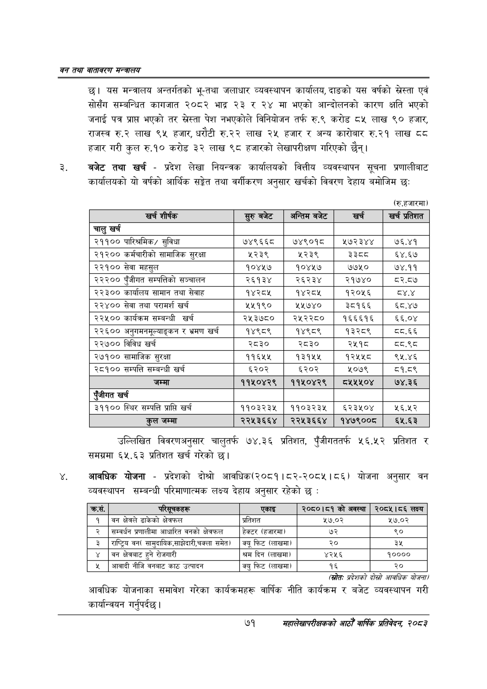

# Page 93 QA

## Rendered page


## Extracted text

```text
वन तथा वातावरण मन्त्रालय
छ। यस मन्त्रालय अन्तर्गतको भू-तथा जलाधार व्यवस्थापन कार्यालय, दाङको यस वर्षको स्रेस्ता एवं सोसँग सम्बन्धित कागजात २०८२ भाद्र २३ र २४ मा भएको आन्दोलनको कारण क्षति भएको जनाई पत्र प्रापत भएको तर पेश नभएकोले विनियोजन तर्फ रु.९ करोड ८४५ लाख ९० हजार, राजस्व रु.२ लाख ९५ हजार, धरौटी रु.२२ लाख २५ हजार र अन्य कारोबार रु.२१ लाख हजार गरी कुल रु.१० करोड ३२ लाख ९८ हजारको लेखापरीक्षण गरिएको छैन्‌।
बजेट तथा खर्च -प्रदेश लेखा नियन्त्रक कार्यालयको वित्तीय व्यवस्थापन सूचना प्रणालीबाट कार्यालयको यो वर्षको आर्थिक सङ्गेत तथा वर्गीकरण अनुसार खर्चको विवरण देहाय बमोजिम छः
(रु.हजारमा)
उल्लिखित विवरणअनुसार चालुतर्फ ७४.३६ प्रतिशत, पुँजीगततर्फ ५६.५२ प्रतिशत समग्रमा ६५.६३ प्रतिशत खर्च गरेको छ।
आवधिक योजना -प्रदेशको दोश्रो आवधिक (२०८१।८२-२०८५।८६) योजना अनुसार वन व्यवस्थापन सम्बन्धी परिमाणात्मक लक्ष्य देहाय अनुसार रहेको छ:
(खेत: प्रदेशको दोस्रो आवधिक योजना/
आवधिक योजनाका समावेश गरेका कार्यक्रमहरू वार्षिक नीति कार्यक्रम र बजेट व्यवस्थापन गरी कार्यान्वयन गर्नुपर्दछ।
७१
सहालेखापरीक्षकको आठौँ वाषिकि प्रतिवेदन २०८२

| खर्च शीर्षक | सुरु बबेट | अन्तिम बजेट | खर्च | खर्च प्रतिशत |
| --- | --- | --- | --- | --- |
| चालु खर्च |  |  |  |  |
| २११०० पारिश्रमिक/ सुविधा | ७४९६६८ | ७४९०१८ | ५७२३४४ | ७६.४१ |
| २१२०० कर्यचारीको सामाजिक सुरक्षा | ५२३९ | ५२३९ | ३३८ | ६४.६७ |
| २२१०० सेवा महसुल | १०४५७ | १०४५७ | ७७५० | ७४.११ |
| २२२०० पुँजीगत सम्पत्तिको सञ्चालन | २६१३४ | २६२३४ | २१७४० | ८२.८७ |
| २२३०० कार्यालय सामान तथा सेवाह | १४२८४५ | १४२८४५ | १२०१६ | ८.४ |
| २२४०० सेवा तथा परामर्श खर्च | २५१९० | २५७४० | ३८१६६ | ६८.४७ |
| २२५०० कार्यक्रम सम्बन्धी खर्च | २५३७८० | २५२२८० | १६६६१६ | ६६.०४ |
| २२६०० अनुगसनसूल्याङ्कन र भ्रमण खर्च | १४९८९ | १४९८९ | १३२८९ | ८्य.६६ |
| २२७०० विविध खर्च | २८३० | २८३० | २५१८ | द्व.९८ |
| २७१०० सामाजिक सुरक्षा | ११६५४५ | १३१५५ | १२५५८ | ९५.४६ |
| २८१०० सम्पत्ति सम्बन्धी खर्च | ६२०२ | ६२०२ | २०७९ | ८१.८९ |
| जम्मा | ११५०४२९ | ११५०४२९ | ८५५४५०४ | ७४.३६ |
| एंजीगत खर्च |  |  |  |  |
| ३११०० स्थिर सम्पत्ति प्राप्ति खर्च | ११०३२३५ | ११०३२३५ | ६२३५०४ | २६.५२ |
| जम्मा | २२५३६६४ | २२५३६६४ | १४७९००८ | ६५.६३ |

| क्रस. | परिपूचकहरू | एकाइ | २०८०।८१ को अवस्था | २०८५।८६ लक्ष्य |
| --- | --- | --- | --- | --- |
| १ | बन क्षेत्रले ढाकेको क्षेत्रफल | प्रतिशत | ५७.०२ | ५७.०२ |
| २ | सम्बर्धन प्रणालीमा आधारित वनको क्षेत्रफल | हेक्टर (हजारमा) | ७२ | ९० |
| ३ | राष्ट्रिय बन( सामुदाबिक,साझेदारी,चक्ला समेत) | क्यू फिट (लाखमा) | २० | ३५ |
| ४ | बन क्षेत्रबाट हुने रोजगारी | श्रम दिन (लाखमा) | ४२५६ | १०००० |
| ५ | आवादी नीजि वनबाट काठ उत्पादन | क्यु फिट (लाखमा) | १६ | २० |
```

## Flags
- table_page
- medium_quality_table
