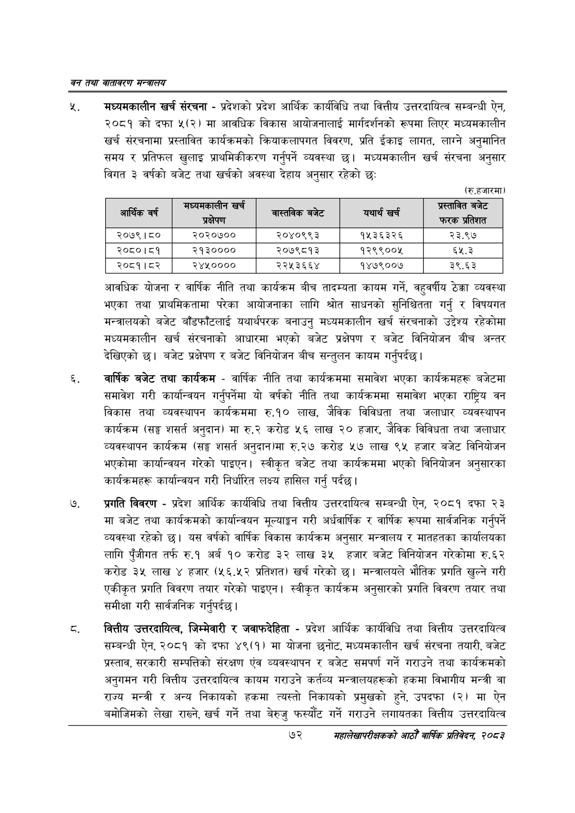

# Page 94 QA

## Rendered page


## Extracted text

```text
वन तथा वातावरण मन्त्रालय
न्‌. मध्यमकालीन खर्च संरचना -प्रदेशको प्रदेश आर्थिक कार्यविधि तथा वित्तीय उत्तरदायित्व सम्बन्धी ऐन, २०८१ को दफा ४५(२) मा आवधिक विकास आयोजनालाई मार्गदर्शनको रूपमा लिएर मध्यमकालीन खर्च संरचनामा प्रस्तावित कार्यक्रमको क्रियाकलापगत विवरण, प्रति ईकाइ लागत, लाग्ने अनुमानित समय र प्रतिफल खुलाइ प्राथमिकीकरण गर्नुपर्ने व्यवस्था छ। मध्यमकालीन खर्च संरचना अनुसार विगत ३ वर्षको बजेट तथा खर्चको अवस्था देहाय अनुसार रहेको छ:
(रु.हजारमा)
आवधिक योजना र वार्षिक नीति तथा कार्यक्रम बीच तादम्यता कायम गर्ने, वहुवर्षीय ठेक्का व्यवस्था भएका तथा प्राथमिकतामा परेका आयोजनाका लागि श्रोत साधनको सुनिश्चितता गर्नु र विषयगत मन्त्रालयको बजेट बाँडफाँटलाई यथार्थपरक बनाउनु मध्यमकालीन खर्च संरचनाको उद्देश्य रहेकोमा मध्यमकालीन खर्च संरचनाको आधारमा भएको बजेट प्रक्षेपण र बजेट विनियोजन बीच अन्तर देखिएको छ। बजेट प्रक्षेपण र बजेट विनियोजन बीच सन्तुलन कायम गर्नुपर्दछ |
वार्षिक बजेट तथा कार्यक्रम -वार्षिक नीति तथा कार्यक्रममा समावेश भएका कार्यक्रमहरू बजेटमा समावेश गरी कार्यान्वयन गर्नुपर्नेमा यो वर्षको नीति तथा कार्यक्रममा समावेश भएका राष्ट्रिय वन विकास तथा व्यवस्थापन कार्यक्रममा रु.१० लाख, जैविक विविधता तथा जलाधार व्यवस्थापन कार्यक्रम (सङ्घ शसर्त अनुदान) मा रु.२ करोड ५६ लाख २० हजार, जैविक विविधता तथा जलाधार व्यवस्थापन कार्यक्रम (सङ्घ शसर्त अनुदान)मा रु.२७ करोड ५७ लाख ९५ हजार बजेट विनियोजन भएकोमा कार्यान्वयन गरेको पाइएन। स्वीकृत बजेट तथा कार्यक्रममा भएको विनियोजन अनुसारका कार्यक्रमहरू कार्यान्वयन गरी निर्धारित लक्ष्य हासिल गर्नु पर्दछ।
प्रगति विवरण -प्रदेश आर्थिक कार्यविधि तथा वित्तीय उत्तरदायित्व सम्बन्धी ऐन, २०८१ दफा २३ मा बजेट तथा कार्यक्रमको कार्यान्वयन मूल्याङ्कन गरी अर्धवार्षिक र वार्षिक रूपमा सार्वजनिक गर्नुपर्ने व्यवस्था रहेको | यस वर्षको वार्षिक विकास कार्यक्रम अनुसार मन्त्रालय र मातहतका कार्यालयका लागि पुँजीगत तर्फ रु.१ अर्ब १० करोड ३२ लाख ३५ हजार बजेट विनियोजन गरेकोमा रु.६२ करोड ३५ लाख ४ हजार (५६.५२ प्रतिशत) खर्च गरेको छ। मन्त्रालयले भौतिक प्रगति खुल्ने गरी एकीकृत प्रगति विवरण तयार गरेको पाइएन। स्वीकृत कार्यक्रम अनुसारको प्रगति विवरण तयार तथा समीक्षा गरी सार्वजनिक गर्नुपर्दछ।
वित्तीय उत्तरदायित्व, जिम्मेवारी र जवाफदेहिता -प्रदेश आर्थिक कार्यविधि तथा वित्तीय उत्तरदायित्व सम्बन्धी ऐन, २०८१ को दफा ४९(१) मा योजना छनोट, मध्यमकालीन खर्च संरचना तयारी, बजेट प्रस्ताव, सरकारी सम्पत्तिको संरक्षण एंव व्यवस्थापन र बजेट समपर्ण गर्ने गराउने तथा कार्यक्रमको अनुगमन गरी वित्तीय उत्तरदायित्व कायम गराउने कर्तव्य मन्त्रालयहरूको हकमा विभागीय मन्त्री वा राज्य मन्त्री र अन्य निकायको हकमा त्यस्तो निकायको प्रमुखको हुने, उपदफा (२) मा ऐन बमोजिमको लेखा राख्ने, खर्च गर्ने तथा बेरुजु फस्यौंट गर्ने गराउने लगायतका वित्तीय उत्तरदायित्व
७२
सहालेखापरीक्षकको आठौँ वाषिकि प्रतिवेदन २०८२

|  | प्रक्षेपण |  | यथार्थ खर्च | एस छे फरक प्रतिशत |
| --- | --- | --- | --- | --- |
| २०७९।८० | २०२०७०० | २०४०९९३ | १५३६३२६ | २३.९७ |
| २०८०।८१ | २१३०००० | २०७९८१३ | १२९९००५ | ६५.३ |
| २०८१।८२ | २४५०००० | २२५३६६४ | १४७९००७ | ३९.६३ |
```

## Flags
- table_page
- medium_quality_table
