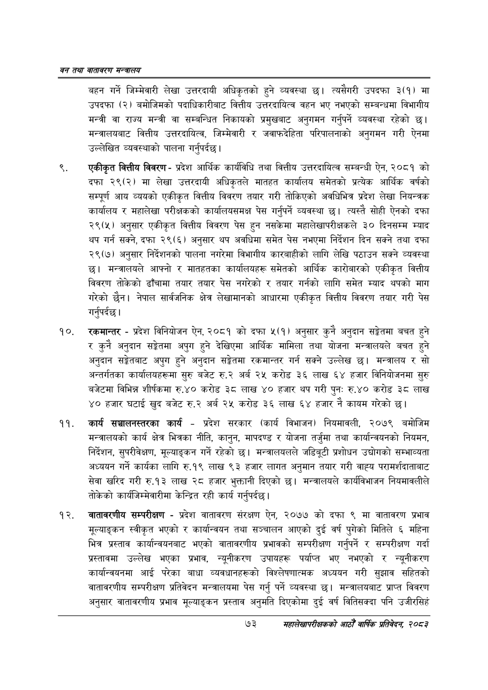

# Page 95 QA

## Rendered page


## Extracted text

```text
वन तथा वातावरण मन्त्रालय
बहन गर्ने जिम्मेवारी लेखा उत्तरदायी अधिकृतको हुने व्यवस्था छ। त्यसैगरी उपदफा ३(१) मा उपदफा (२) बमोजिमको पदाधिकारीबाट वित्तीय उत्तरदायित्व वहन भए नभएको सम्बन्धमा विभागीय मन्त्री वा राज्य मन्त्री वा सम्बन्धित निकायको प्रमुखबाट अनुगमन गर्नुपर्ने व्यवस्था रहेको छ। मन्त्रालयबाट वित्तीय उत्तरदायित्व, जिम्मेवारी र जवाफदेहिता परिपालनाको अनुगमन गरी ऐनमा उल्लेखित व्यवस्थाको पालना गर्नुपर्दछ |
एकीकृत वित्तीय विवरण -प्रदेश आर्थिक कार्यविधि तथा वित्तीय उत्तरदायित्व सम्बन्धी ऐन, २०८१ को दफा २९(२) मा लेखा उत्तरदायी अधिकृतले मातहत कार्यालय समेतको प्रत्येक आर्थिक वर्षको सम्पूर्ण आय व्ययको एकीकृत वित्तीय विवरण तयार गरी तोकिएको अवधिभित्र प्रदेश लेखा नियन्त्रक कार्यालय र महालेखा परीक्षकको कार्यालयसमक्ष पेस गर्नुपर्ने व्यवस्था | त्यस्तै सोही ऐनको दफा २९(५) अनुसार एकीकृत वित्तीय विवरण पेस हुन नसकेमा महालेखापरीक्षकले ३० दिनसम्म म्याद थप गर्न सक्ने, दफा २९(६) अनुसार थप अवधिमा समेत पेस नभएमा निर्देशन दिन सक्ने तथा दफा २९(७) अनुसार निर्देशनको पालना नगरेमा विभागीय कारबाहीको लागि लेखि पठाउन सक्ने व्यवस्था छ। मन्त्रालयले आफ्नो र मातहतका कार्यालयहरू समेतको आर्थिक कारोबारको एकीकृत वित्तीय विवरण तोकेको ढाँचामा तयार तयार पेस नगरेको र तयार गर्नको लागि समेत म्याद थपको माग गरेको छैन। नेपाल सार्वजनिक क्षेत्र लेखामानको आधारमा एकीकृत वित्तीय विवरण तयार गरी पेस गर्नुपर्दछ |
रकमान्तर -प्रदेश विनियोजन ऐन, २०८१ को दफा ५(१) अनुसार कुनै अनुदान सङ्गेतमा बचत हुने र कुनै अनुदान सङ्ेतमा अपुग हुने देखिएमा आर्थिक मामिला तथा योजना मन्त्रालयले बचत हुने अनुदान सङ्गेतबाट अपुग हुने अनुदान सङ्गेतमा रकमान्तर गर्न सक्ने उल्लेख छ। मन्त्रालय र सो अन्तर्गतका कार्यालयहरूमा सुरु बजेट रु.२ अर्ब २५ करोड ३६ लाख ६४ हजार विनियोजनमा सुरु बजेटमा विभिन्न शीर्षकमा रु.४० करोड ३ लाख ४० हजार थप गरी पुनः रु.४० करोड ३८ लाख ४० हजार घटाई खुद बजेट रु.२ अर्ब २५ करोड ३६ लाख ६४ हजार नै कायम गरेको छ।
कार्य सञ्चालनस्तरका कार्य -प्रदेश सरकार (कार्य विभाजन) नियमावली, २०७९ बमोजिम मन्त्रालयको कार्य क्षेत्र भित्रका नीति, कानुन, मापदण्ड र योजना तर्जुमा तथा कार्यान्वयनको नियमन, निर्देशन, सुपरीवेक्षण, मूल्याङ्कन गर्ने रहेको मन्त्रालयलले जडिबूटी प्रशोधन उद्योगको सम्भाव्यता अध्ययन गर्ने कार्यका लागि रु.१९ लाख ९३ हजार लागत अनुमान तयार गरी वाह्य परामर्शदाताबाट सेवा खरिद गरी रु.१३ लाख २८ हजार भुक्तानी दिएको छ। मन्त्रालयले कार्यविभाजन नियमावलीले तोकेको कार्यजिम्मेवारीमा केन्द्रित रही कार्य गर्नुपर्दछ |
वातावरणीय सम्परीक्षण -प्रदेश वातावरण संरक्षण ऐन, २०७७ को दफा ९ मा वातावरण प्रभाव मूल्याङ्कन स्वीकृत भएको र कार्यान्वयन तथा सञ्चालन आएको दुई वर्ष पुगेको मितिले ६ महिना भित्र प्रस्ताव कार्यान्वयनबाट भएको वातावरणीय प्रभावको सम्परीक्षण गर्नुपर्ने र सम्परीक्षण गर्दा प्रस्तावमा उल्लेख भएका प्रभाव, न्यूनीकरण उपायहरू पर्याप्त भए नभएको र न्यूनीकरण कार्यान्वयनमा आई परेका बाधा व्यवधानहरूको विश्लेषणात्मक अध्ययन गरी सुझाव सहितको वातावरणीय सम्परीक्षण प्रतिवेदन मन्त्रालयमा पेस गर्नु पर्ने व्यवस्था छ। मन्त्रालयबाट प्राप्त विवरण अनुसार वातावरणीय प्रभाव मूल्याङ्कन प्रस्ताव अनुमति दिएकोमा दुई वर्ष वितिसक्दा पनि उजीरसिहँ
७३
सहालेखापरीक्षकको आठौँ वाषिकि प्रतिवेदन २०८२
```

## Flags
- None
