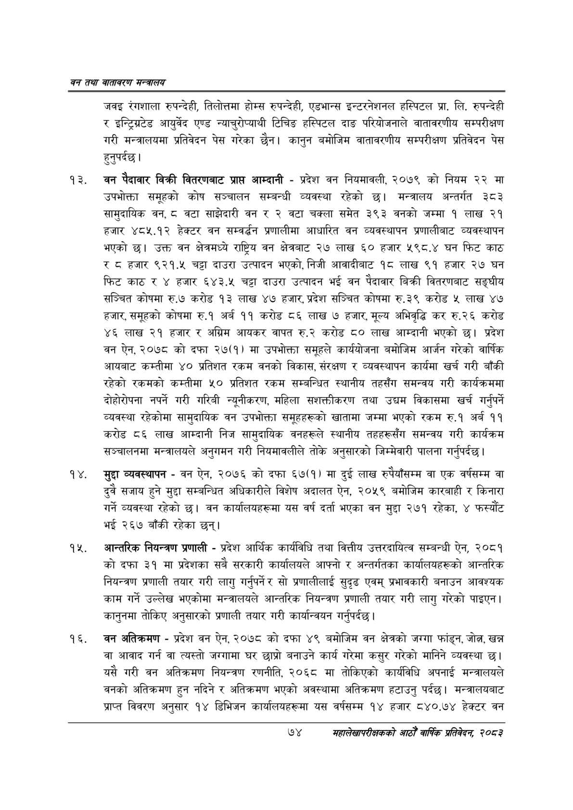

# Page 96 QA

## Rendered page


## Extracted text

```text
वन तथा वातावरण मन्त्रालय
जवइ रंगशाला रुपन्देही, तिलोत्तमा होम्स रुपन्देही, एडभान्स इन्टरनेशनल हस्पिटल प्रा. लि. रुपन्देही र इन्ट्रिग्रटड आयुर्वेद एण्ड न्याचुरोप्याथी टिचिङ हस्पिटल दाङ परियोजनाले वातावरणीय सम्परीक्षण गरी मन्त्रालयमा प्रतिवेदन पेस गरेका छैन। कानुन बमोजिम वातावरणीय सम्परीक्षण प्रतिवेदन पेस हुनुपर्दछ।
वन पैदावार विक्री वितरणबाट प्राप्त आम्दानी -प्रदेश वन नियमावली, २०७९ को नियम २२ मा उपभोक्ता समूहको कोष सञ्चालन सम्बन्धी व्यवस्था रहेको छ। मन्त्रालय अन्तर्गत ३८३ सामुदायिक वन, ८ वटा साझेदारी वन र २ वटा चक्ला समेत ३९३ वनको जम्मा १ लाख २१ हजार ४८५.१२ हेक्टर वन सम्वर्धन प्रणालीमा आधारित वन व्यवस्थापन प्रणालीबाट व्यवस्थापन भएको छ। उक्त वन क्षेत्रमध्ये राष्ट्रिय वन क्षेत्रबाट २७ लाख ६० हजार ५९८.४ घन फिट काठ र ट८ हजार ९२१.५ चट्टा दाउरा उत्पादन भएको, निजी आवादीबाट १८ लाख ९१ हजार २७ घन फिट काठ र ४ हजार ६४३.५ चट्टा दाउरा उत्पादन भई वन पैदावार बिक्री वितरणबाट सङ्घीय सञ्चित कोषमा रु.७ करोड १३ लाख ४७ हजार, प्रदेश सञ्चित कोषमा रु.३९ करोड लाख ४७ हजार, समूहको कोषमा रु.१ अर्ब ११ करोड ८६ लाख ७ हजार, मूल्य अभिवृद्धि कर रु.२६ करोड ४६ लाख २१ हजार र अग्रिम आयकर वापत रु.२ करोड ८० लाख आम्दानी भएको छ। प्रदेश वन ऐन, २०७८ को दफा २७(१) मा उपभोक्ता समूहले कार्ययोजना बमोजिम आर्जन गरेको वार्षिक आयबाट कम्तीमा ४० प्रतिशत रकम वनको विकास, संरक्षण र व्यवस्थापन कार्यमा खर्च गरी बाँकी रहेको रकमको कम्तीमा ५० प्रतिशत रकम सम्बन्धित स्थानीय तहसँग समन्वय गरी कार्यक्रममा दोहोरोपना नपर्ने गरी गरिबी न्यूनीकरण, महिला सशक्तीकरण तथा उद्यम विकासमा खर्च गर्नुपर्ने व्यवस्था रहेकोमा सामुदायिक वन उपभोक्ता समूहहरूको खातामा जम्मा भएको रकम रु.१ अर्ब ११ करोड ८६ लाख आम्दानी निज सामुदायिक वनहरूले स्थानीय तहहरूसँग समन्वय गरी कार्यक्रम सञ्चालनमा मन्त्रालयले अनुगमन गरी नियमावलीले तोके अनुसारको जिम्मेवारी पालना गर्नुपर्दछ।
मुद्दा व्यवस्थापन -वन ऐन, २०७६ को दफा ६७(१) मा दुई लाख रुपैयाँसम्म वा एक वर्षसम्म वा दुवै सजाय हुने मुद्दा सम्बन्धित अधिकारीले विशेष अदालत ऐन, २०५९ बमोजिम कारबाही र किनारा गर्ने व्यवस्था रहेको | वन कार्यालयहरूमा यस वर्ष दर्ता भएका वन मुद्दा २७१ रहेका, ४ फस्यौट भई २६७ बाँकी रहेका छन्‌।
आन्तरिक नियन्त्रण प्रणाली -प्रदेश आर्थिक कार्यविधि तथा वित्तीय उत्तरदायित्व सम्बन्धी ऐन, २०८१ को दफा ३१ मा प्रदेशका सबै सरकारी कार्यालयले आफ्नो र अन्तर्गतका कार्यालयहरूको आन्तरिक नियन्त्रण प्रणाली तयार गरी लागु गर्नुपर्ने र सो प्रणालीलाई सुदृढ एवम्‌ प्रभावकारी बनाउन आवश्यक काम गर्ने उल्लेख भएकोमा मन्त्रालयले आन्तरिक नियन्त्रण प्रणाली तयार गरी लागु गरेको पाइएन | कानुनमा तोकिए अनुसारको प्रणाली तयार गरी कार्यान्वयन गर्नुपर्दछ |
वन अतिक्रमण -प्रदेश वन ऐन, २०७८ को दफा ४९ बमोजिम वन क्षेत्रको जग्गा फांड्न, जोल, खन्न वा आवाद गर्न वा त्यस्तो जग्गामा घर छाप्रो बनाउने कार्य गरेमा कसुर गरेको मानिने व्यवस्था छ। यसै गरी वन अतिक्रमण नियन्त्रण रणनीति, २०६८ मा तोकिएको कार्यविधि अपनाई मन्त्रालयले वनको अतिक्रमण हुन नदिने र अतिक्रमण भएको अवस्थामा अतिक्रमण हटाउनु पर्दछ। मन्त्रालयबाट प्राप्त विवरण अनुसार १४ डिभिजन कार्यालयहरूमा यस वर्षसम्म १४ हजार ८४०.७४ हेक्टर वन
७४
सहालेखापरीक्षकको आठौँ वाषिकि प्रतिवेदन २०८२
```

## Flags
- None
