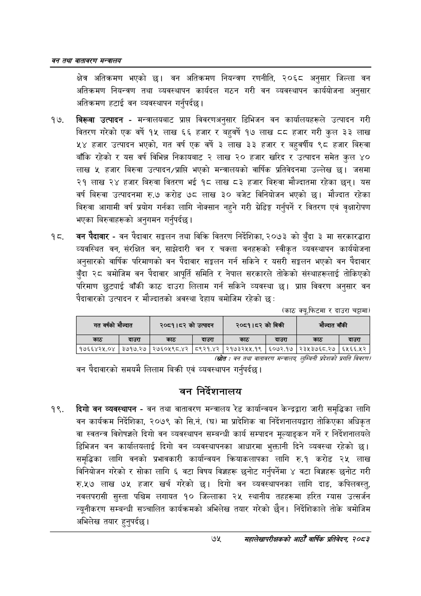

# Page 97 QA

## Rendered page


## Extracted text

```text
वन तथा वातावरण मन्त्रालय
क्षेत्र अतिक्रमण भएको छ। वन अतिक्रमण नियन्त्रण रणनीति, २०६८ अनुसार जिल्ला वन अतिक्रमण नियन्त्रण तथा व्यवस्थापन कार्यदल गठन गरी वन व्यवस्थापन कार्ययोजना अनुसार अतिक्रमण हटाई वन व्यवस्थापन गर्नुपर्दछ |
बिख्वा उत्पादन -मन्त्रालयबाट प्राप्त विवरणअनुसार डिभिजन वन कार्यालयहरूले उत्पादन गरी वितरण गरेको एक वर्ष १५ लाख ६६ हजार र बहुवर्ष १७ लाख ८८ हजार गरी कुल ३३ लाख ५४ हजार उत्पादन भएको, गत वर्ष एक वर्षे ३ लाख ३३ हजार र बहुवर्षीय ९८ हजार बिरुवा बाँकि रहेको र यस वर्ष विभिन्न निकायबाट २ लाख २० हजार खरिद र उत्पादन समेत कुल ४० लाख ५ हजार बिरुवा उत्पादन/प्राप्ति भएको मन्त्रालयको वार्षिक प्रतिवेदनमा उल्लेख | जसमा २१ लाख २४ हजार बिरुवा वितरण भई १८ लाख ८३ हजार बिरुवा मौज्दातमा रहेका छन्‌। यस वर्ष बिरुवा उत्पादनमा रु.७ करोड ७८ लाख ३० बजेट विनियोजन भएको छ। मौज्दात रहेका बिरुवा आगामी वर्ष प्रयोग गर्नका लागि नोक्सान नहुने गरी ग्रेडिङ्ग गर्नुपर्ने र वितरण एवं वृक्षारोपण भएका बिरुवाहरूको अनुगमन गर्नुपर्दछ |
बन पैदावार -वन पैदावार सङ्कलन तथा विक्रि वितरण निर्देशिका, २०७३ को बुँदा ३ मा सरकारद्धारा व्यवस्थित वन, संरक्षित वन, साझेदारी वन र चक्ला वनहरूको स्वीकृत व्यवस्थापन कार्ययोजना अनुसारको वार्षिक परिमाणको वन पैदावार सङ्कलन गर्न सकिने र यसरी सङ्कलन भएको वन पैदावार बुँदा २८ बमोजिम वन पैदावार आपूर्ति समिति र नेपाल सरकारले तोकेको संस्थाहरूलाई तोकिएको परिमाण छुट्याई बाँकी काठ दाउरा लिलाम गर्न सकिने व्यवस्था छ। प्राप्त विवरण अनुसार वन पैदावारको उत्पादन र मौज्दातको अवस्था देहाय बमोजिम रहेको छ:
(काठ क्यूफिटमा र दाउरा चट्ामा)
(स्रोत -वन तथा वातावरण सन्बालयु लुम्विनी प्रदेशको प्रगति विवरण/
वन पैदावारको समयमै लिलाम बिक्री एवं व्यवस्थापन गर्नुपर्दछ |
चन निर्देशनालय
दिगो वन व्यवस्थापन -वन तथा वातावरण मन्त्रालय रेड कार्यान्वयन केन्द्रद्वारा जारी समृद्धिका लागि वन कार्यक्रम निर्देशिका, २०७९ को सि.नं. (घ) मा प्रादेशिक वा निर्देशनालयद्वारा तोकिएका अधिकृत वा स्वतन्त्र विशेषज्ञले दिगो वन व्यवस्थापन सम्बन्धी कार्य सम्पादन मूल्याङ्कन गर्ने र निर्देशनालयले डिभिजन वन कार्यालयलाई दिगो वन व्यवस्थापनका आधारमा भुक्तानी दिने व्यवस्था रहेको छ। समृद्धिका लागि वनको प्रभावकारी कार्यान्वयन क्रियाकलापका लागि रु.१ करोड २५ लाख विनियोजन गरेको र सोका लागि ६ वटा विषय विज्ञहरू छनोट गर्नुपर्नेमा ४ वटा विज्ञहरू छनोट गरी रु.५७ लाख ७५ हजार खर्च गरेको दिगो वन व्यवस्थापनका लागि दाङ, कपिलवस्तु, नवलपरासी सुस्ता पश्चिम लगायत १० जिल्लाका २५ स्थानीय तहहरूमा हरित ग्यास उत्सर्जन न्यूनीकरण सम्बन्धी सञ्चालित कार्यक्रमको अभिलेख तयार गरेको छैन। निर्देशिकाले तोके बमोजिम अभिलेख तयार हुनुपर्दछ |
७५
सहालेखापरीक्षकको आठौँ वाषिकि प्रतिवेदन २०८२

| 'गत वर्षको | मौज्दात | २०८१।८२ को | उत्पादन | २०८१।८२ | को बिक्री | मौज्दात | बाँकी |
| --- | --- | --- | --- | --- | --- | --- | --- |
| काठ | दाउरा | काठ | दाउरा | काठ | दाउरा | काठ | दाउरा |
| १७६६४२५.०४ | ३७१७.२७ | २७६०५९८.४२ | ८९२१.४२ | २१७३२५५.१९ | ६०७२.१७ | २३५३७६८.२७ | ६५६६.५२ |
```

## Flags
- table_page
- medium_quality_table
