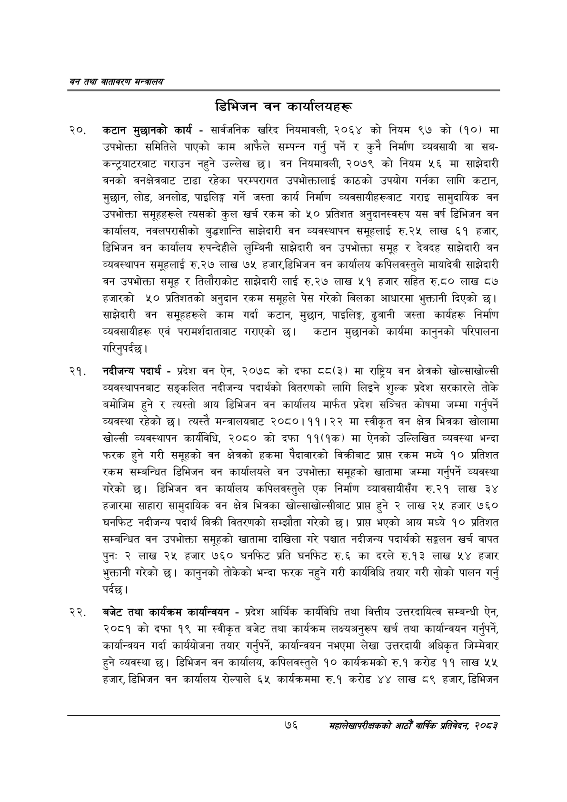

# Page 98 QA

## Rendered page


## Extracted text

```text
वन तथा वातावरण मन्त्रालय
डिभिजन वन कार्यालयहरू
२०, कटान मुछानको कार्य -सार्वजनिक खरिद नियमावली, २०६४ को नियम ९७ को (१०) मा उपभोक्ता समितिले पाएको काम आफैले सम्पन्न गर्नु पर्ने र कुनै निर्माण व्यवसायी वा सबकन्ट्रयाटरबाट गराउन नहुने उल्लेख | वन नियमावली, २०७९ को नियम ५६ मा साझेदारी वनको वनक्षेत्रबाट टाढा रहेका परम्परागत उपभोक्तालाई काठको उपयोग गर्नका लागि कटान, मुछान, लोड, अनलोड, पाइलिङ्ग गर्ने जस्ता कार्य निर्माण व्यवसायीहरूबाट गराइ सामुदायिक वन उपभोक्ता समूहहरूले त्यसको कुल खर्च रकम को ५० प्रतिशत अनुदानस्वरुप यस वर्ष डिभिजन वन कार्यालय, नवलपरासीको बुद्धशान्ति साझेदारी वन व्यवस्थापन समूहलाई रु.२५ लाख ६१ हजार, डिभिजन वन कार्यालय रुपन्देहीले लुम्बिनी साझेदारी वन उपभोक्ता समूह र देवदह साझेदारी वन व्यवस्थापन समूहलाई रु.२७ लाख ७५ हजार,डिभिजन वन कार्यालय कपिलवस्तुले मायादेवी साझेदारी वन उपभोक्ता समूह र तिलौराकोट साझेदारी लाई रु.२७ लाख ५१ हजार सहित रु.८० लाख ८७ हजारको ५० प्रतिशतको अनुदान रकम समूहले पेस गरेको बिलका आधारमा भुक्तानी दिएको छ। साझेदारी वन समूहहरूले काम गर्दा कटान, मुछान, पाइलिङ्ग, ढुवानी जस्ता कार्यहरू निर्माण व्यवसायीहरू एवं परामर्शदाताबाट गराएको छ। कटान मुछानको कार्यमा कानुनको परिपालना गरिनुपर्दछ |
नदीजन्य पदार्थ -प्रदेश वन ऐन, २०७८ को दफा ८८(३) मा राष्ट्रिय वन क्षेत्रको खोल्साखोल्सी व्यवस्थापनबाट सङ्कलित नदीजन्य पदार्थको वितरणको लागि लिइने शुल्क प्रदेश सरकारले तोके बमोजिम हुने र त्यस्तो आय डिभिजन वन कार्यालय मार्फत प्रदेश सञ्चित कोषमा जम्मा गर्नुपर्ने व्यवस्था रहेको | त्यस्तै मन्त्रालयबाट २०८०।११।२२ मा स्वीकृत वन क्षेत्र भित्रका खोलामा खोल्सी व्यवस्थापन कार्यविधि, २०८० को दफा ११(१क) मा ऐनको उल्लिखित व्यवस्था भन्दा फरक हुने गरी समूहको वन क्षेत्रको हकमा पैदावारको विक्रीबाट प्राप्त रकम मध्ये १० प्रतिशत रकम सम्बन्धित डिभिजन वन कार्यालयले वन उपभोक्ता समूहको खातामा जम्मा गर्नुपर्ने व्यवस्था गरेको डिभिजन वन कार्यालय कपिलवस्तुले एक निर्माण व्यावसायीसँग रु.२१ लाख ३४ हजारमा साहारा सामुदायिक वन क्षेत्र भित्रका खोल्साखोल्सीबाट प्राप्त हुने २ लाख २५ हजार ७६० घनफिट नदीजन्य पदार्थ बिक्री वितरणको सम्झौता गरेको छ। प्रापत भएको आय मध्ये १० प्रतिशत सम्बन्धित वन उपभोक्ता समूहको खातामा दाखिला गरे पश्चात नदीजन्य पदार्थको सङ्कलन खर्च वापत पुनः २ लाख २५ हजार ७६० घनफिट प्रति घनफिट रु.६ का दरले रु.१३ लाख ५४ हजार भुक्तानी गरेको छ। कानुनको तोकेको भन्दा फरक नहुने गरी कार्यविधि तयार गरी सोको पालन गर्नु पर्दछ।
बजेट तथा कार्यक्रम कार्यान्वयन -प्रदेश आर्थिक कार्यविधि तथा वित्तीय उत्तरदायित्व सम्बन्धी ऐन, २०८१ को दफा १९ मा स्वीकृत बजेट तथा कार्यक्रम लक्ष्यअनुरूप खर्च तथा कार्यान्वयन गर्नुपर्ने, कार्यान्वयन गर्दा कार्ययोजना तयार गर्नुपर्ने, कार्यान्वयन नभएमा लेखा उत्तरदायी अधिकृत जिम्मेवार हुने व्यवस्था छ। डिभिजन वन कार्यालय, कपिलवस्तुले १० कार्यक्रमको रु.१ करोड ११ लाख ५४५ हजार, डिभिजन वन कार्यालय रोल्पाले ६५ कार्यक्रममा रु.१ करोड ४४ लाख ८९ हजार, डिभिजन
७६
सहालेखापरीक्षकको आठौँ वाषिकि प्रतिवेदन २०८२
```

## Flags
- None
