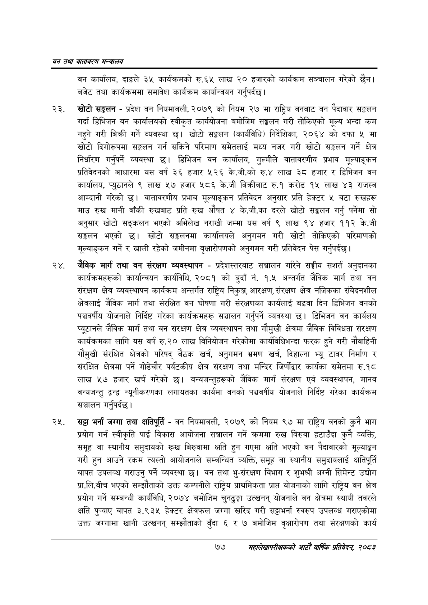

# Page 99 QA

## Rendered page


## Extracted text

```text
वन तथा वातावरण मन्त्रालय
वन कार्यालय, दाङले ३५ कार्यक्रमको रु.६५ लाख २० हजारको कार्यक्रम सञ्चालन गरेको छैन। बजेट तथा कार्यक्रममा समावेश कार्यक्रम कार्यान्वयन गर्नुपर्दछ |
खोटो सङ्घलन -प्रदेश वन नियमावली, २०७९ को नियम २७ मा राष्ट्रिय वनबाट वन पैदावार सङ्कलन गर्दा डिभिजन वन कार्यालयको स्वीकृत कार्ययोजना बमोजिम सङ्गलन गरी तोकिएको मूल्य भन्दा कम नहुने गरी बिक्री गर्ने व्यवस्था छ। खोटो सङ्कलन (कार्यविधि) निर्देशिका, २०६४ को दफा ५ मा खोटो दिगोरूपमा सङ्कलन गर्न सकिने परिमाण समेतलाई मध्य नजर गरी खोटो सङ्कलन गर्ने क्षेत्र निर्धारण गर्नुपर्ने व्यवस्था डिभिजन वन कार्यालय, गुल्मीले वातावरणीय प्रभाव मूल्याङ्कन प्रतिवेदनको आधारमा यस वर्ष ३६ हजार ५२६ के.जी.को रु.४ लाख ३८ हजार र डिभिजन वन कार्यालय, प्युठानले ९ लाख ५७ हजार ५८६ के.जी बिक्रीबाट रु.१ करोड १५ लाख ४३ राजस्व आम्दानी गरेको छ। वातावरणीय प्रभाव मूल्याङ्कन प्रतिवेदन अनुसार प्रति हेक्टर ५ वटा रुखहरू माउ रुख मानी बाँकी रुखबाट प्रति रुख औषत ४ के.जी.का दरले खोटो सङ्कलन गर्नु पर्नेमा सो अनुसार खोटो सङ्कलन भएको अभिलेख नराखी जम्मा यस वर्ष ९ लाख ९४ हजार ११२ के.जी सङ्घलतन भएको छ। खोटो सङ्कलनमा कार्यालयले अनुगमन गरी खोटो तोकिएको परिमाणको मूल्याङ्कन गर्ने र खाली रहेको जमीनमा वृक्षारोपणको अनुगमन गरी प्रतिवेदन पेस गर्नुपर्दछ |
जैविक मार्ग तथा वन संरक्षण व्यवस्थापन -प्रदेशस्तरबाट सञ्चालन गरिने सङ्घीय सशर्त अनुदानका कार्यक्रमहरूको कार्यान्वयन कार्यविधि, २०८१ को बुदाँ नं. १.५ अन्तर्गत जैविक मार्ग तथा वन संरक्षण क्षेत्र व्यवस्थापन कार्यक्रम अन्तर्गत राष्ट्रिय निकुञ्ज, आरक्षण, संरक्षण क्षेत्र नजिकका संवेदनशील क्षेत्रलाई जैविक मार्ग तथा संरक्षित वन घोषणा गरी संरक्षणका कार्यलाई बढवा दिन डिभिजन वनको पञ्चवर्षीय योजनाले निर्दिष्ट गरेका कार्यक्रमहरू सञ्चालन गर्नुपर्ने व्यवस्था छ। डिभिजन वन कार्यलय प्यूठानले जैविक मार्ग तथा वन संरक्षण क्षेत्र व्यवस्थापन तथा गौमुखी क्षेत्रमा जैविक विविधता संरक्षण कार्यक्रमका लागि यस वर्ष रु.२० लाख विनियोजन गरेकोमा कार्यविधिभन्दा फरक हुने गरी नौवाहिनी गौमुखी संरक्षित क्षेत्रको परिषद्‌ बैठक खर्च, अनुगमन भ्रमण खर्च, दिहाल्ना भ्यू टावर निर्माण र संरक्षित क्षेत्रमा पर्ने गोडेचौर पर्यटकीय क्षेत्र संरक्षण तथा मन्दिर जिर्णोद्वार कार्यका समेतमा रु.१८ लाख ५७ हजार खर्च गरेको | वन्यजन्तुहरूको जैविक मार्ग संरक्षण एवं व्यवस्थापन, मानव वन्यजन्तु द्वन्द्व न्यूनीकरणका लगायतका कार्यमा वनको पञ्चवर्षीय योजनाले निर्दिष्ट गरेका कार्यक्रम सञ्चालन गर्नुपर्दछ।
सट्टा भर्ना जग्गा तथा क्षतिपूर्ति -वन नियमावली, २०७९ को नियम ९७ मा राष्ट्रिय वनको कुनै भाग प्रयोग गर्न स्वीकृति पाई विकास आयोजना सञ्चालन गर्ने क्रममा रुख बिरुवा हटाउँदा कुनै व्यक्ति, समूह वा स्थानीय समुदायको रूख बिरुवामा क्षति हुन गएमा क्षति भएको वन पैदावारको मूल्याङ्कन गरी हुन आउने रकम त्यस्तो आयोजनाले सम्बन्धित व्यक्ति, समूह वा स्थानीय समुदायलाई क्षतिपूर्ति बापत उपलब्ध गराउनु पर्ने व्यवस्था वन तथा भु-संरक्षण विभाग र शुभश्री अग्नी सिमेन्ट उद्योग प्रा.लि.बीच भएको सम्झौताको उक्त कम्पनीले राष्ट्रिय प्राथमिकता प्राप्त योजनाको लागि राष्ट्रिय वन क्षेत्र प्रयोग गर्ने सम्बन्धी कार्यविधि, २०७४ बमोजिम चुनढुङ्गा उत्खनन्‌ योजनाले वन क्षेत्रमा स्थायी तवरले क्षति वापत ३.९३५ हेक्टर क्षेत्रफल जग्गा खरिद गरी सट्टाभर्ना स्वरुप उपलव्ध गराएकोमा उक्त जग्गामा खानी उत्खनन्‌ सम्झौताको बुँदा ६ र ७ बमोजिम वृक्षारोपण तथा संरक्षणको कार्य
७७
सहालेखापरीक्षकको आठौँ वाषिकि प्रतिवेदन २०८२
```

## Flags
- None
