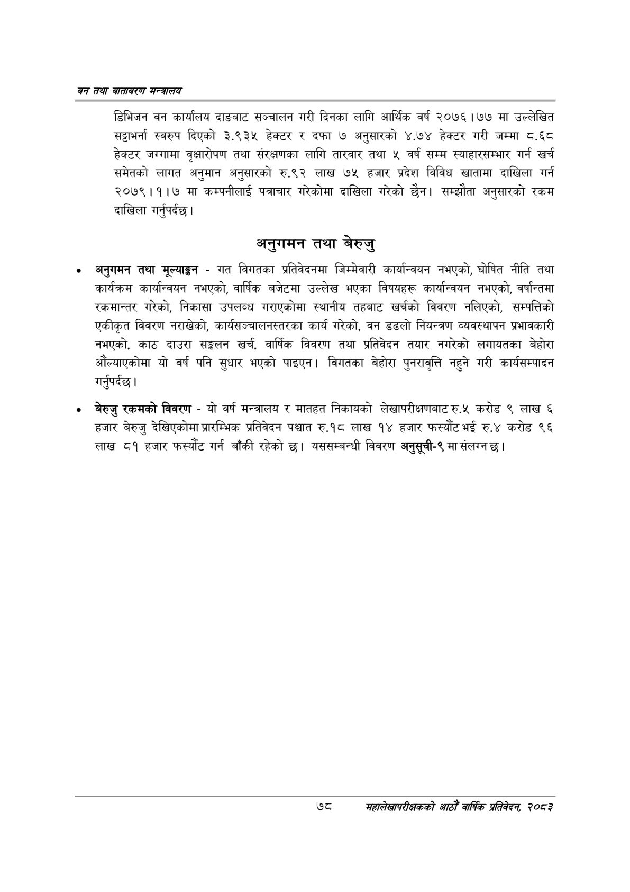

# Page 100 QA

## Rendered page


## Extracted text

```text
वन तथा वातावरण मन्त्रालय
डिभिजन वन कार्यालय दाङबाट सञ्चालन गरी दिनका लागि आर्थिक वर्ष २०७६।७७ मा उल्लेखित सट्टाभर्ना स्वरुप दिएको ३.९३५ हेक्टर र दफा ७ अनुसारको ४.७४ हेक्टर गरी जम्मा ८.६८० हेक्टर जग्गामा वृक्षारोपण तथा संरक्षणका लागि तारवार तथा ५ वर्ष सम्म स्याहारसम्भार गर्न खर्च समेतको लागत अनुमान अनुसारको रु.९२ लाख ७५ हजार प्रदेश विविध खातामा दाखिला गर्न २०७९।१।७ मा कम्पनीलाई पत्राचार गरेकोमा दाखिला गरेको छैन। सम्झौता अनुसारको रकम दाखिला गर्नुपर्दछ |
अनुगमन तथा बेरुजु
अनुगमन तथा मूल्याङ्कन -गत विगतका प्रतिवेदनमा जिम्मेवारी कार्यान्वयन नभएको, घोषित नीति तथा कार्यक्रम कार्यान्वयन नभएको, वार्षिक बजेटमा उल्लेख भएका विषयहरू कार्यान्वयन नभएको, वर्षान्तमा रकमान्तर गरेको, निकासा उपलव्ध गराएकोमा स्थानीय तहबाट खर्चको विवरण नलिएको, सम्पत्तिको एकीकृत विवरण नराखेको, कार्यसञ्चालनस्तरका कार्य गरेको, वन डढलो नियन्त्रण व्यवस्थापन प्रभावकारी नभएको, काठ दाउरा सङ्कलन खर्च, वार्षिक विवरण तथा प्रतिवेदन तयार नगरेको लगायतका बेहोरा औंल्याएकोमा यो वर्ष पनि सुधार भएको पाइएन। विगतका बेहोरा पुनरावृत्ति नहुने गरी कार्यसम्पादन गर्नुपर्दछ |
बेरुजु रकमको विवरण -यो वर्ष मन्त्रालय र मातहत निकायको लेखापरीक्षणबाट रु.५ करोड ९ लाख ६ हजार बेरुजु देखिएकोमा प्रारम्भिक प्रतिवेदन पश्चात रु.१८ लाख १४ हजार फस्यौट भई रु.४ करोड ९६ लाख ८१ हजार फस्यौट गर्न बाँकी रहेको छ। यससम्बन्धी विवरण अनुसूची-९ मा संलग्न छ |
७८
सहालेखापरीक्षकको आठौँ वाषिकि प्रतिवेदन २०८२
```

## Flags
- None
