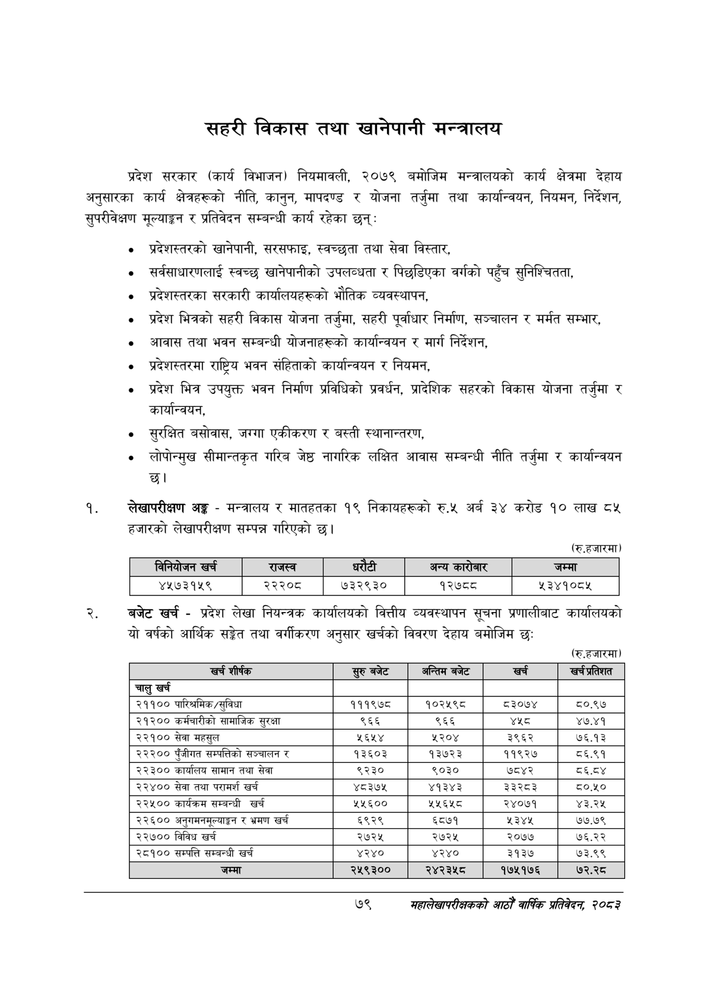

# Page 101 QA

## Rendered page


## Extracted text

```text
सहरी विकास तथा खानेपानी मन्त्रालय
प्रदेश सरकार (कार्य विभाजन) नियमावली, २०७९ बमोजिम मन्त्रालयको कार्य क्षेत्रमा देहाय अनुसारका कार्य क्षेत्रहरूको नीति, कानुन, मापदण्ड र योजना तर्जुमा तथा कार्यान्वयन, नियमन, निर्देशन, सुपरीवेक्षण मूल्याङ्कन र प्रतिवेदन सम्बन्धी कार्य रहेका छन्‌:
० प्रदेशस्तरको खानेपानी, सरसफाइ, स्वच्छुता तथा सेवा विस्तार,
० सर्वसाधारणलाई स्वच्छ खानेपानीको उपलव्धता र पिछडिएका वर्गको पहुँच सुनिश्चितता,
० प्रदेशस्तरका सरकारी कार्यालयहरूको भौतिक व्यवस्थापन,
प्रदेश भित्रको सहरी विकास योजना तर्जुमा, सहरी पूर्वाधार निर्माण, सञ्चालन र मर्मत सम्भार,
० आवास तथा भवन सम्बन्धी योजनाहरूको कार्यान्वयन र मार्ग निर्देशन,
० प्रदेशस्तरमा राष्ट्रिय भवन संहिताको कार्यान्वयन र नियमन,
प्रदेश भित्र उपयुक्त भवन निर्माण प्रविधिको प्रवर्धन, प्रादेशिक सहरको विकास योजना तर्जुमा र कार्यान्वयन,
० सुरक्षित बसोवास, जग्गा एकीकरण र बस्ती स्थानान्तरण,
लोपोन्मुख सीमान्तकृत गरिब जेष्ठ नागरिक लक्षित आवास सम्बन्धी नीति तर्जुमा र कार्यान्वयन छ।
लेखापरीक्षण अङ्ग -मन्त्रालय र मातहतका १९ निकायहरूको रु.५ अर्ब ३४ करोड १० लाख ८५ हजारको लेखापरीक्षण सम्पन्न गरिएको छ।
(रू.हजारमा)
बजेट खर्च -प्रदेश लेखा नियन्त्रक कार्यालयको वित्तीय व्यवस्थापन सूचना प्रणालीबाट कार्यालयको यो वर्षको आर्थिक सङ्गेत तथा वर्गीकरण अनुसार खर्चको विवरण देहाय बमोजिम छः
(रु.हजारमा)
७९
सहालेखापरीक्षकको आठौँ वाषिकि प्रतिवेदन २०८२

|  |  | नियोजन खरी |  | राजस्व |  |  | अन्य | जम्मा |
| --- | --- | --- | --- | --- | --- | --- | --- | --- |
|  |  | ४५७३१५९ |  | २२२०८ | ७३२९३० |  | १२७८८ | ५३४१०८४५ |

| खर्च शीर्षक | सुरु बजेट | अन्तिम बजेट | खर्च | खर्च अतिरात |
| --- | --- | --- | --- | --- |
| चालु खर्च |  |  |  |  |
| २११०० पारिश्रमिक /सुविधा | १११९७८ | १०२५९८ | ८३०७४ | ८०.९७ |
| २१२०० कर्मचारीको सामाजिक सुरक्षा | ९६६ | ९६६ | श्श्ट | ४७.४१ |
| २२१०० सेवा महसुल | ५६५४ | ५२०४ | ३९६२ | ७६.१३ |
| २२२०० पुँजीगत सम्पत्तिको सञ्चालन र | १३६०३ | १३७२३ | ११९२७ | ८६.९१ |
| २२३०० कार्यालय सामान तथा सेवा | ९२३० | ९०३० | ७८४२ | ८६.८४ |
| २२४०० सेवा तथा परामर्श खर्च | ४८३७५ | ४१३४३ | ३३२८३ | ८०.५० |
| २२५०० कार्यक्रम सम्बन्धी खर्च | ५५६०० | २५६४५८ | २४०७१ | ४३.२५ |
| २२६०० अनुनभनमूल्याङ्गन र भ्रमण खर्च | ६९२९ | ६८७१ | २३४५ | ७७.७९ |
| २२७०० विविध खर्च | २७२५ | २७२५ | २०७७ | ७६.२२ |
| २८१०० सम्पत्ति सम्बन्धी खर्च | ४२४० | ४२४० | ३१३७ | ७३.९९ |
| जम्मा | २५९३०० | २४२३५८ | १७५१७६ | ७२.२८ |
```

## Flags
- table_page
- medium_quality_table
