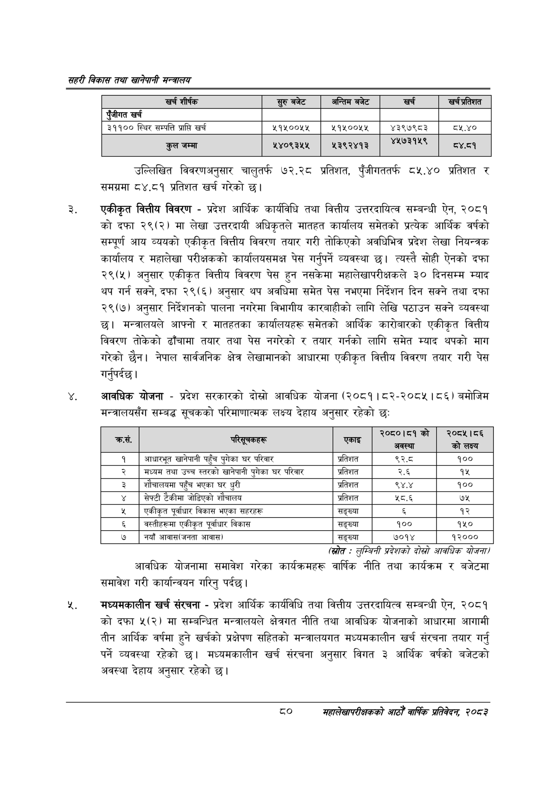

# Page 102 QA

## Rendered page


## Extracted text

```text
सहरी विकास तथा खानेपानी मन्वालय
उल्लिखित विवरणअनुसार चालुतर्फ ७२.२८ प्रतिशत, पुँजीगततर्फ ८५.४० प्रतिशत र समग्रमा ८४.८१ प्रतिशत खर्च गरेको छ।
एकीकृत वित्तीय विवरण -प्रदेश आर्थिक कार्यविधि तथा वित्तीय उत्तरदायित्व सम्बन्धी ऐन, २०८१ को दफा २९(२) मा लेखा उत्तरदायी अधिकृतले मातहत कार्यालय समेतको प्रत्येक आर्थिक वर्षको सम्पूर्ण आय व्ययको एकीकृत वित्तीय विवरण तयार गरी तोकिएको अवधिभित्र प्रदेश लेखा नियन्त्रक कार्यालय र महालेखा परीक्षकको कार्यालयसमक्ष पेस गर्नुपर्ने व्यवस्था छ। त्यस्तै सोही ऐनको दफा २९(५) अनुसार एकीकृत वित्तीय विवरण पेस हुन नसकेमा महालेखापरीक्षकले ३० दिनसम्म म्याद थप गर्न सक्ने, दफा २९(६) अनुसार थप अवधिमा समेत पेस नभएमा निर्देशन दिन सक्ने तथा दफा २९(७) अनुसार निर्देशनको पालना नगरेमा विभागीय कारबाहीको लागि लेखि पठाउन सक्ने व्यवस्था छ। मन्त्रालयले आफ्नो र मातहतका कार्यालयहरू समेतको आर्थिक कारोबारको एकीकृत वित्तीय विवरण तोकेको ढाँचामा तयार तथा पेस नगरेको र तयार गर्नको लागि समेत म्याद थपको माग गरेको छैन। नेपाल सार्वजनिक क्षेत्र लेखामानको आधारमा एकीकृत वित्तीय विवरण तयार गरी पेस गर्नुपर्दछ |
आवधिक योजना -प्रदेश सरकारको दोस्रो आवधिक योजना (२०८१।८२-२०८५। ८६) बमोजिम मन्त्रालयसँग सम्बद्ध सूचकको परिमाणात्मक लक्ष्य देहाय अनुसार रहेको छ:
(स्रोत -लुम्बिनी प्रदेशको दोस्रो आवधिक योजना/
आवधिक योजनामा समावेश गरेका कार्यक्रमहरू वार्षिक नीति तथा कार्यक्रम र बजेटमा समावेश गरी कार्यान्वयन गरिनु पर्दछ।
मध्यमकालीन खर्च संरचना -प्रदेश आर्थिक कार्यविधि तथा वित्तीय उत्तरदायित्व सम्बन्धी ऐन, २०८१ कोदफा ५(२) मा सम्बन्धित मन्त्रालयले क्षेत्रगत नीति तथा आवधिक योजनाको आधारमा आगामी तीन आर्थिक वर्षमा हुने खर्चको प्रक्षेपण सहितको मन्त्रालयगत मध्यमकालीन खर्च संरचना तयार गर्नु पर्ने व्यवस्था रहेको छ। मध्यमकालीन खर्च संरचना अनुसार विगत ३ आर्थिक वर्षको बजेटको अवस्था देहाय अनुसार रहेको छ।
८०
सहालेखापरीक्षकको आठौँ वाषिकि प्रतिवेदन २०८२

| खर्च शीर्षक | सुरु बजेट | अन्तिम बजेट | खर्च | खर्च प्रतिशत |
| --- | --- | --- | --- | --- |
| पुँजीगत खर्च |  |  |  |  |
| ३११०० स्थिर सम्पत्ति प्राप्ति खर्च | २१५००५५ | ५१५००५४५ | ४३९७९८३ | ८४.४० |
| कुल जम्मा | ५४०९३४४५ | ४३९२४१३ |  | ८४८१ |

| कस. | चारलूनकहरू | एकाइ | २०८०।४१को हा | २०८५।८६ को लक्ष्य |
| --- | --- | --- | --- | --- |
| १ | आधारभूत खानेपानी पहुँच पुगेका घर परिवार | प्रतिशत | ९२. | १०० |
| २ | मध्यम तथा उच्च स्तरको खानेपानी पुगेका घर परिवार | प्रतिशत | २.६ | १५ |
| ३ | शोचालकमा पहुँच भएका घर धुरी | प्रतिशत | ९४.४ | १०० |
| ४ | सेफ्टी टेकीमा जोडिएको शौचालय | प्रतिशत | ५८.६ | ७५ |
| ५ | एकीकृत पूर्वाधार विकास भएका सहरहरू | सङ्ख्या |  | १२ |
| ६ | बह्तीहरूमा एकीकृत पूर्वाधार विकास | सङ्ख्या | १०० | १५० |
| ७ | नयाँ आवास(जनता आवास) | सङ्ख्या | ७०१४ | १२००० |
```

## Flags
- table_page
- medium_quality_table
