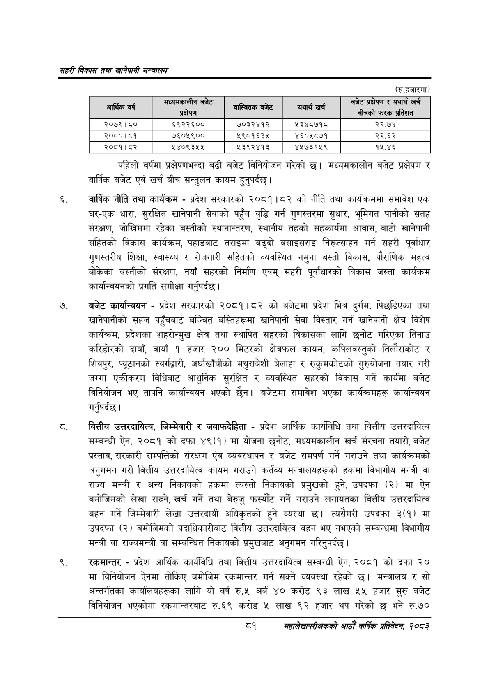

# Page 103 QA

## Rendered page


## Extracted text

```text
सहरी विकास तथा खानेपानी मन्वालय
(रु.हजारमा)
पहिलो वर्षमा प्रक्षेपणभन्दा बढी बजेट विनियोजन गरेको छ। मध्यमकालीन बजेट प्रक्षेपण र वार्षिक बजेट एवं खर्च बीच सन्तुलन कायम हुनुपर्दछ।
वार्षिक नीति तथा कार्यक्रम -प्रदेश सरकारको २०८१।८२ को नीति तथा कार्यक्रममा समावेश एक घर-एक धारा, सुरक्षित खानेपानी सेवाको पहुँच वृद्धि गर्न गुणस्तरमा सुधार, भूमिगत पानीको सतह संरक्षण, जोखिममा रहेका बस्तीको स्थानान्तरण, स्थानीय तहको सहकार्यमा आवास, बाटो खानेपानी सहितको विकास कार्यक्रम, पहाडबाट तराइमा बढ्दो बसाइसराइ निरूत्साहन गर्न सहरी पूर्वाधार गुणस्तरीय शिक्षा, स्वास्थ्य र रोजगारी सहितको व्यवस्थित नमुना बस्ती विकास, पौराणिक महत्व बोकेका बस्तीको संरक्षण, नयाँ सहरको निर्माण एवम्‌ सहरी पूर्वाधारको विकास जस्ता कार्यक्रम कार्यान्वयनको प्रगति समीक्षा गर्नुपर्दछ |
बजेट कार्यान्वयन -प्रदेश सरकारको २०८१।८२ को बजेटमा प्रदेश भित्र दुर्गम, पिछडिएका तथा खानेपानीको सहज पहुँचबाट बञ्चित बस्तिहरूमा खानेपानी सेवा विस्तार गर्न खानेपानी क्षेत्र विशेष कार्यक्रम, प्रदेशका शहरोन्मुख क्षेत्र तथा स्थापित सहरको विकासका लागि छनोट गरिएका तिनाउ करिडोरको दायाँ, वायाँ १ हजार २०० मिटरको क्षेत्रफल कायम, कपिलवस्तुको तिलौराकोट र शिवपुर, प्यूठानको स्वर्गद्वारी, अर्घाखाँचीको मधुराबेशी बेलाहा र रुकुमकोटको गुरुयोजना तयार गरी जग्गा एकीकरण विधिबाट आधुनिक सुरक्षित र व्यवस्थित सहरको विकास गर्ने कार्यमा बजेट विनियोजन भए तापनि कार्यान्वयन भएको छैन। बजेटमा समावेश भएका कार्यक्रमहरू कार्यान्वयन गर्नुपर्दछ |
वित्तीय उत्तरदायित्व, जिम्मेवारी र जवाफदेहिता -प्रदेश आर्थिक कार्यविधि तथा वित्तीय उत्तरदायित्व सम्बन्धी ऐन, २०८१ को दफा ४९(१) मा योजना छनोट, मध्यमकालीन खर्च संरचना तयारी, बजेट प्रस्ताव, सरकारी सम्पत्तिको संरक्षण एंव व्यवस्थापन र बजेट समपर्ण गर्ने गराउने तथा कार्यक्रमको अनुगमन गरी वित्तीय उत्तरदायित्व कायम गराउने कर्तव्य मन्त्रालयहरूको हकमा विभागीय मन्त्री वा राज्य मन्त्री र अन्य निकायको हकमा त्यस्तो निकायको प्रमुखको हुने, उपदफा (२) मा ऐन बमोजिमको लेखा राख्ने, खर्च गर्ने तथा बेरुजु फस्यौट गर्ने गराउने लगायतका वित्तीय उत्तरदायित्व बहन गर्ने जिम्मेवारी लेखा उत्तरदायी अधिकृतको हुने व्यस्था छ। त्यसैगरी उपदफा ३(१) मा उपदफा (२) बमोजिमको पदाधिकारीबाट वित्तीय उत्तरदायित्व वहन भए नभएको सम्बन्धमा विभागीय मन्त्री वा राज्यमन्त्री वा सम्बन्धित निकायको प्रमुखबाट अनुगमन गरिनुपर्दछ |
रकमान्तर -प्रदेश आर्थिक कार्यविधि तथा वित्तीय उत्तरदायित्व सम्बन्धी ऐन, २०८१ को दफा २० मा विनियोजन ऐनमा तोकिए बमोजिम रकमान्तर गर्न सक्ने व्यवस्था रहेको छ। मन्त्रालय र सो अन्तर्गतका कार्यालयहरूका लागि यो वर्ष रु.५ अर्ब ४० करोड ९३ लाख ५५ हजार सुरु बजेट विनियोजन भएकोमा रकमान्तरबाट रु.६९ करोड ५ लाख ९२ हजार थप गरेको छ भने रु.७०
१
सहालेखापरीक्षकको आठौँ वाषिकि प्रतिवेदन २०८२

| आर्थिक वर्ष | कषपण | बाल्वितक बजेट | यथार्थ खर्च | लेट पबोपणा र यथा खर्च |
| --- | --- | --- | --- | --- |
| २०७९।८० | ६९२२६०० | ७०३२४१२ | ५३४८७१८ | २२.७४ |
| २०८०।८१ | ७६०५९०० | ५९८१६३४५ | ४६०५८७१ | २२.६२ |
| २०८१।८२ | ५४०९३५५ | ५३९२४१३ | ४५७३१५९ | १५.४६ |
```

## Flags
- table_page
- medium_quality_table
