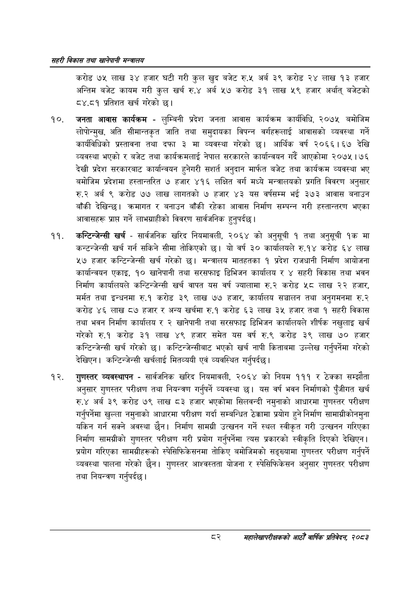

# Page 104 QA

## Rendered page


## Extracted text

```text
सहरी विकास तथा खानेपानी मन्वालय
करोड ७५ लाख ३४ हजार घटी गरी कुल खुद बजेट रु.५ अर्ब ३९ करोड २४ लाख १३ हजार अन्तिम बजेट कायम गरी कुल खर्च रु.४ अर्ब ५२७ करोड ३१ लाख ५९ हजार अर्थात्‌ बजेटको ८४.८१ प्रतिशत खर्च गरेको छ।
जनता आवास कार्यक्रम -लुम्बिनी प्रदेश जनता आवास कार्यक्रम कार्यविधि, २०७५ बमोजिम लोपोन्मुख, अति सीमान्तकृत जाति तथा समुदायका विपन्न वर्गहरूलाई आवासको व्यवस्था गर्ने कार्यविधिको प्रस्तावना तथा दफा ३ मा व्यवस्था गरेको छु। आर्थिक वर्ष २०६६।१६७ देखि व्यवस्था भएको र बजेट तथा कार्यक्रमलाई नेपाल सरकारले कार्यान्वयन गर्दे आएकोमा २०७५ | ७६ देखी प्रदेश सरकारबाट कार्यान्वयन हुनेगरी सशर्त अनुदान मार्फत बजेट तथा कार्यक्रम व्यवस्था भए बमोजिम प्रदेशमा हस्तान्तरित ७ हजार ४१६ लक्षित वर्ग मध्ये मन्त्रालयको प्रगति विवरण अनुसार रु.२ अर्ब ९ करोड ७७ लाख लागतको ७ हजार ४३ यस वर्षसम्म भई ३७३ आवास बनाउन बाँकी देखिन्छ। क्रमागत र बनाउन बाँकी रहेका आवास निर्माण सम्पन्न गरी हस्तान्तरण भएका आवासहरू प्राप्त गर्ने लाभग्राहीको विवरण सार्वजनिक हुनुपर्दछ |
कन्टिन्जेन्सी खर्च -सार्वजनिक खरिद नियमावली, २०६४ को अनुसूची १ तथा अनुसूची ९ मा कन्टन्जेन्सी खर्च गर्न सकिने सीमा तोकिएको छ। यो वर्ष ३० कार्यालयले रु.१४ करोड ६४ लाख ५७ हजार कन्टिन्जेन्सी खर्च गरेको छ। मन्त्रालय मातहतका १ प्रदेश राजधानी निर्माण आयोजना कार्यान्वयन एकाइ, १० खानेपानी तथा सरसफाइ डिभिजन कार्यालय र ४ सहरी विकास तथा भवन निर्माण कार्यालयले कन्टिन्जेन्सी खर्च वापत यस वर्ष ज्यालामा रु.२ करोड ५८ लाख २२ हजार, मर्मत तथा इन्धनमा रु.१ करोड ३९ लाख ७७ हजार, कार्यालय सञ्चालन तथा अनुगमनमा रु.२ करोड ४६ लाख ८७ हजार र अन्य खर्चमा रु.१ करोड ६३ लाख ३५ हजार तथा १ सहरी विकास तथा भवन निर्माण कार्यालय र २ खानेपानी तथा सरसफाइ डिभिजन कार्यालयले शीर्षक नखुलाइ खर्च गरेको रु.१ करोड ३९ लाख हजार समेत यस वर्ष रु.९ करोड ३९ लाख ७० हजार कन्टिन्जेन्सी खर्च गरेको | कन्टिन्जेन्सीबाट भएको खर्च नापी किताबमा उल्लेख गर्नुपर्नेमा गरेको देखिएन। कन्टिन्जेन्सी खर्चलाई मितव्ययी एवं व्यवस्थित गर्नुपर्दछ |
गुणस्तर व्यवस्थापन -सार्वजनिक खरिद नियमावली, २०६४ को नियम १११ र ठेक्का सम्झौता अनुसार गुणस्तर परीक्षण तथा नियन्त्रण गर्नुपर्ने व्यवस्था छ। यस वर्ष भवन निर्माणको पुँजीगत खर्च रु.४ अर्ब ३९ करोड ७९ लाख ८३ हजार भएकोमा सिलवन्दी नमुनाको आधारमा गुणस्तर परीक्षण गर्नुपर्नेमा खुल्ला नमुनाको आधारमा परीक्षण गर्दा सम्बन्धित ठेक्कामा प्रयोग हुने निर्माण सामाग्रीकोनमुना यकिन गर्न सक्ने अवस्था छैन। निर्माण सामग्री उत्खनन गर्ने स्थल स्वीकृत गरी उत्खनन गरिएका निर्माण सामग्रीको गुणस्तर परीक्षण गरी प्रयोग गर्नुपर्नेमा त्यस प्रकारको स्वीकृति दिएको देखिएन | प्रयोग गरिएका सामग्रीहरूको स्पेसिफिकेसनमा तोकिए बमोजिमको सङ्ख्यामा गुणस्तर परीक्षण गर्नुपर्ने व्यवस्था पालना गरेको छैन। गुणस्तर आश्वस्तता योजना र स्पेसिफिकेसन अनुसार गुणस्तर परीक्षण तथा नियन्त्रण गर्नुपर्दछ |
सहालेखापरीक्षकको आठौँ वाषिकि प्रतिवेदन २०८२
```

## Flags
- None
