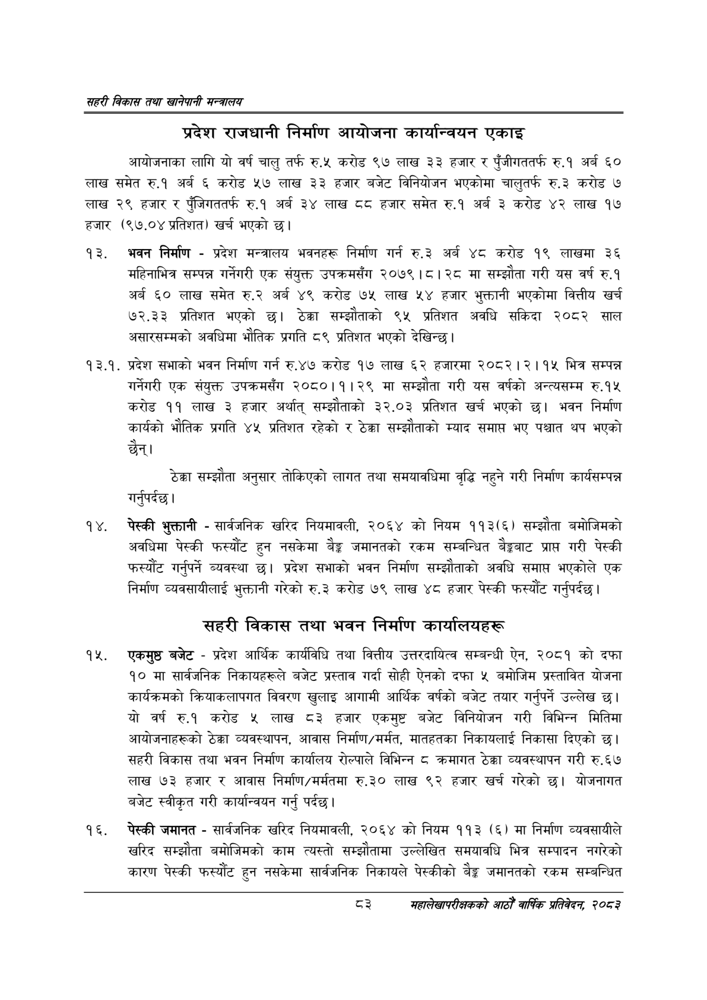

# Page 105 QA

## Rendered page


## Extracted text

```text
सहरी विकास तथा खानेपानी मन्वालय
प्रदेश राजधानी निर्माण आयोजना कार्यान्वयन
एकाइ
आयोजनाका लागि यो वर्ष चालु तर्फ रु.५ करोड ९७ लाख ३३ हजार र पुँजीगततर्फ रु.१ अर्ब ६० लाख समेत रु.१ अर्ब ६ करोड ५७ लाख ३३ हजार बजेट विनियोजन भएकोमा चालुतर्फ रु.३ करोड ७ लाख २९ हजार र पुँजिगततर्फ रु.१ अर्ब ३४ लाख ८८ हजार समेत रु.१ अर्ब ३ करोड ४२ लाख १७ हजार (९७.०४ प्रतिशत) खर्च भएको छ।
भवन निर्माण -प्रदेश मन्त्रालय भवनहरू निर्माण गर्न रु.३ अर्ब ४८ करोड १९ लाखमा ३६ महिनाभित्र सम्पन्न गर्नेगरी एक संयुक्त उपक्रमसँग २०७९।८। २८ मा सम्झौता गरी यस वर्ष रु.१ अर्ब ६० लाख समेत रु.२ अर्ब ४९ करोड ७५ लाख ५४ हजार भुक्तानी भएकोमा वित्तीय खर्च ७२.३३ प्रतिशत भएको छ। ठेक्का सम्झौताको ९५ प्रतिशत अवधि सकिदा २०८२ साल असारसम्मको अवधिमा भौतिक प्रगति ८९ प्रतिशत भएको देखिन्छ |
. प्रदेश सभाको भवन निर्माण गर्न रु.४७ करोड १७ लाख ६२ हजारमा २०८२।२।१५ भित्र सम्पन्न गर्नेगरी एक संयुक्त उपक्रमसँग २०८०।१।२९ मा सम्झौता गरी यस वर्षको अन्त्यसम्म रु.१५ करोड ११ लाख ३ हजार अर्थात्‌ सम्झौताको ३२.०३ प्रतिशत खर्च भएको छ। भवन निर्माण कार्यको भौतिक प्रगति ४५ प्रतिशत रहेको र ठेक्का सम्झौताको म्याद समाप्त भए पश्चात थप भएको छैन्‌।
ठेक्का सम्झौता अनुसार तोकिएको लागत तथा समयावधिमा वृद्धि नहुने गरी निर्माण गर्नुपर्दछ |
कार्यसम्पन्न
पेस्की भुक्तानी -सार्वजनिक खरिद नियमावली, २०६४ को नियम ११३(६) सम्झौता बमोजिमको अवधिमा पेस्की फस्यौट हुन नसकेमा बैङ्क जमानतको रकम सम्बन्धित बैङ्कबाट प्राप्त गरी पेस्की फस्यौट गर्नुपर्ने ब्यवस्था छ। प्रदेश सभाको भवन निर्माण सम्झौताको अवधि समाप्त भएकोले एक निर्माण व्यवसायीलाई भुक्तानी गरेको रु.३ करोड ७९ लाख ४८ हजार पेस्की फस्यौट गर्नुपर्दछ |
सहरी विकास तथा भवन निर्माण कार्यालयहरू
एकमुष्ठ बजेट -प्रदेश आर्थिक कार्यविधि तथा वित्तीय उत्तरदायित्व सम्बन्धी ऐन, २०८१ को दफा १० मा सार्वजनिक निकायहरूले बजेट प्रस्ताव गर्दा सोही ऐनको दफा ५ बमोजिम प्रस्तावित योजना कार्यक्रमको क्रियाकलापगत विवरण खुलाइ आगामी आर्थिक वर्षको बजेट तयार गर्नुपर्ने उल्लेख | यो वर्ष रु.१ करोड लाख ८३ हजार एकमुष्ट बजेट विनियोजन गरी विभिन्न मितिमा आयोजनाहरूको ठेक्का व्यवस्थापन, आवास निर्माण/मर्मत, मातहतका निकायलाई निकासा दिएको छ। सहरी विकास तथा भवन निर्माण कार्यालय रोल्पाले विभिन्न ८ क्रमागत ठेक्का व्यवस्थापन गरी रु. ६७ लाख ७३ हजार र आवास निर्माण/मर्मतमा €.३० लाख ९२ हजार खर्च गरेको छ। योजनागत बजेट स्वीकृत गरी कार्यान्वयन गर्नु पर्दछ।
पेस्की जमानत -सार्वजनिक खरिद नियमावली, २०६४ को नियम ११३ (६) मा निर्माण व्यवसायीले खरिद सम्झौता बमोजिमको काम त्यस्तो सम्झौतामा उल्लेखित समयावधि भित्र सम्पादन नगरेको कारण पेस्की फरस्यौट हुन नसकेमा सार्वजनिक निकायले पेस्कीको बैङ्क जमानतको रकम सम्बन्धित
३
सहालेखापरीक्षकको आठौँ वाषिकि प्रतिवेदन २०८२
```

## Flags
- None
