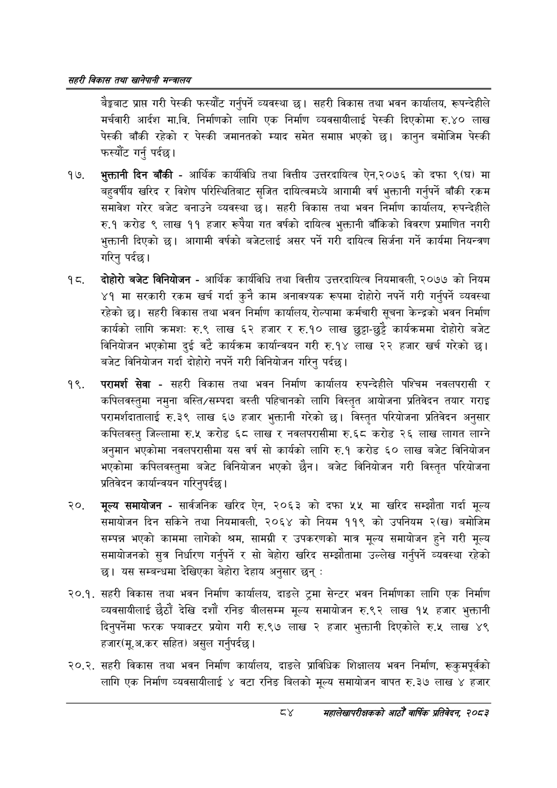

# Page 106 QA

## Rendered page


## Extracted text

```text
सहरी विकास तथा खानेपानी मन्वालय
बैङ्कबाट प्राप्त गरी पेस्की फस्यौंट गर्नुपर्ने व्यवस्था छ। सहरी विकास तथा भवन कार्यालय, रूपन्देहीले मर्चवारी आर्दश मा.वि. निर्माणको लागि एक निर्माण व्यवसायीलाई पेस्की दिएकोमा रु.४० लाख पेस्की बाँकी रहेको र पेस्की जमानतको म्याद समेत समाप्त भएको छ। कानुन बमोजिम पेस्की फस्यौट गर्नु पर्दछ।
भुक्तानी दिन बाँकी -आर्थिक कार्यविधि तथा वित्तीय उत्तरदायित्व ऐन,२०७६ को दफा ९(घ) मा बहुवर्षीय खरिद र विशेष परिस्थितिबाट सृजित दायित्वमध्ये आगामी वर्ष भुक्तानी गर्नुपर्ने बाँकी रकम समावेश गरेर बजेट बनाउने व्यवस्था छ। सहरी विकास तथा भवन निर्माण कार्यालय, रुपन्देहीले रु.१ करोड ९ लाख ११ हजार रूपैया गत वर्षको दायित्व भुक्तानी बाँकिको विवरण प्रमाणित नगरी भुक्तानी दिएको छ। आगामी वर्षको बजेटलाई असर पर्ने गरी दायित्व सिर्जना गर्ने कार्यमा नियन्त्रण गरिनु पर्दछ।
दोहोरो बजेट विनियोजन -आर्थिक कार्यविधि तथा वित्तीय उत्तरदायित्व नियमावली, २०७७ को नियम ४१ मा सरकारी रकम खर्च गर्दा कुनै काम अनावश्यक रूपमा दोहोरो नपर्ने गरी गर्नुपर्ने व्यवस्था रहेको | सहरी विकास तथा भवन निर्माण कार्यालय, रोल्पामा कर्मचारी सूचना केन्द्रको भवन निर्माण कार्यको लागि क्रमशः रु.९ लाख ६२ हजार र रु.१० लाख छुट्टा-छुट्टै कार्यक्रममा दोहोरो बजेट विनियोजन भएकोमा दुई वटै कार्यक्रम कार्यान्वयन गरी रु.१४ लाख २२ हजार खर्च गरेको छ। बजेट विनियोजन गर्दा दोहोरो नपर्ने गरी विनियोजन गरिनु पर्दछ।
परामर्श सेवा -सहरी विकास तथा भवन निर्माण कार्यालय रुपन्देहीले पश्चिम नवलपरासी र कपिलवस्तुमा नमुना बस्ति/सम्पदा बस्ती पहिचानको लागि विस्तृत आयोजना प्रतिवेदन तयार गराइ परामर्शदातालाई रु.३९ लाख ६७ हजार भुक्तानी गरेको छ। विस्तृत परियोजना प्रतिवेदन अनुसार कपिलवस्तु जिल्लामा रु.५ करोड ६८ लाख र नवलपरासीमा रु.६८ करोड २६ लाख लागत लाग्ने अनुमान भएकोमा नवलपरासीमा यस वर्ष सो कार्यको लागि रु.१ करोड ६० लाख बजेट विनियोजन भएकोमा कपिलवस्तुमा बजेट विनियोजन भएको छैन। बजेट विनियोजन गरी विस्तृत परियोजना प्रतिवेदन कार्यान्वयन गरिनुपर्दछ |
मूल्य समायोजन -सार्वजनिक खरिद ऐन, २०६३ को दफा ५५ मा खरिद सम्झौता गर्दा मूल्य समायोजन दिन सकिने तथा नियमावली, २०६४ को नियम ११९ को उपनियम २(ख) बमोजिम सम्पन्न भएको काममा लागेको श्रम, सामग्री र उपकरणको मात्र मूल्य समायोजन हुने गरी मूल्य समायोजनको सुत्र निर्धारण गर्नुपर्ने र सो बेहोरा खरिद सम्झौतामा उल्लेख गर्नुपर्ने व्यवस्था रहेको छ। यस सम्बन्धमा देखिएका बेहोरा देहाय अनुसार छन्‌:
२०.१. सहरी विकास तथा भवन निर्माण कार्यालय, दाङले ट्रमा सेन्टर भवन निर्माणका लागि एक निर्माण व्यवसायीलाई छैठौं देखि दशौं रनिङ बीलसम्म मूल्य समायोजन रु.९२ लाख १५ हजार भुक्तानी दिनुपर्नेमा फरक फ्याक्टर प्रयोग गरी रु.९७ लाख २ हजार भुक्तानी दिएकोले रु.५ लाख ४९ हजार(मू.अ.कर सहित) असुल गर्नुपर्दछ |
२०.२. सहरी विकास तथा भवन निर्माण कार्यालय, दाङले प्राविधिक शिक्षालय भवन निर्माण, रूकुमपूर्वको लागि एक निर्माण व्यवसायीलाई ४ वटा रनिङ बिलको मूल्य समायोजन वापत रु.३७ लाख ४ हजार
सहालेखापरीक्षकको आठौँ वाषिकि प्रतिवेदन २०८२
```

## Flags
- None
