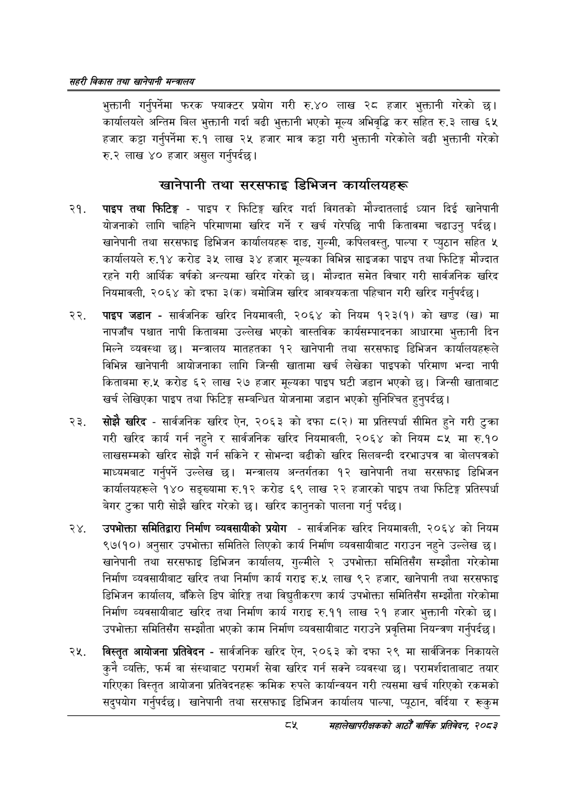

# Page 107 QA

## Rendered page


## Extracted text

```text
सहरी विकास तथा खानेपानी मन्वालय
भुक्तानी गर्नुपर्नेमा फरक फ्याक्टर प्रयोग गरी रु.४० लाख २८ हजार भुक्तानी गरेको छ। कार्यालयले अन्तिम बिल भुक्तानी गर्दा बढी भुक्तानी भएको मूल्य अभिवृद्धि कर सहित रु.३ लाख ६५ हजार कट्टा गर्नुपर्नेमा रु.१ लाख २५ हजार मात्र कट्टा गरी भुक्तानी गरेकोले बढी भुक्तानी गरेको रु.२ लाख ४० हजार असुल गर्नुपर्दछ |
खानेपानी तथा सरसफाइ डिभिजन कार्यालयहरू
पाइप तथा फिटिङ्ग -पाइप र फिटिङ्ग खरिद गर्दा विगतको मौज्दातलाई ध्यान दिई खानेपानी योजनाको लागि चाहिने परिमाणमा खरिद गर्ने र खर्च गरेपछि नापी कितावमा चढाउनु पर्दछ। खानेपानी तथा सरसफाइ डिभिजन कार्यालयहरू दाङ, गुल्मी, कपिलवस्तु, पाल्पा र प्युठान सहित ५ कार्यालयले रु.१४ करोड ३५ लाख ३४ हजार मूल्यका विभिन्न साइजका पाइप तथा फिटिङ्ग मौज्दात रहने गरी आर्थिक वर्षको अन्त्यमा खरिद गरेको छ। मौज्दात समेत विचार गरी सार्वजनिक खरिद नियमावली, २०६४ को दफा ३(क) बमोजिम खरिद आवश्यकता पहिचान गरी खरिद गर्नुपर्दछ।
पाइप जडान -सार्वजनिक खरिद नियमावली, २०६४ को नियम १२३(१) को खण्ड (ख) मा नापजाँच पश्चात नापी किताबमा उल्लेख भएको वास्तविक कार्यसम्पादनका आधारमा भुक्तानी दिन मिल्ने व्यवस्था छ। मन्त्रालय मातहतका १२ खानेपानी तथा सरसफाइ डिभिजन कार्यालयहरूले विभिन्न खानेपानी आयोजनाका लागि जिन्सी खातामा खर्च लेखेका पाइपको परिमाण भन्दा नापी किताबमा रु.५ करोड ६२ लाख २७ हजार मूल्यका पाइप घटी जडान भएको छ। जिन्सी खाताबाट खर्च लेखिएका पाइप तथा फिटिङ्ग सम्बन्धित योजनामा जडान भएको सुनिश्चित हुनुपर्दछ |
सोझै खरिद -सार्वजनिक खरिद ऐन, २०६३ को दफा ८(२) मा प्रतिस्पर्धा सीमित हुने गरी टुक्रा गरी खरिद कार्य गर्न नहुने र सार्वजनिक खरिद नियमावली, २०६४ को नियम ८५ मा रु.१० लाखसम्मको खरिद सोझै गर्न सकिने र सोभन्दा बढीको खरिद सिलबन्दी दरभाउपत्र वा बोलपत्रको माध्यमबाट गर्नुपर्ने उल्लेख छ। मन्त्रालय अन्तर्गतका १२ खानेपानी तथा सरसफाइ डिभिजन कार्यालयहरूले १४० सङ्ख्यामा रु.१२ करोड ६९ लाख २२ हजारको पाइप तथा फिटिङ्ग प्रतिस्पर्धा बेगर टुक्रा पारी सोझै खरिद गरेको | खरिद कानुनको पालना गर्नु पर्दछु।
उपभोक्ता समितिद्वारा निर्माण व्यवसायीको प्रयोग -सार्वजनिक खरिद नियमावली, २०६४ को नियम ९७(१०) अनुसार उपभोक्ता समितिले लिएको कार्य निर्माण व्यवसायीबाट गराउन नहुने उल्लेख | खानेपानी तथा सरसफाइ डिभिजन कार्यालय, गुल्मीले २ उपभोक्ता समितिसँग सम्झौता गरेकोमा निर्माण व्यवसायीबाट खरिद तथा निर्माण कार्य गराइ रु.५ लाख ९२ हजार, खानेपानी तथा सरसफाइ डिभिजन कार्यालय, बाँकेले डिप बोरिङ्ग तथा विद्युतीकरण कार्य उपभोक्ता समितिसँग सम्झौता गरेकोमा निर्माण व्यवसायीबाट खरिद तथा निर्माण कार्य गराइ रु.११ लाख २१ हजार भुक्तानी गरेको छ। उपभोक्ता समितिसँग सम्झौता भएको काम निर्माण व्यवसायीबाट गराउने प्रवृत्तिमा नियन्त्रण गर्नुपर्दछ |
विस्तृत आयोजना प्रतिवेदन -सार्वजनिक खरिद ऐन, २०६३ को दफा २९ मा सार्वजिनक निकायले कुनै व्यक्ति, फर्म वा संस्थाबाट परामर्श सेवा खरिद गर्न सक्ने व्यवस्था छ। परामर्शदाताबाट तयार गरिएका विस्तृत आयोजना प्रतिवेदनहरू क्रमिक रुपले कार्यान्वयन गरी त्यसमा खर्च गरिएको रकमको सदुपयोग गर्नुपर्दछ। खानेपानी तथा सरसफाइ डिभिजन कार्यालय पाल्पा, प्यूठान, वर्दिया र रूकुम
दश
सहालेखापरीक्षकको आठौँ वाषिकि प्रतिवेदन २०८२
```

## Flags
- None
