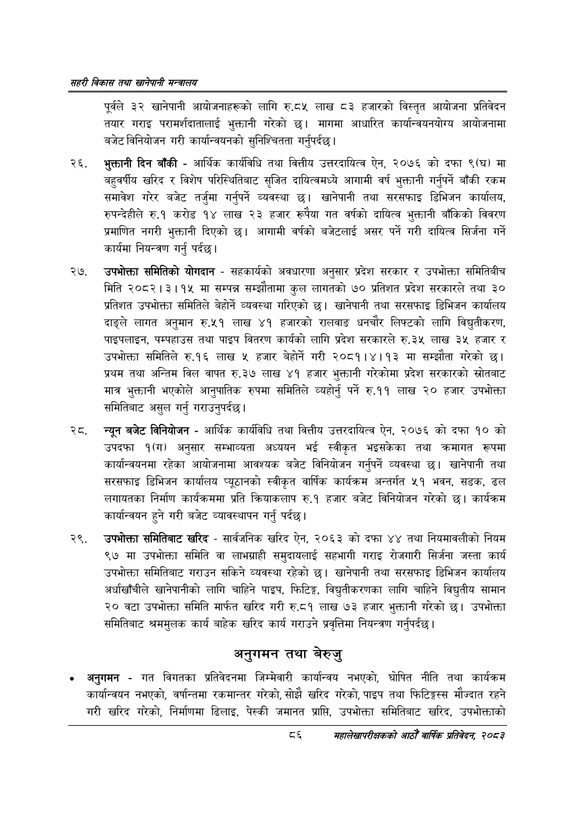

# Page 108 QA

## Rendered page


## Extracted text

```text
सहरी विकास तथा खानेपानी मन्वालय
पूर्वले ३२ खानेपानी आयोजनाहरूको लागि रु.८५ लाख ८३ हजारको विस्तृत आयोजना प्रतिवेदन तयार गराइ परामर्शदातालाई भुक्तानी गरेको छ। मागमा आधारित कार्यान्वयनयोग्य आयोजनामा बजेट विनियोजन गरी कार्यान्वयनको सुनिश्चितता गर्नुपर्दछ |
भुक्तानी दिन बाँकी -आर्थिक कार्यविधि तथा वित्तीय उत्तरदायित्व ऐन, २०७६ को दफा ९(घ) मा बहुवर्षीय खरिद र विशेष परिस्थितिबाट सृजित दायित्वमध्ये आगामी वर्ष भुक्तानी गर्नुपर्ने बाँकी रकम समावेश गरेर बजेट तर्जुमा गर्नुपर्ने व्यवस्था खानेपानी तथा सरसफाइ डिभिजन कार्यालय, रुपन्देहीले रु.१ करोड १४ लाख २३ हजार रूपैया गत वर्षको दायित्व भुक्तानी बाँकिको विवरण प्रमाणित नगरी भुक्तानी दिएको छ। आगामी वर्षको बजेटलाई असर पर्ने गरी दायित्व सिर्जना गर्ने कार्यमा नियन्त्रण गर्नु पर्दछ।
उपभोक्ता समितिको योगदान -सहकार्यको अवधारणा अनुसार प्रदेश सरकार र उपभोक्ता समितिबीच मिति २०८२।३।१५ मा सम्पन्न सम्झौतामा कुल लागतको ७० प्रतिशत प्रदेश सरकारले तथा ३० प्रतिशत उपभोक्ता समितिले बेहोर्ने व्यवस्था गरिएको छ। खानेपानी तथा सरसफाइ डिभिजन कार्यालय दाङ्ले लागत अनुमान रु.५१ लाख ४१ हजारको रालवाङ धनचौर लिफ्टको लागि विद्युतीकरण, पाइपलाइन, पम्पहाउस तथा पाइप वितरण कार्यको लागि प्रदेश सरकारले रु.३५ लाख ३५ हजार र उपभोक्ता समितिले रु.१६ लाख ५ हजार बेहोर्ने गरी २०८१।४।१३ मा सम्झौता गरेको प्रथम तथा अन्तिम विल वापत रु.३७ लाख ४१ हजार भुक्तानी गरेकोमा प्रदेश सरकारको स्रोतबाट मात्र भुक्तानी भएकोले आनुपातिक रुपमा समितिले व्यहोर्नु पर्ने रु.११ लाख २० हजार उपभोक्ता समितिबाट असुल गर्नु गराउनुपर्दछ।
२्ट. न्यून बजेट विनियोजन -आर्थिक कार्यविधि तथा वित्तीय उत्तरदायित्व ऐन, २०७६ को दफा १० को उपदफा १(ग) अनुसार सम्भाव्यता अध्ययन भई स्वीकृत भइसकेका तथा क्रमागत रूपमा कार्यान्वयनमा रहेका आयोजनामा आवश्यक बजेट विनियोजन गर्नुपर्ने व्यवस्था छ। खानेपानी तथा सरसफाइ डिभिजन कार्यालय प्यूठानको स्वीकृत वार्षिक कार्यक्रम अन्तर्गत ५१ भवन, सडक, ढल लगायतका निर्माण कार्यक्रममा प्रति क्रियाकलाप रु.१ हजार बजेट विनियोजन गरेको छ। कार्यक्रम कार्यान्वयन हुने गरी बजेट व्यावस्थापन गर्नु पर्दछ।
उपभोक्ता समितिबाट खरिद -सार्वजनिक खरिद ऐन, २०६३ को दफा ४४ तथा नियमावलीको नियम ९७ मा उपभोक्ता समिति वा लाभग्राही समुदायलाई सहभागी गराइ रोजगारी सिर्जना जस्ता कार्य उपभोक्ता समितिबाट गराउन सकिने व्यवस्था रहेको छ। खानेपानी तथा सरसफाइ डिभिजन कार्यालय अर्घाखाँचीले खानेपानीको लागि चाहिने पाइप, फिटिङ्ग, विद्युतीकरणका लागि चाहिने विद्युतीय सामान २० वटा उपभोक्ता समिति मार्फत खरिद गरी रु.८१ लाख ७३ हजार भुक्तानी गरेको छ। उपभोक्ता समितिबाट श्रममुलक कार्य बाहेक खरिद कार्य गराउने प्रवृत्तिमा नियन्त्रण गर्नुपर्दछ |
अनुगमन तथा बेरुजु
अनुगमन -गत विगतका प्रतिवेदनमा जिम्मेवारी कार्यान्वय नभएको, घोषित नीति तथा कार्यक्रम कार्यान्वयन नभएको, वर्षान्तमा रकमान्तर गरेको, सोझै खरिद गरेको, पाइप तथा फिटिङ्गस्स मौज्दात रहने गरी खरिद गरेको, निर्माणमा ढिलाइ, पेस्की जमानत प्राप्ति, उपभोक्ता समितिबाट खरिद, उपभोक्ताको
६
सहालेखापरीक्षकको आठौँ वाषिकि प्रतिवेदन २०८२
```

## Flags
- None
