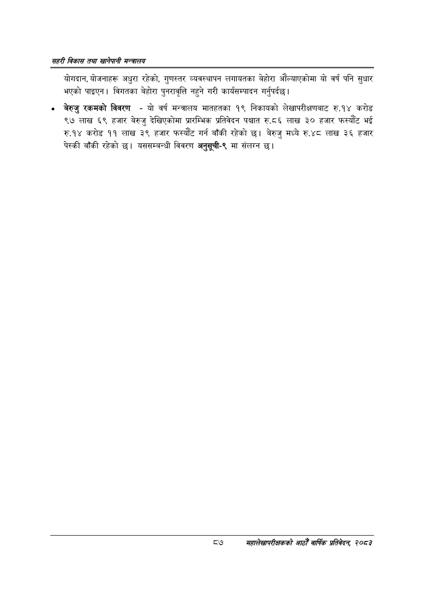

# Page 109 QA

## Rendered page


## Extracted text

```text
सहरी विकास तथा खानेपानी मन्वालय
योगदान, योजनाहरू अधुरा रहेको, गुणस्तर व्यवस्थापन लगायतका बेहोरा औंल्याएकोमा यो वर्ष पनि सुधार भएको पाइएन। विगतका बेहोरा पुनरावृत्ति नहुने गरी कार्यसम्पादन गर्नुपर्दछ।
बेरुजु रकमको विवरण -यो वर्ष मन्त्रालय मातहतका १९ निकायको लेखापरीक्षणबाट रु.१४ करोड ९७ लाख ६९ हजार बेरुजु देखिएकोमा प्रारम्भिक प्रतिवेदन पश्चात रु.८६ लाख ३० हजार फस्यौट भई रु.१४ करोड ११ लाख ३९ हजार फस्यौंट गर्न बाँकी रहेको छ। बेरुजु मध्ये रु.४८ लाख ३६ हजार पेस्की बाँकी रहेको छ। यससम्बन्धी विवरण अनुसूची-९ मा संलग्न
८७
सहालेखापरीक्षकको आठौँ वाषिकि प्रतिवेदन २०८२
```

## Flags
- None
