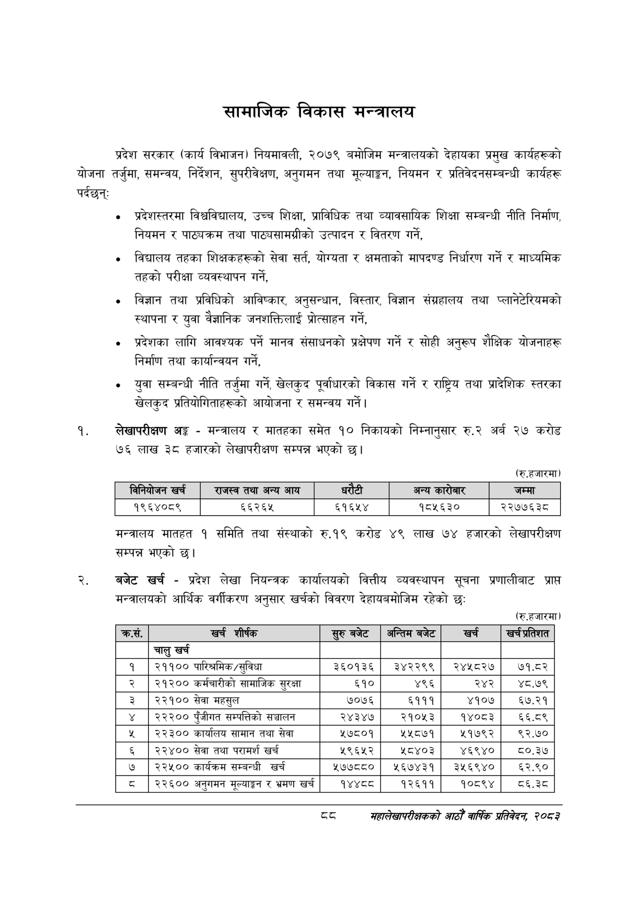

# Page 110 QA

## Rendered page


## Extracted text

```text
सामाजिक विकास मन्त्रालय
प्रदेश सरकार (कार्य विभाजन) नियमावली, २०७९ बमोजिम मन्त्रालयको देहायका प्रमुख कार्यहरूको योजना तर्जुमा, समन्वय, निर्देशन, सुपरीवेक्षण, अनुगमन तथा मूल्याङ्कन, नियमन र प्रतिवेदनसम्बन्धी कार्यहरू पर्दछन्‌:
० प्रदेशस्तरमा विश्वविद्यालय, उच्च शिक्षा, प्राविधिक तथा व्यावसायिक शिक्षा सम्बन्धी नीति निर्माण, नियमन र पाठ्यक्रम तथा पाठ्यसामग्रीको उत्पादन र वितरण गर्ने,
विद्यालय तहका शिक्षकहरूको सेवा सर्त, योग्यता र क्षमताको मापदण्ड निर्धारण गर्ने र माध्यमिक तहको परीक्षा व्यवस्थापन गर्ने,
विज्ञान तथा प्रविधिको आविष्कार, अनुसन्धान, विस्तार, विज्ञान संग्रहालय तथा प्लानेटेरियमको स्थापना र युवा वैज्ञानिक जनशक्तिलाई प्रोत्साहन गर्ने,
० प्रदेशका लागि आवश्यक पर्ने मानव संसाधनको प्रक्षेपण गर्ने र सोही अनुरूप शैक्षिक योजनाहरू निर्माण तथा कार्यान्वयन गर्ने,
० युवा सम्बन्धी नीति तर्जुमा गर्ने, खेलकुद पूर्वाधारको विकास गर्ने र राष्ट्रिय तथा प्रादेशिक स्तरका खेलकुद प्रतियोगिताहरूको आयोजना र समन्वय गर्ने |
लेखापरीक्षण अङ्ग -मन्त्रालय र मातहका समेत १० निकायको निम्नानुसार रु.२ अर्ब २७ करोड ७६ लाख ३८ हजारको लेखापरीक्षण सम्पन्न भएको छ।
(रु.हजारमा)
मन्त्रालय मातहत १ समिति तथा संस्थाको रु.१९ करोड ४९ लाख ७४ हजारको लेखापरीक्षण सम्पन्न भएको |
बजेट खर्च -प्रदेश लेखा नियन्त्रक कार्यालयको वित्तीय व्यवस्थापन सूचना प्रणालीबाट प्राप्त मन्त्रालयको आर्थिक वर्गीकरण अनुसार खर्चको विवरण देहायबमोजिम रहेको छः:
(रु.हजारमा)
द्द
सहालेखापरीक्षकको आठौँ वाषिकि प्रतिवेदन २०८२

| खर्च | राजस्व तथा अन्य आय |  | धरेटी | अन्य | जम्मा |
| --- | --- | --- | --- | --- | --- |
| १९६४०८९ | ६६२६५ | ६१६५४ |  | १८५६३० | २२७७६३८ |

| कसे. | खर्च शीर्षक | सुरुबबेट | अन्तिम बबेट | खर्च | खर अतिशात |
| --- | --- | --- | --- | --- | --- |
|  | चालु खर्च |  |  |  |  |
| १ | २११०० पारिश्रमिक/सुविधा | ३६०१३६ | ३४२२९९ | २४५८२७ | ७१.८२ |
| २ | २१२०० कर्मचारीको सामाजिक सुरक्षा | ६१० | ४९६ | २४२ | ४८.७९ |
| ३ | २२१०० सेवा महसुल | ७०७६ | ६१११ | ४१०७ | ६७.२१ |
| ४ | २२२०० पुँजीगत सम्पत्तिको सञ्चालन | २४३४७ | २१०५३ | १४०८३ | ६६.८९ |
| ५ | २२३०० कार्वालष सामान तथा सेवा | ४५७८०१ | ४५५८७१ | २१७९२ | ९२.७० |
| ६ | २२४०० सेवा तथा परामर्श खर्च | ५९६५२ | ५८४०३ | ४६९४० | ८०.३७ |
| ७ | २२५०० कार्यक्रम सम्बन्धी खर्च | ५७७८८० | ४५६७४३१ | ३५६९४० | ६२.९० |
| ८ | २२६०० अनुगमन भूल्याङ्गग र भ्रमण खर्च | १४४८०८ | १२६११ | १०८९४ | बव६.३८ |
```

## Flags
- table_page
- medium_quality_table
